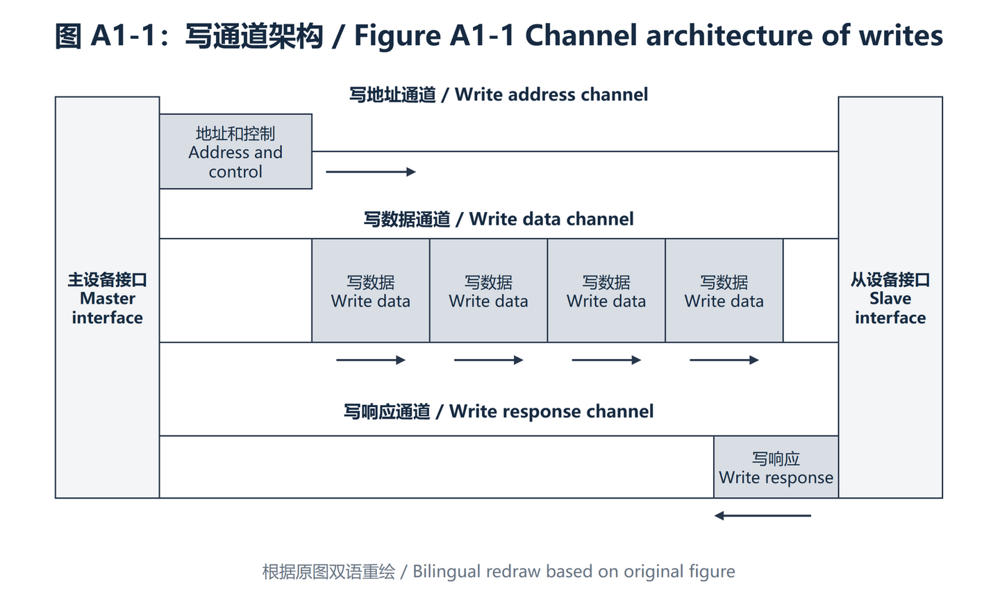
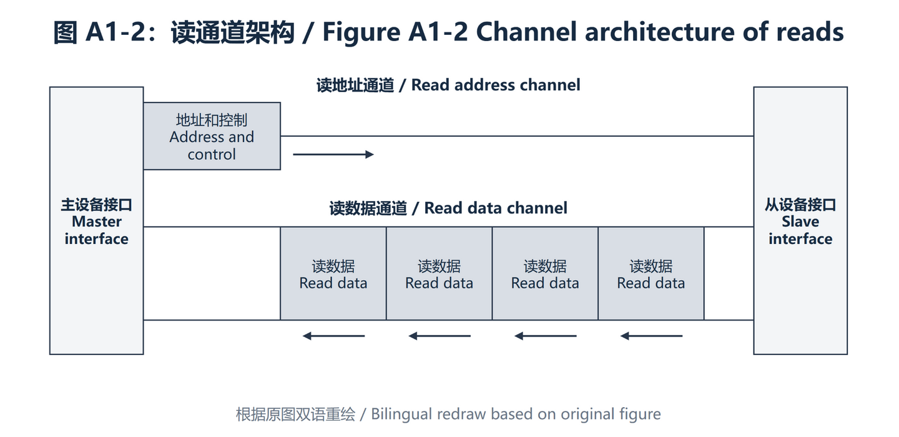
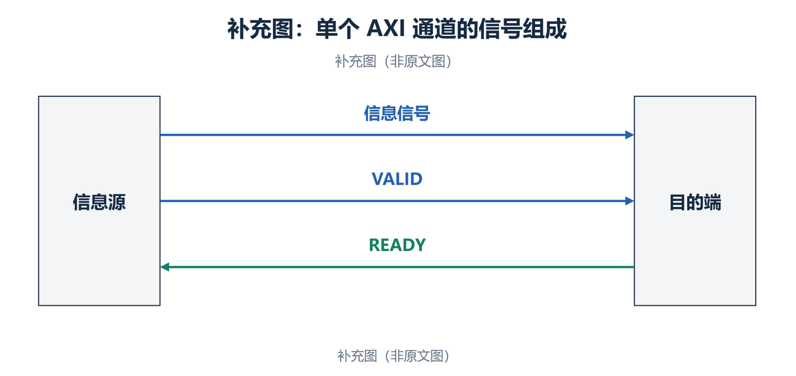
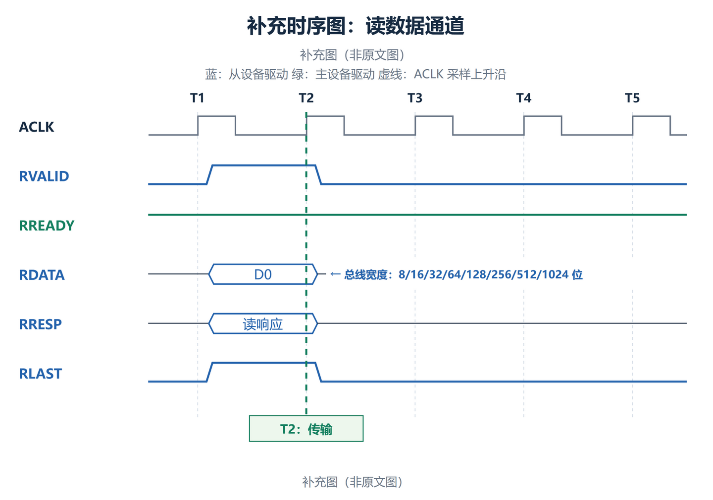
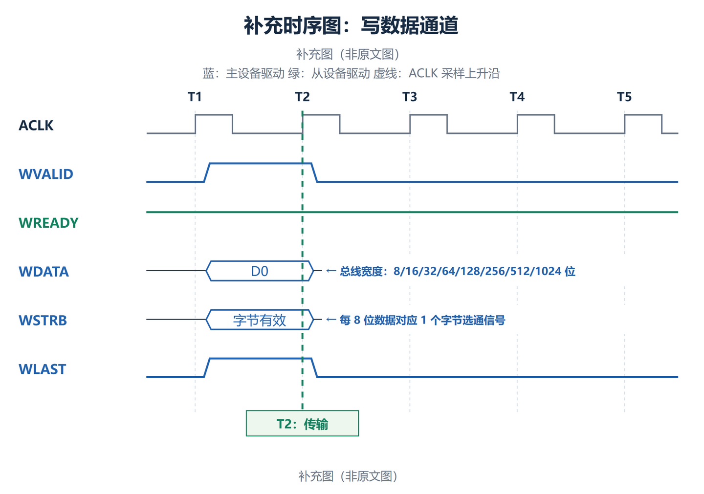
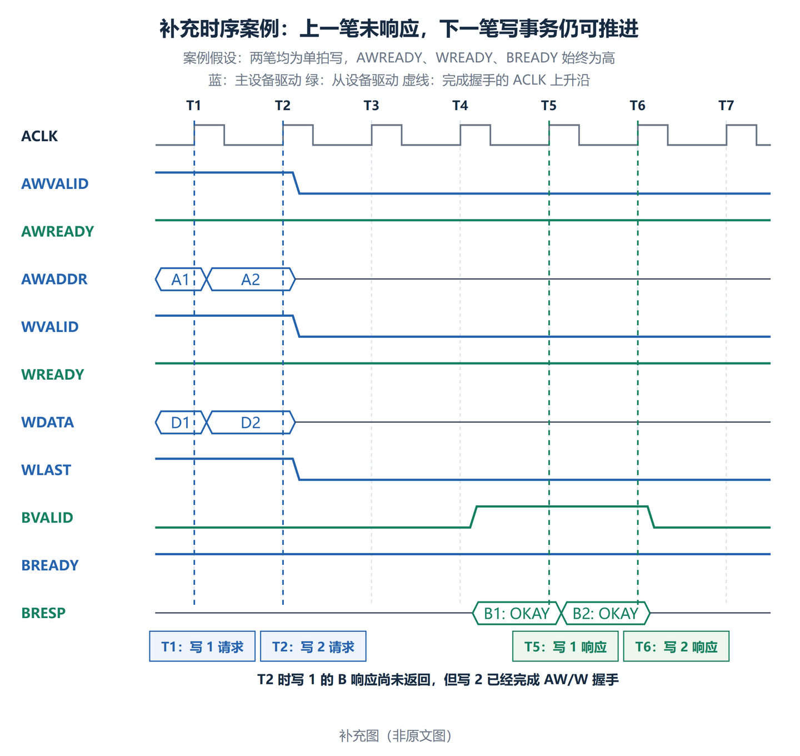
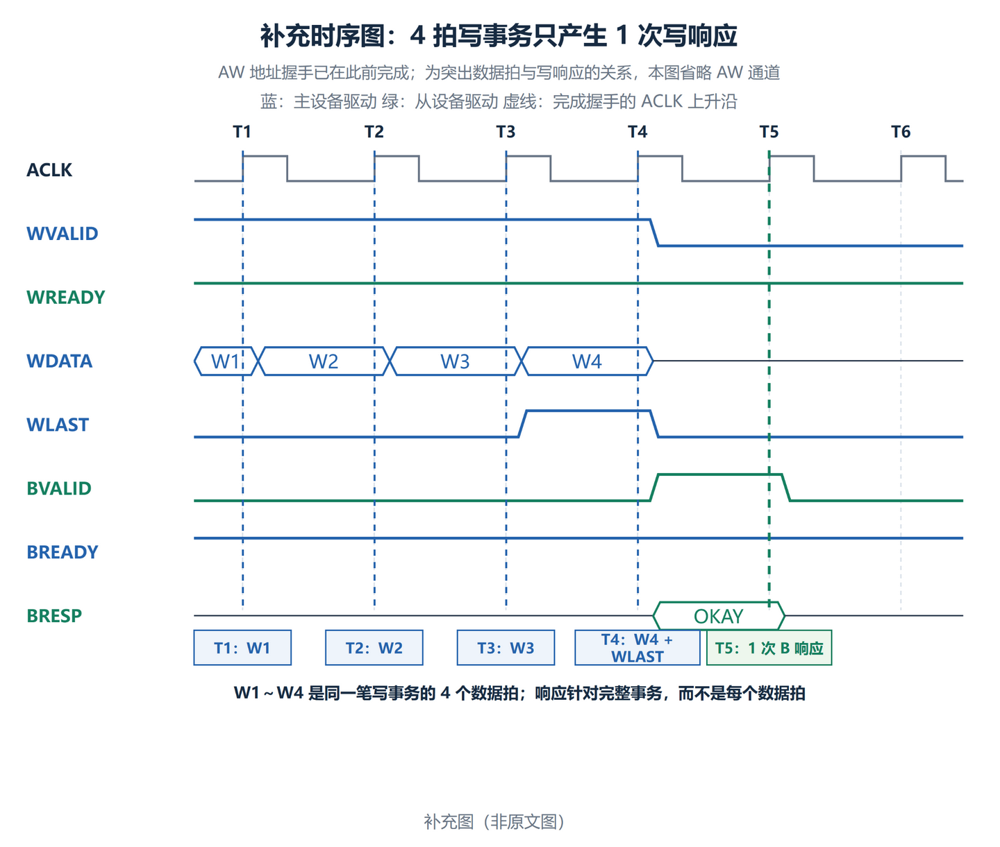
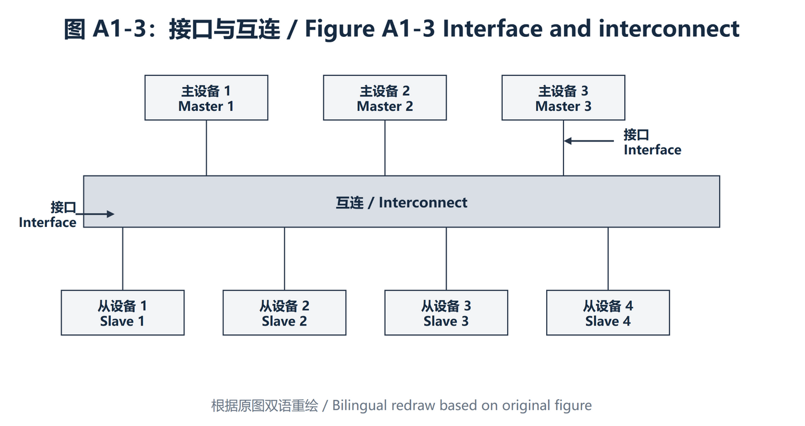
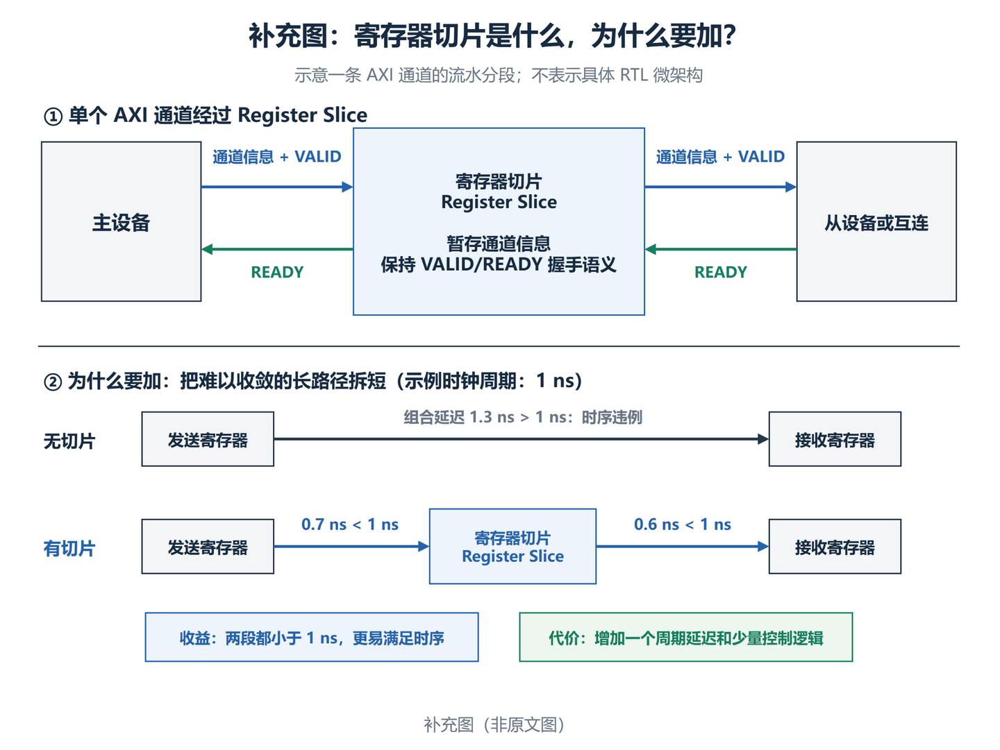

# A1：简介 / Introduction

> 译文性质：Arm 规范的非官方中英双语对照翻译。
>
> 原始文档：Arm IHI 0022H《AMBA AXI and ACE Protocol Specification》。
>
> 版本：Issue H，ID040120。
>
> 范围：Chapter A1，原文章节页码 A1-25～A1-30。
>
> 说明：中文与对应英文原文按原文顺序完整保留；省略每页重复的页眉、页脚、版权行和物理页码。

本章介绍 AXI 协议的架构（architecture），以及本规范（specification）中使用的术语（terminology）：

- 关于 AXI 协议，见第 A1-26 页。
- AXI 架构，见第 A1-27 页。
- 术语，见第 A1-30 页。

> **原文（English）**
>
> This chapter introduces the architecture of the AXI protocol and the terminology that is used in this specification:
>
> - About the AXI protocol on page A1-26
> - AXI Architecture on page A1-27
> - Terminology on page A1-30

## A1.1 关于 AXI 协议 / About the AXI protocol

AMBA AXI 协议支持主设备组件（master component）与从设备组件（slave component）之间通信的高性能、高频率系统设计。

> **原文（English）**
>
> The AMBA AXI protocol supports high-performance, high-frequency system designs for communication between master and slave components.

AXI 协议具有以下特点：

- 适用于高带宽、低延迟设计。
- 无需使用复杂的桥接器即可实现高频率运行。
- 协议满足各种组件的接口要求。
- 适用于初始访问延迟较高的内存控制器。
- 为互连架构（interconnect architecture）的实现提供灵活性。
- 与 AHB 和 APB 接口向后兼容。

> **原文（English）**
>
> The AXI protocol features are:
>
> - It is suitable for high-bandwidth and low-latency designs.
> - High-frequency operation is provided, without using complex bridges.
> - The protocol meets the interface requirements of a wide range of components.
> - It is suitable for memory controllers with high initial access latency.
> - Flexibility in the implementation of interconnect architectures is provided.
> - It is backward-compatible with AHB and APB interfaces.

AXI 协议的主要特性包括：

- 地址/控制阶段与数据阶段分离。
- 使用字节选通信号支持非对齐数据传输。
- 使用基于突发的事务，仅发出起始地址。
- 读数据通道和写数据通道相互独立，可以提供低成本的直接存储器访问（DMA）。
- 支持发出多个尚未完成的地址请求（outstanding addresses）。
- 支持事务乱序完成（out-of-order transaction completion）。
- 允许轻松添加寄存器级（register stages），以实现时序收敛（timing closure）。

> **原文（English）**
>
> The key features of the AXI protocol are:
>
> - Separate address/control and data phases.
> - Support for unaligned data transfers, using byte strobes.
> - Uses burst-based transactions with only the start address issued.
> - Separate read and write data channels, that can provide low-cost Direct Memory Access (DMA).
> - Support for issuing multiple outstanding addresses.
> - Support for out-of-order transaction completion.
> - Permits easy addition of register stages to provide timing closure.

AXI 协议包括：

- AXI4-Lite，它是 AXI4 的一个子集，用于与组件内部较简单的控制寄存器式接口进行通信。参见第 B1 章“AMBA AXI4-Lite”。
- AXI5-Lite，它是 AXI5 的一个子集，用于在组件内部较简单的控制寄存器式接口中使用 AXI5 特性。参见第 C2 章“AMBA AXI5-Lite”。

> **原文（English）**
>
> The AXI protocol includes:
>
> - AXI4-Lite, a subset of AXI4 for communication with simpler control register style interfaces within components. See Chapter B1 AMBA AXI4-Lite.
> - AXI5-Lite, a subset of AXI5 for using AXI5 features with simpler control register style interfaces within components. See Chapter C2 AMBA AXI5-Lite.

## A1.2 AXI 架构 / AXI Architecture

AXI 协议基于突发（burst），并定义了五个相互独立的事务通道（transaction channels）：

- 读地址通道，其信号名称以 `AR` 开头。
- 读数据通道，其信号名称以 `R` 开头。
- 写地址通道，其信号名称以 `AW` 开头。
- 写数据通道，其信号名称以 `W` 开头。
- 写响应通道，其信号名称以 `B` 开头。

> **原文（English）**
>
> The AXI protocol is burst-based and defines five independent transaction channels:
>
> - Read address, which has signal names beginning with AR.
> - Read data, which has signal names beginning with R.
> - Write address, which has signal names beginning with AW.
> - Write data, which has signal names beginning with W.
> - Write response, which has signal names beginning with B.

地址通道携带描述待传输数据性质的控制信息。数据使用以下任一通道在主设备与从设备之间传输：

- 写数据通道，用于将数据从主设备传输到从设备。在写事务中，从设备使用写响应通道向主设备发出传输完成信号。
- 读数据通道，用于将数据从从设备传输到主设备。

> **原文（English）**
>
> An address channel carries control information that describes the nature of the data to be transferred. The data is transferred between master and slave using either:
>
> - A write data channel to transfer data from the master to the slave. In a write transaction, the slave uses the write response channel to signal the completion of the transfer to the master.
> - A read data channel to transfer data from the slave to the master.

AXI 协议：

- 允许在实际数据传输之前发出地址信息。
- 支持多个未完成事务（outstanding transactions）。
- 支持事务乱序完成（out-of-order completion）。

> **原文（English）**
>
> The AXI protocol:
>
> - Permits address information to be issued ahead of the actual data transfer.
> - Supports multiple outstanding transactions.
> - Supports out-of-order completion of transactions.

图 A1-1 展示写事务如何使用写地址通道、写数据通道和写响应通道。

> **原文（English）**
>
> Figure A1-1 shows how a write transaction uses the write address, write data, and write response channels.

> **原文图题（English）**：Figure A1-1 Channel architecture of writes

图 A1-2 展示读事务如何使用读地址通道和读数据通道。

> **原文（English）**
>
> Figure A1-2 shows how a read transaction uses the read address and read data channels.

> **原文图题（English）**：Figure A1-2 Channel architecture of reads

### A1.2.1 通道定义 / Channel definition

五个独立通道中的每一个都由一组信息信号（information signals）以及提供双向握手机制（two-way handshake mechanism）的 `VALID` 和 `READY` 信号组成。参见第 A3-41 页的“基本读写事务”。

> **原文（English）**
>
> Each of the five independent channels consists of a set of information signals and VALID and READY signals that provide a two-way handshake mechanism. See Basic read and write transactions on page A3-41.

信息源（information source）使用 `VALID` 信号表示通道上存在有效的地址、数据或控制信息。目的端（destination）使用 `READY` 信号表示它能够接收该信息。读数据通道和写数据通道还都包含一个 `LAST` 信号，用于指示事务中最后一个数据项（final data item）的传输。

> **原文（English）**
>
> The information source uses the VALID signal to show when valid address, data, or control information is available on the channel. The destination uses the READY signal to show when it can accept the information. Both the read data channel and the write data channel also include a LAST signal to indicate the transfer of the final data item in a transaction.

#### 读地址通道和写地址通道 / Read and write address channels

读事务和写事务各自具有独立的地址通道。相应的地址通道携带某一事务所需的全部地址和控制信息。

> **原文（English）**
>
> Read and write transactions each have their own address channel. The appropriate address channel carries all the required address and control information for a transaction.

#### 读数据通道 / Read data channel

读数据通道将读数据和读响应信息（read response information）从从设备传送到主设备，并包括：

- 数据总线（data bus），其宽度可以是 8、16、32、64、128、256、512 或 1024 位。
- 指示读事务完成状态的读响应信号（read response signal）。

> **原文（English）**
>
> The read data channel carries both the read data and the read response information from the slave to the master, and includes:
>
> - The data bus, which can be 8, 16, 32, 64, 128, 256, 512, or 1024 bits wide.
> - A read response signal indicating the completion status of the read transaction.

#### 写数据通道 / Write data channel

写数据通道将写数据从主设备传送到从设备，并包括：

- 数据总线，其宽度可以是 8、16、32、64、128、256、512 或 1024 位。
- 每八个数据位对应一个字节通道选通信号（byte lane strobe signal），用于指示数据中哪些字节有效。

> **原文（English）**
>
> The write data channel carries the write data from the master to the slave and includes:
>
> - The data bus, which can be 8, 16, 32, 64, 128, 256, 512, or 1024 bits wide.
> - A byte lane strobe signal for every eight data bits, indicating the bytes of the data that are valid.

写数据通道信息始终被视为已缓冲（buffered），因此主设备无需从设备确认先前的写事务，即可执行写事务。

> **原文（English）**
>
> Write data channel information is always treated as buffered, so that the master can perform write transactions without slave acknowledgement of previous write transactions.

上图给出两笔单拍写事务的简化案例，并假设从设备始终置高 <code style="color:#D9822B;">AWREADY</code>、<code style="color:#D9822B;">WREADY</code>，主设备始终置高 <code style="color:#D9822B;">BREADY</code>：

- T1 时，写事务 1 的地址 A1 和数据 D1 完成握手。
- T2 时，写事务 1 的 <code style="color:#D9822B;">BVALID</code> 仍为低，即从设备尚未返回写响应；主设备仍可立即发送写事务 2，地址 A2 和数据 D2 在该周期完成握手。
- T5、T6 时，从设备才依次通过 B 通道返回写事务 1 和写事务 2 的响应。

这里的“已缓冲”表示主设备不必把写事务串行化为“发送一笔、等待 B 响应、再发送下一笔”。但它不表示可以忽略握手，也不表示 B 响应可以省略：若从设备或互连暂时没有空间继续接收，可以拉低 <code style="color:#D9822B;">AWREADY</code> 或 <code style="color:#D9822B;">WREADY</code> 施加背压；所有写事务最终仍必须获得写响应。

#### 写响应通道 / Write response channel

从设备使用写响应通道对写事务作出响应。所有写事务都要求通过写响应通道发出完成信号（completion signaling）。

> **原文（English）**
>
> A slave uses the write response channel to respond to write transactions. All write transactions require completion signaling on the write response channel.

如第 A1-27 页的图 A1-1 所示，仅对完整事务发出完成信号，而不是对事务中的每次数据传输发出完成信号。

> **原文（English）**
>
> As Figure A1-1 on page A1-27 shows, completion is signaled only for a complete transaction, not for each data transfer in a transaction.

上图假设写地址已经完成握手，并以一笔包含 4 个数据拍的写事务为例：

- T1～T4 时，<code style="color:#D9822B;">WVALID</code> 与 <code style="color:#D9822B;">WREADY</code> 在各个上升沿同时为高，因此依次传输了 W1、W2、W3、W4。W1～W3 的 <code style="color:#D9822B;">WLAST</code> 为低，T4 传输 W4 时 <code style="color:#D9822B;">WLAST=1</code>，表示这是一笔写突发的最后一个数据拍。
- T1～T4 的每个数据拍之后都没有单独产生 <code style="color:#D9822B;">BRESP</code>。T5 时，从设备才置高 <code style="color:#D9822B;">BVALID</code> 并给出 <code style="color:#D9822B;">BRESP=OKAY</code>，为整笔写事务返回一次完成响应。
- 图中主设备始终置高 <code style="color:#D9822B;">BREADY</code>，所以 T5 上升沿同时满足 <code style="color:#D9822B;">BVALID=1</code> 和 <code style="color:#D9822B;">BREADY=1</code>，该写响应在此时完成传输。

因此，4 个 W 数据拍属于同一笔完整写事务，最终只对应一次 B 通道写响应，而不是每个 W 数据拍各返回一次响应。T5 仅是便于理解的示例时序，并不表示协议规定从设备必须在最后一个数据拍后的下一周期返回响应。

### A1.2.2 接口与互连 / Interface and interconnect

典型系统由若干主设备和从设备组成，这些设备通过某种形式的互连（interconnect）连接在一起，如图 A1-3 所示。

> **原文（English）**
>
> A typical system consists of several master and slave devices that are connected together through some form of interconnect, as Figure A1-3 shows.

> **原文图题（English）**：Figure A1-3 Interface and interconnect

AXI 协议为以下对象之间的接口（interface）提供单一接口定义：

- 主设备与互连。
- 从设备与互连。
- 主设备与从设备。

> **原文（English）**
>
> The AXI protocol provides a single interface definition, for the interfaces between:
>
> - A master and the interconnect
> - A slave and the interconnect
> - A master and a slave

该接口定义支持多种不同的互连实现。

> **原文（English）**
>
> This interface definition supports many different interconnect implementations.

> **注（Note）**
>
> 设备之间的互连等同于另一个具有对称主设备端口和从设备端口的设备，实际的主设备和从设备可以连接到这些端口。
>
> **原文（English）**
>
> An interconnect between devices is equivalent to another device with symmetrical master and slave ports that the real master and slave devices can be connected.

#### 典型系统拓扑 / Typical system topologies

大多数系统使用以下三种互连拓扑（interconnect topologies）之一：

- 共享地址总线和数据总线。
- 共享地址总线和多条数据总线。
- 多层结构，具有多条地址总线和数据总线。

> **原文（English）**
>
> Most systems use one of three interconnect topologies:
>
> - Shared address and data buses
> - Shared address buses and multiple data buses
> - Multilayer, with multiple address and data buses

在大多数系统中，地址通道的带宽要求明显低于数据通道的带宽要求。这类系统可以使用共享地址总线和多条数据总线来支持并行数据传输，从而在系统性能与互连复杂度之间取得良好平衡。

> **原文（English）**
>
> In most systems, the address channel bandwidth requirement is significantly less than the data channel bandwidth requirement. Such systems can achieve a good balance between system performance and interconnect complexity by using a shared address bus with multiple data buses to enable parallel data transfers.

### A1.2.3 寄存器切片 / Register slices

每个 AXI 通道只沿一个方向传输信息，且该架构不要求通道之间存在任何固定关系。这些特性意味着，几乎可以在任何通道的任何位置插入寄存器切片（register slice），其代价是增加一个周期的延迟。

> **原文（English）**
>
> Each AXI channel transfers information in only one direction, and the architecture does not require any fixed relationship between the channels. These qualities mean that a register slice can be inserted at almost any point in any channel, at the cost of an additional cycle of latency.

> **注（Note）**
>
> 这些特性使以下方案成为可能：
>
> - 在延迟周期数与最大工作频率之间进行权衡。
> - 在处理器与高性能内存之间采用直接、快速的连接，同时使用简单的寄存器切片，将通往性能要求较低的外设的较长路径隔离开来。
>
> **原文（English）**
>
> These qualities make the following possible:
>
> - Trade-off between cycles of latency and maximum frequency of operation.
> - Direct, fast connection between a processor and high-performance memory, but to use simple register slices to isolate a longer path to less performance critical peripherals.

#### 问题：什么是寄存器切片，为什么要加？

## A1.3 术语 / Terminology

本节概述本规范中使用并在词汇表（Glossary）或其他位置定义的术语。在适当情况下，本节列出的术语链接到相应的词汇表定义。

> **原文（English）**
>
> This section summarizes terms that are used in this specification, and are defined in the Glossary, or elsewhere. Where appropriate, terms that are listed in this section link to the corresponding glossary definition.

### A1.3.1 AXI 组件与拓扑 / AXI components and topology

以下术语描述 AXI 组件：

- 组件（Component）。
- 主设备组件（Master component）。
- 从设备组件（Slave component），包括内存从设备组件（Memory slave components）和外设从设备组件（Peripheral slave components）。
- 互连组件（Interconnect component）。

> **原文（English）**
>
> The following terms describe AXI components:
>
> - Component
> - Master component
> - Slave component, which includes Memory slave components and Peripheral slave components
> - Interconnect component

对于某个特定 AXI 事务，上游（Upstream）和下游（Downstream）是指 AXI 组件在 AXI 拓扑中的相对位置。

> **原文（English）**
>
> For a particular AXI transaction, Upstream and Downstream refer to the relative positions of AXI components within the AXI topology.

### A1.3.2 AXI 事务和内存类型 / AXI transactions, and memory types

当 AXI 主设备发起以某个 AXI 从设备为目标的 AXI 操作时：

- AXI 总线上所需的完整操作集合构成 AXI 事务（AXI Transaction）。
- 所需的任何有效载荷数据均以 AXI 突发（AXI Burst）的形式传输。
- 一个突发可以包含多次数据传输，即多个 AXI 数据拍（AXI Beats）。

> **原文（English）**
>
> When an AXI master initiates an AXI operation, targeting an AXI slave:
>
> - The complete set of required operations on the AXI bus form the AXI Transaction
> - Any required payload data is transferred as an AXI Burst
> - A burst can comprise multiple data transfers, or AXI Beats

### A1.3.3 缓存与缓存操作 / Caches and cache operation

本规范不定义标准缓存术语，这些术语可在任何缓存参考资料中找到定义。不过，词汇表中的缓存（Cache）和缓存行（Cache line）条目阐明了这些术语在本文档中的使用方式。

> **原文（English）**
>
> This specification does not define standard cache terminology, that is defined in any reference work on caching. However, the glossary entries for Cache and Cache line clarify how these terms are used in this document.

### A1.3.4 时间描述 / Temporal description

AXI 规范使用“及时地”（in a timely manner）这一术语。

> **原文（English）**
>
> The AXI specification uses the term in a timely manner.
