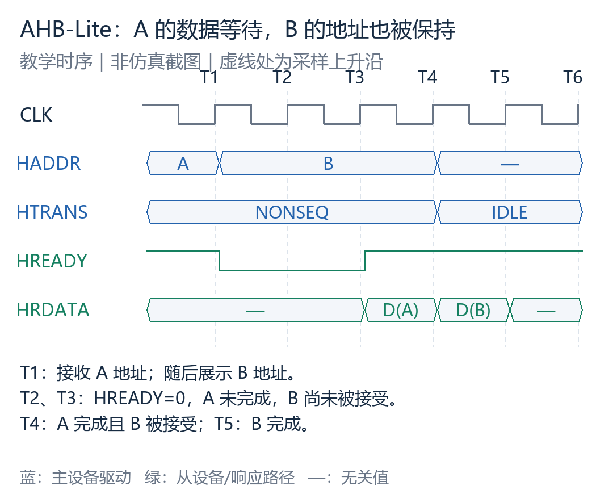
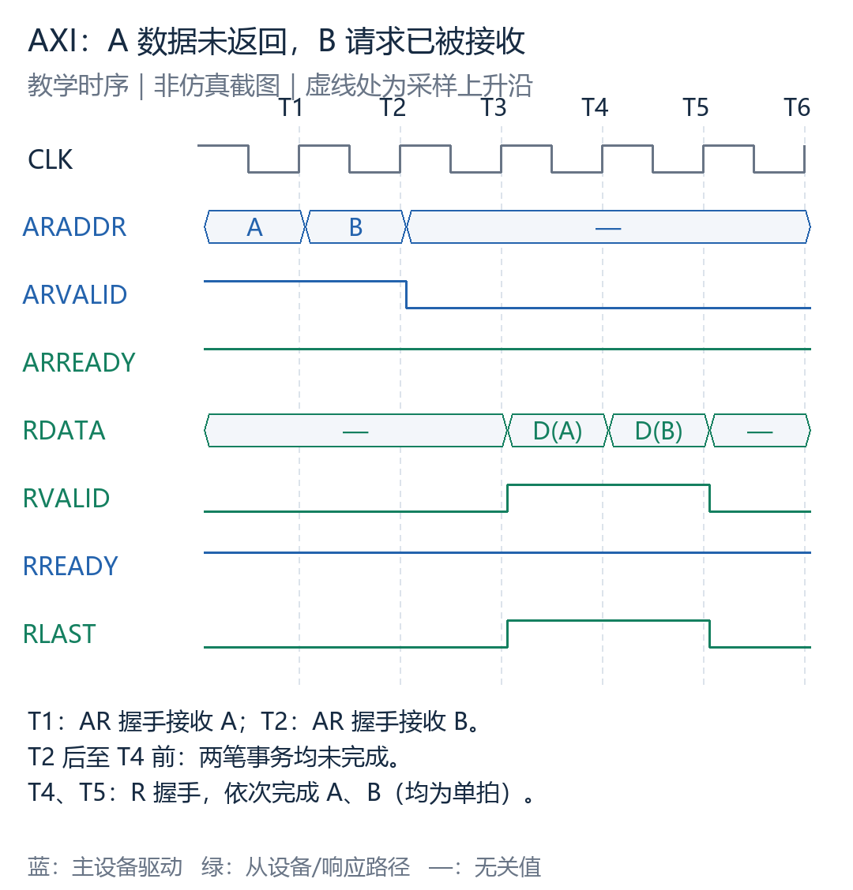
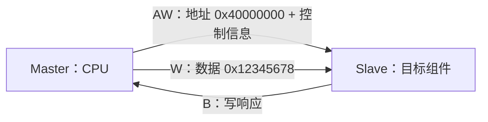
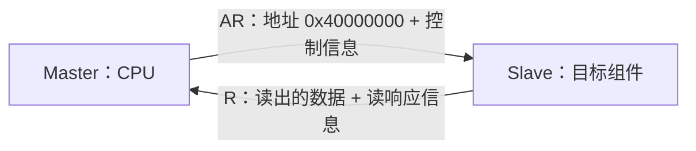
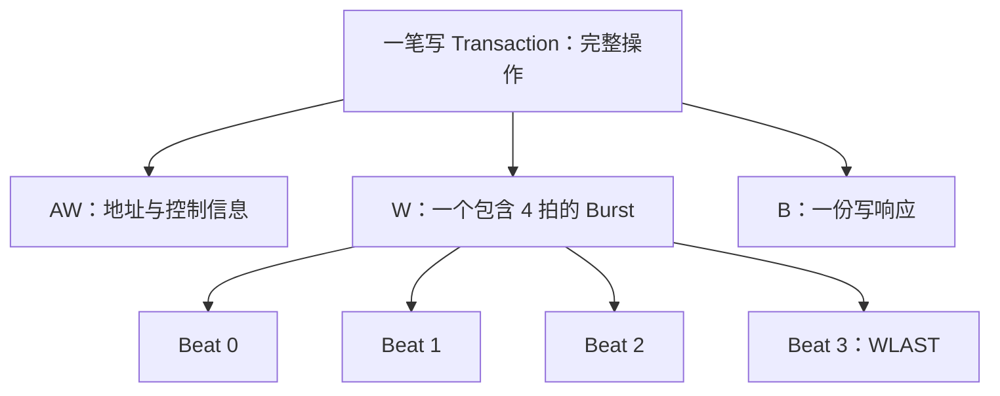
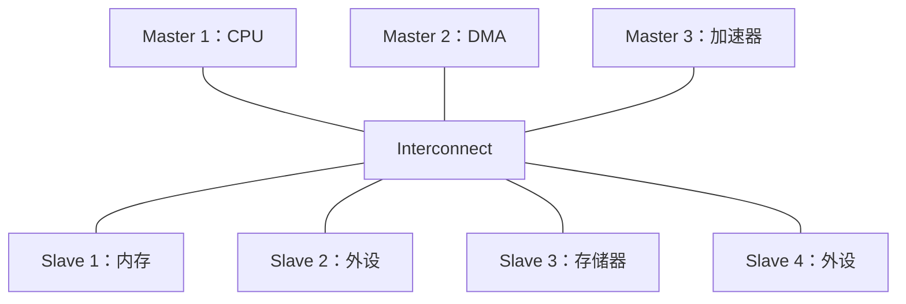

# A1：AXI 入门——先看懂一次读写，再理解系统架构

> 阅读对象：第一次学习 AXI、具备基本数字电路概念的读者。
>
> 依据：Arm IHI 0022H，Chapter A1 Introduction，原文页码 A1-25～A1-30（本项目 PDF 第 25～30 页）。本文覆盖 A1 全部小节的知识点，用中文重新组织讲解，不是逐字翻译，也不是整份 500 页规范的摘要。
>
> 阅读方式：先顺序读正文，再用文末的原文对照表查漏。文中的结构图均为教学重绘。

## 阅读路线

1. AHB 已经能完成读写，为什么还需要 AXI
2. 谁发起访问，谁响应访问
3. 一次读写如何经过五个通道
4. 每个通道怎样完成一次传输
5. Transaction、Burst 和 Beat
6. AXI 的性能从哪里来
7. 多个组件怎样连接
8. 为什么要插入寄存器切片
9. A1 剩余术语与阅读边界
10. 原文覆盖对照与自测

## 1. AHB 已经能完成读写，为什么还需要 AXI

**AXI 要改善的不是“能不能通信”，而是长延迟访问发生时，系统还能不能继续提交工作。** AHB（Advanced High-performance Bus，高性能总线）已经支持等待、Burst 和流水线；无等待时，前一笔的数据阶段可以与后一笔的地址阶段重叠。问题出现在当前数据阶段需要等待的时候。

假设主设备连续读取 A=`0x1000` 和 B=`0x1004`，A 的数据要多等两拍：



图 1：AHB-Lite 等待状态（教学时序，非仿真截图）。默认 HSEL=1、HWRITE=0、HSIZE=010、HBURST=SINGLE、HRESP=OKAY。T1 接受 A；T2、T3 的 `HREADY=0` 延长 A 的数据阶段，此时 B 虽已出现在 `HADDR` 上，却尚未被接受，地址和控制信息必须保持；到 T4，A 完成的同时才接受 B。

AXI 把读地址通道 AR 和读数据通道 R 分开，两条通道各自握手。仍让 A 在 T4 返回，并假设从设备能容纳两笔请求：



图 2：AXI 的两个单拍读取（教学时序，非仿真截图）。默认 `ARLEN=0`、`ARSIZE=010`、`ARBURST=INCR`，响应为 OKAY。T1、T2 分别完成 A、B 的 AR 握手；到 T4 返回 A 之前，两笔请求都已被接受但尚未完成，这就是两个 Outstanding（未完成事务）。T4、T5 再通过 R 通道依次返回数据。

**关键区别是：AHB 当前数据阶段的等待会牵制后续地址的接受；AXI 的地址与数据通道可以独立推进。** 多个 Outstanding 不等于乱序完成，图中仍按 A、B 返回；具体顺序规则在 A5、A6 中学习。

| AHB 的限制 | AXI 提供的机制 | 实现代价 |
| --- | --- | --- |
| 当前数据阶段等待会影响后续地址推进 | 独立通道、独立握手、多个 Outstanding | 需要更多缓冲和事务跟踪逻辑 |

AXI 提供的是并行处理的机会，不保证固定快几拍。实际性能还取决于从设备的处理能力、缓冲容量、资源冲突和顺序要求；需求较简单时，AHB 仍然适用。完整 AHB 还具有本例未展开的机制，这里只比较一个 AHB-Lite 接口上的基本流水行为。

## 2. 谁发起访问，谁响应访问

**AXI 沿用了与 AHB 相同的基本主从关系：Master 发起事务，Slave 接收并响应事务。** AXI 的主要变化不在角色，而在地址、数据和响应的传递方式，以及多笔事务的并行机制。

这一节对应 A1.3.1，只用于统一后文使用的角色和方向术语。

| 术语 | 含义 | 教学例子 |
| --- | --- | --- |
| Component，组件 | 系统中的一个功能单元 | CPU、DMA 控制器、内存控制器 |
| Master，主设备 | 发起读或写事务的一方 | CPU 请求读内存 |
| Slave，从设备 | 接收并响应事务的一方 | 内存控制器返回数据 |
| Memory slave，存储器从设备 | 提供存储器访问的从设备 | SRAM 控制器 |
| Peripheral slave，外设从设备 | 提供外设访问的从设备 | 控制寄存器接口 |
| Interconnect，互连 | 连接主设备和从设备的组件 | 把访问送往对应目标的连接逻辑 |


主从角色由谁发起事务决定，**不是由当前谁在发送数据决定**。读操作中，从设备发送读数据，但它仍然是从设备。

针对某一笔事务，靠近发起方叫 **Upstream（上游）**，靠近目标方叫 **Downstream（下游）**。返回数据流向上游，不会让这两个称呼互换。一个组件也可能在不同接口上承担不同角色。

## 3. 一次读写如何经过五个通道

对应 A1.2 及原文 Figure A1-1、Figure A1-2。

通道是一组共同传递某类信息的信号。AXI 把读写操作拆成五条独立通道：

| 通道 | 英文名称 | 信息方向 | 负责什么 |
| --- | --- | --- | --- |
| AW | Write Address | Master → Slave | 写地址及本次写事务的控制信息 |
| W | Write Data | Master → Slave | 写数据及相关信息 |
| B | Write Response | Slave → Master | 写事务的响应 |
| AR | Read Address | Master → Slave | 读地址及本次读事务的控制信息 |
| R | Read Data | Slave → Master | 读数据及读响应信息 |

这里的方向是信息流方向；用于握手的 READY 沿相反方向返回，下一节会解释。

### 3.1 写操作：地址、数据、响应分开走

假设 CPU 向地址 `0x40000000` 写入一个 32 位数 `0x12345678`。



可以把 AW 看成说明“写到哪里、怎样写”，W 负责“实际内容”，B 负责“返回处理结果”。

**这张图表示职责，不表示固定的时间先后。** 地址信息可以提前发出；写地址和写数据通道独立，不能据此假设 AW 必须先于 W 完成传输。具体通道依赖规则在 A3。

所有写事务都需要通过 B 通道进行完成响应。若一笔写事务包含多拍数据，也不是每拍都返回一次 B，而是针对整笔事务返回响应。响应的架构含义和它是否已到达最终存储位置，要结合 A4、A6 理解。

### 3.2 读操作：返回数据时一起带回响应

假设 CPU 从地址 `0x40000000` 读取一个数。



读操作只用两条通道，因为 R 已经同时承载数据和读响应，不需要再设置一条单独的读响应通道。

### 3.3 地址通道不只传地址

AR 和 AW 分别携带对应事务所需的地址及控制信息。教学上可以先理解为“起点在哪里、要传多少、按什么方式传”。具体信号和编码到 A2、A3 再学。

## 4. 每个通道怎样完成一次传输

对应 A1.2.1。

### 4.1 信息与握手信号

每个通道都有一组信息信号，以及 VALID、READY 两个握手信号。


- 发送方用 **VALID** 表示当前信息有效。
- 接收方用 **READY** 表示当前可以接收信息。
- 学习补充：在时钟上升沿，两者同时为高才完成一次传输；这是 A3 的握手规则。

| 在某次上升沿采样到的 VALID | READY | 是否完成传输 |
| --- | --- | --- |
| 0 | 0 | 否 |
| 0 | 1 | 否，接收方准备好了但没有有效信息 |
| 1 | 0 | 否，发送方正在等待接收 |
| 1 | 1 | 是 |

例如 W 通道由 Master 产生 WVALID，Slave 产生 WREADY；R 通道则由 Slave 产生 RVALID，Master 产生 RREADY。**VALID 属于信息发送方，不固定属于 Master。**

学习补充：等待接收期间，发送方必须保持有效信息稳定，不能因 READY 为低而随意撤回 VALID；发送方也不能等待 READY 才开始置起 VALID。完整时序和依赖关系请读 A3.2～A3.3。

### 4.2 数据宽度、字节选通与 LAST

A1 列出的读、写数据总线宽度为：**8、16、32、64、128、256、512、1024 位**。这是规范提供的宽度选项，不表示一个实现运行时可以随意切换总线宽度。

W 通道还带有字节选通信息：每 8 位数据对应一个选通信号位，用来说明哪些字节有效。后续信号名称是 **WSTRB**。

以 32 位写数据为例：

| 字节位置 | WDATA 对应位 | 有效性由谁指示 |
| --- | --- | --- |
| 字节 0 | `[7:0]` | `WSTRB[0]` |
| 字节 1 | `[15:8]` | `WSTRB[1]` |
| 字节 2 | `[23:16]` | `WSTRB[2]` |
| 字节 3 | `[31:24]` | `WSTRB[3]` |

在地址和传输尺寸允许的前提下，`WSTRB = 0011` 表示最低两个字节通道有效，另外两个不参与本次写入。它不是对整个 32 位数据的一次“全写或不写”选择。

字节选通帮助支持非对齐传输；非对齐访问并不意味着可以任意设置选通，地址、传输尺寸与字节位置仍需符合 A3 的规则。

读、写数据通道还有 **LAST**，表示当前数据是事务中的最后一个数据项，分别称为 RLAST 和 WLAST。它不是一个独立通道；最后一拍仍需完成握手。

### 4.3 为什么上一笔没响应，下一笔写入也可能推进

A1 说明写数据通道信息按可缓冲的方式对待，使主设备能够在前面写事务尚未得到从设备确认时继续开展写事务。

可以理解为系统允许把多个工作放在处理中，而不是每次都要等到上一笔 B 返回后才能推进下一笔。**这不意味着缓存无限大，也不意味着不需要 B 响应**；接收能力由握手体现，事务顺序仍受协议约束。

## 5. Transaction、Burst 和 Beat

对应 A1.3.2。这三个词描述的是不同层次。

| 术语 | 中文理解 | 关注范围 |
| --- | --- | --- |
| Transaction | 事务 | 主设备对目标从设备发起一次操作所需的完整 AXI 总线活动 |
| Burst | 突发传输 | 搬运该操作所需的有效载荷数据的一组传输 |
| Beat | 数据拍 | Burst 中的一次数据传输；这里不是单纯指一个时钟周期 |

以一笔包含 4 拍数据的写事务为例：



该图是组成关系图，不是时序图。一次事务不是一个时钟周期；等待 READY 时，一个 Beat 可以跨多个周期才被接收。

### 5.1 只发起始地址是什么意思

教学例子：采用递增地址的传输方式，从 `0x1000` 开始，每拍传 4 字节，一共 4 拍。

| 数据拍 | 本拍对应起始地址 | 搬运字节数 |
| --- | --- | --- |
| Beat 0 | `0x1000` | 4 |
| Beat 1 | `0x1004` | 4 |
| Beat 2 | `0x1008` | 4 |
| Beat 3 | `0x100C` | 4 |

地址通道发送一次起始地址及控制信息，后续地址根据约定的传输参数得到，不需要为每拍重新发起一次地址传输。其他 Burst 类型的地址规律不一定递增，详细计算在 A3.4。

对这个例子来说，写操作是 1 次 AW、4 次 W、1 次 B 传输；读操作则是 1 次 AR、4 次 R 传输，最后一拍 R 带 RLAST。Burst 也可以只有一拍，不能把它理解成“必定很多拍”。

## 6. AXI 的性能从哪里来

对应 A1.1 的关键特性，以及 A1.2 对地址提前发出、多笔事务和乱序完成的说明。

| 机制 | 它解决的问题 | 不应误解为 |
| --- | --- | --- |
| 地址/控制与数据分离 | 地址可以先推进，数据可稍后到达 | 写地址永远必须先于写数据 |
| 字节选通与非对齐传输支持 | 可以表达哪些字节真正参与写入 | 任何非对齐组合都合法 |
| Burst 只发送起始地址 | 多拍数据不必反复发送完整地址请求 | 每拍地址一定相同 |
| 读写数据通道分离 | 有利于读写并行，也有利于实现低成本 DMA 数据搬运 | 所有系统都必然每周期同时读写 |
| 多个 Outstanding 地址/事务 | 前一笔未完成时仍可发出后续请求，减少串行等待 | 可以无限制发送请求 |
| 允许乱序完成 | 在顺序规则允许时，先就绪的事务不必被另一笔较慢事务阻塞 | 任意事务、任意数据拍都能乱序 |
| 易于加入寄存器级 | 将长组合路径分段，帮助满足时序约束 | 加寄存器一定降低总访问时间 |

**DMA（Direct Memory Access，直接存储器访问）**是让专门的数据搬运组件承担访问工作，减少 CPU 逐项搬运的负担；AXI 是它可以使用的通信接口，不是 DMA 本身。

### 6.1 Outstanding 与乱序完成不是一回事

以下只是事务层面的示意，假定两笔请求满足允许乱序完成的条件：

```text
时间向后 →
发出请求： A ── B
完成响应：          B ── A
                    ↑
             B 比 A 更早完成
```

发出 B 时 A 尚未完成，说明存在多个 Outstanding 事务；B 比 A 更早完成，才体现乱序完成。系统也可以支持多个 Outstanding，但仍按 A、B 顺序完成。

这里没有说同一 Burst 内的数据可以随意重排，也没有说所有相同 ID 的事务都能乱序。ID 与具体保序规则分别留到 A5、A6。

### 6.2 A1.1 总结的设计目标

| 原文中的目标 | 初学者可以怎样理解 |
| --- | --- |
| 高带宽、低延迟 | 希望单位时间搬运更多数据，也希望请求较快得到响应；两者不是同一指标 |
| 支持高频工作，无需依赖复杂桥接 | 接口结构适合高速电路；不代表任何设计都无需桥接 |
| 适用于多种组件 | 处理器、内存控制器和外设等可围绕统一接口集成 |
| 适合首次访问延迟较高的内存控制器 | 第一份数据可能较晚返回，接口仍支持安排后续工作 |
| 互连实现灵活 | 可以根据面积、并行度和性能需求选择连接结构 |
| 与 AHB、APB 接口向后兼容 | 可以通过适配或桥接组成系统，不是把不同协议的引脚直接相连 |

带宽表示单位时间能够传送多少数据，延迟表示一次请求需要等待多久。AXI 提供实现高性能的机制，最终表现仍取决于系统实现。

### 6.3 A1 提到的简化接口

| 接口 | 关系与用途 | 后续阅读 |
| --- | --- | --- |
| AXI4-Lite | AXI4 的子集，面向较简单的控制寄存器式访问 | B1 |
| AXI5-Lite | AXI5 的子集，用于在简单控制寄存器式接口中使用相应 AXI5 能力 | C2 |

本文的多拍数据和 LAST 示意用于完整 AXI 的入门理解，不能照搬为 AXI4-Lite 的信号清单。AXI4-Stream 另有规范，不是这里的五通道存储器映射接口。

## 7. 多个组件怎样连接

对应 A1.2.2 及原文 Figure A1-3。

### 7.1 统一接口与互连的两面



每条连线代表接口连接，不是单根信号线。图中的具体设备名称是教学例子。

同一套 AXI 接口定义用于 Master 与 Interconnect、Interconnect 与 Slave，以及 Master 与 Slave 的直接连接。

从接口角色看，互连可以理解为一个同时拥有主、从端口的组件：面向上游 Master 的一侧接收请求，面向下游 Slave 的一侧转发请求。原文描述其具有相互对应的主从端口，不代表两侧端口数量必须相同；原图就画出了 3 个主设备和 4 个从设备。

### 7.2 三种典型拓扑

下面是资源共享方式的概念图，不是可以直接据此连线的 RTL 电路图。“共享地址”也不是把 AW、AR 合并成一个 AXI 通道。

```text
① 地址和数据资源都共享
多个 Master ── [共享地址路径 + 共享数据路径] ── 多个 Slave

② 地址资源共享，数据路径有多条
多个 Master ── [共享地址路径] ─────────────── 多个 Slave
           └─ [数据路径 1 / 数据路径 2 / …] ─┘

③ 多层结构：地址与数据均有多条路径
多个 Master ── [地址路径 1 + 数据路径 1] ── 多个 Slave
           └─ [地址路径 2 + 数据路径 2] ─────┘
```

| 拓扑 | 理解重点 | 教学上的取舍理解 |
| --- | --- | --- |
| 共享地址和数据总线 | 多个访问竞争共同的传输资源 | 实现可较简单，共享资源容易成为瓶颈 |
| 共享地址总线、多条数据总线 | 地址仍共享，但数据可走不同路径 | 可在复杂度与并行数据传输之间折中 |
| 多层地址和数据总线 | 为地址和数据提供更多独立路径 | 并行机会更多，实现资源与控制也可能增加 |

为什么第二种结构有意义？一笔 Burst 只需一次地址传输，却可能有多拍数据，所以很多系统对地址通道带宽的需求明显低于对数据通道的需求。共享地址资源、保留多条数据路径，可以取得较好的性能与复杂度平衡。这不是所有系统都成立的固定比例。

## 8. 为什么要插入寄存器切片

对应 A1.2.3。

**Register Slice（寄存器切片）**是在通道路径中加入寄存器级，使信息分阶段向前传递。


图表示一个通道路径的分段，READY 反向握手也必须正确处理。实际实现不能只给数据加寄存器而忽略握手关系。

AXI 各通道的信息流有固定方向，通道之间又不要求固定的周期对应关系，因此可以在通道的许多位置插入寄存器级。原文以增加一个周期延迟来说明这种流水化的代价；完整组件的延迟还应看实现和配置。

```text
原来：寄存器 ───── 一段较长的组合逻辑 ───── 寄存器
分段：寄存器 ── 较短逻辑 ── 寄存器 ── 较短逻辑 ── 寄存器
```

较短的组合路径有机会支持更高时钟频率，这就是帮助实现 **Timing Closure（时序收敛）**：让信号在规定的时钟周期内到达并满足时序要求。

这里需要同时看两个量：

- **周期延迟**：多一级寄存器通常意味着多等一级流水线。
- **时钟频率**：每一级路径更短，可能允许每秒运行更多周期。

所以“周期数变多”和“频率能提高”可以同时发生，实际时间是否缩短要结合两者计算。

原文给出的系统思路是：处理器到高性能内存可采用直接、快速的连接；对距离更远、性能要求较低的外设路径，则用寄存器切片隔离长路径。独立通道使这种布局更灵活，但并不取消通道之间的协议依赖。

## 9. A1 剩余术语与阅读边界

### 9.1 Cache 与 Cache line（A1.3.3）

A1 明确说明：本规范不承担讲解通用缓存术语的任务；文末 Glossary 中的 Cache 和 Cache line 条目说明它们在本规范中的用法。

作为入门辅助，可以先这样理解：**Cache（缓存）**保存部分数据的副本，帮助更快完成访问；**Cache line（缓存行）**是缓存组织数据的基本块。不要把缓存行与 AXI 的一个 Beat 混为一谈，也不要默认一行一定等于一个 Burst。

这些是教学解释。缓存行大小和缓存行为取决于具体系统，A1 没有规定固定大小，也没有展开缓存一致性协议。

### 9.2 in a timely manner（A1.3.4）

A1 的最后一小节指出规范会使用 **in a timely manner** 这一时间描述。中文可先理解为“及时地”。

A1 此处没有给出固定周期数，因此不能自行把它解释成“必须下一拍完成”或“必须在某个固定周期数以内完成”。具体要求应结合该用语出现处的上下文和规范定义阅读。

### 9.3 本章学到哪里就够了

读完 A1，应当能画出五通道方向、描述一笔读写事务、区分 Transaction/Burst/Beat，并解释互连与寄存器切片的作用。

信号位宽和完整信号表在 A2；握手、通道依赖、Burst 地址规则在 A3；事务属性在 A4；ID 和顺序规则在 A5、A6。本文涉及这些内容时仅提供理解 A1 所需的补充，不替代后续章节。

## 10. 原文覆盖对照与自测

### 10.1 A1 全章覆盖对照

| PDF 位置 | 原文章节或要点 | 本文位置 |
| --- | --- | --- |
| A1-25 | Introduction：架构与术语导览 | 开篇与阅读路线 |
| A1.1 / A1-26 | 六项设计目标 | 6.2 |
| A1.1 / A1-26 | 地址数据分离、字节选通、Burst、独立读写、Outstanding、乱序、寄存器级 | 4、5、6、8 |
| A1.1 / A1-26 | AXI4-Lite、AXI5-Lite 及 B1/C2 引用 | 6.3 |
| A1.2 / A1-27 | 五通道、地址控制信息、地址提前、多笔事务与乱序 | 3、6 |
| Figure A1-1 / A1-27 | 写通道架构 | 3.1、5 |
| Figure A1-2 / A1-27 | 读通道架构 | 3.2 |
| A1.2.1 / A1-28 | 信息信号、VALID/READY、LAST | 4.1、4.2 |
| A1.2.1 / A1-28 | 读写地址、数据宽度、读响应、字节选通 | 3.3、4.2 |
| A1.2.1 / A1-28 | 写数据缓冲语义、每事务写响应 | 4.3、3.1 |
| A1.2.2 / A1-28～29 | 统一接口、互连主从端口、Figure A1-3 | 7.1 |
| A1.2.2 / A1-29 | 三类拓扑、地址与数据带宽差异 | 7.2 |
| A1.2.3 / A1-29 | 寄存器切片、延迟与频率取舍、内存及外设路径例子 | 8 |
| A1.3.1 / A1-30 | 组件、主从、两类从设备、互连、上游下游 | 2、7.1 |
| A1.3.2 / A1-30 | Transaction、Burst、Beat | 5 |
| A1.3.3 / A1-30 | 缓存术语说明与 Glossary 引用 | 9.1 |
| A1.3.4 / A1-30 | 时间描述 in a timely manner | 9.2 |

### 10.2 自测：先自己回答，再展开答案

1. 为什么写操作有三个通道，而读操作只有两个？
2. R 通道中，谁驱动 VALID，谁驱动 READY？
3. 一笔四拍写事务需要几次 AW、W、B 传输？
4. VALID 为 1、READY 为 0 时，是否已经完成传输？
5. 多个 Outstanding 事务是否一定乱序完成？
6. 为什么“共享地址、多条数据路径”可能有效？
7. 插入寄存器切片后，多等一个周期为什么仍可能有价值？
8. 上游、下游会因为读数据返回而互换吗？
9. Cache line、Burst、Beat 是否是同一个概念？
10. “及时地”是否就表示“下一拍”？

<details>
<summary>展开参考答案</summary>

1. 写操作通过 AW、W、B 分别传地址控制、数据和响应；读操作的 R 同时携带数据与响应，所以只需要 AR、R。
2. Slave 提供读数据，所以驱动 RVALID；Master 接收数据，所以驱动 RREADY。
3. 1 次 AW、4 次 W、1 次 B；这里统计成功传输次数，不是耗费周期数。
4. 没有。必须在时钟上升沿同时采样到 VALID、READY 为高。
5. 不一定。Outstanding 说明有尚未完成的事务，乱序说明完成先后发生改变，两者不是一回事。
6. 一个地址请求可能对应多拍数据，地址带宽需求可能较低，而多条数据路径可以支持并行数据传输。
7. 它可缩短每一级组合路径，帮助提高可达时钟频率；总时间还要结合周期数与频率评估。
8. 不会。上下游是针对这笔事务发起方与目标方的相对位置。
9. 不是。缓存行是缓存组织概念，Burst 是成组的数据传输，Beat 是其中一次数据传输。
10. 不是。A1 没有在此给出固定周期要求。

</details>

### 10.3 下一步

先尝试不看正文，画出 Master 和 Slave 之间的五条通道，并给每条通道标出信息方向。能够正确画出后，再读 A2，把具体信号放回通道；随后读 A3，理解这些信号在时钟边沿怎样协作。

参考来源：Arm IHI 0022H《AMBA AXI and ACE Protocol Specification》，Chapter A1，A1-25～A1-30。本文为学习导读，协议实现应以对应版本规范为准。

第一节时序补充参考：Arm《Fundamentals of System-on-Chip Design》Chapter 3“AMBA, AHB, and APB”，地址/数据流水线与 HREADY 说明；Arm IHI 0022H，A3.2～A3.4 的握手、通道依赖和事务结构规则。图示周期安排为教学假设，不是规范规定的固定响应延迟。
