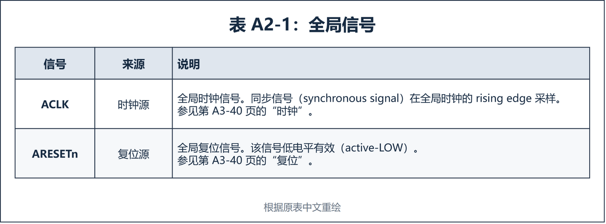
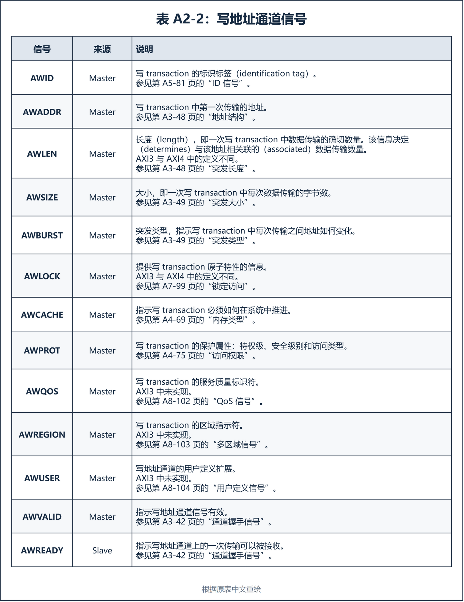
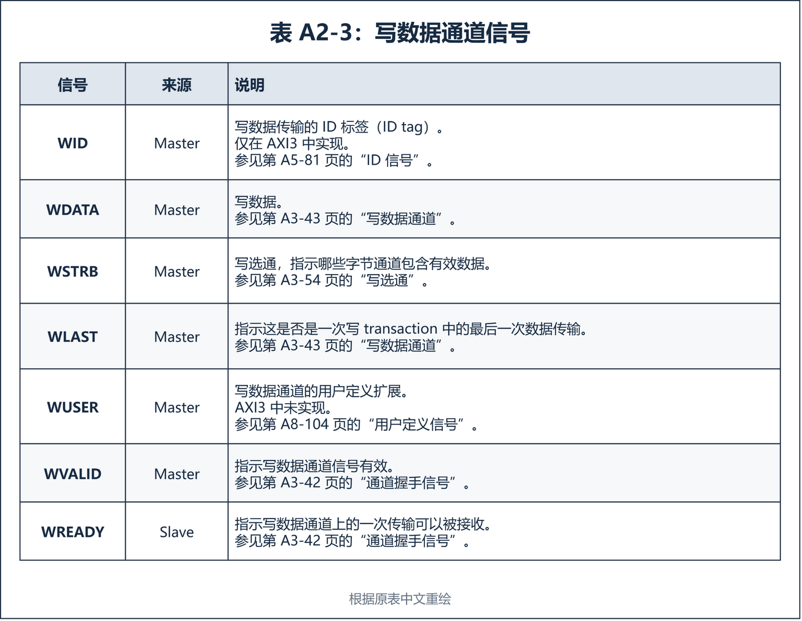
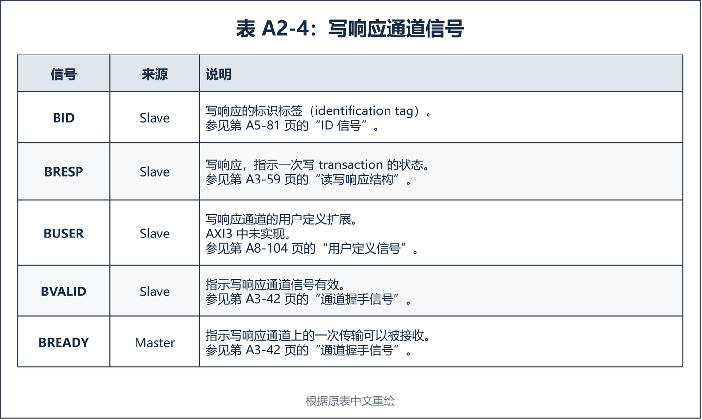
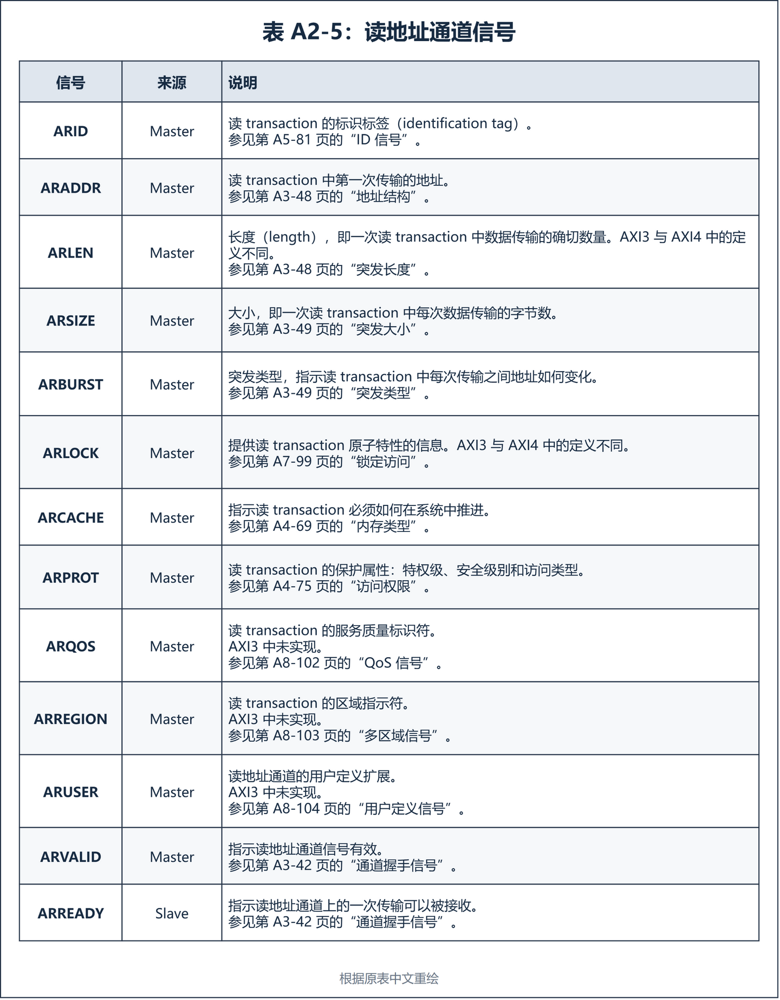
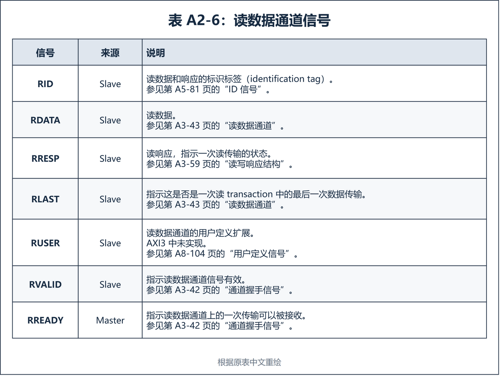

# A2：信号说明

> 译文性质：Arm 规范的非官方中文翻译。
>
> 原始文档：Arm IHI 0022H《AMBA AXI and ACE Protocol Specification》。
>
> 版本：Issue H，ID040120。
>
> 范围：Chapter A2，原文章节页码 A2-31～A2-38。
>
> 说明：正文按原文顺序完整翻译；省略每页重复的页眉、页脚、版权行和物理页码。

本章介绍 AXI 接口信号。AXI3 和 AXI4 协议实现需要使用大多数信号，汇总这些信号的表格指出了例外情况。本章包含以下各节：

- 全局信号，见第 A2-32 页。
- 写地址通道信号，见第 A2-33 页。
- 写数据通道信号，见第 A2-34 页。
- 写响应通道信号，见第 A2-35 页。
- 读地址通道信号，见第 A2-36 页。
- 读数据通道信号，见第 A2-37 页。

> 原文：Most of the signals are required for AXI3 and AXI4 implementations of the protocol, and the tables summarizing the signals identify the exceptions.

后续章节定义信号参数和用法。

## A2.1 全局信号

表 A2-1 给出了 AXI 的全局信号。这些信号供 AXI3 和 AXI4 协议使用。

所有信号都在全局时钟的 rising edge 采样。

## A2.2 写地址通道信号

表 A2-2 给出了 AXI 写地址通道信号。除非说明中另有指明，否则 AXI3 和 AXI4 都使用该信号。

> 原文：Unless the description indicates otherwise, a signal is used by AXI3 and AXI4.

## A2.3 写数据通道信号

表 A2-3 给出了 AXI 写数据通道信号。除非说明中另有指明，否则 AXI3 和 AXI4 都使用该信号。

> 原文：Unless the description indicates otherwise, a signal is used by AXI3 and AXI4.

## A2.4 写响应通道信号

表 A2-4 给出了 AXI 写响应通道信号。除非说明中另有指明，否则 AXI3 和 AXI4 都使用该信号。

> 原文：Unless the description indicates otherwise, a signal is used by AXI3 and AXI4.

## A2.5 读地址通道信号

表 A2-5 给出了 AXI 读地址通道信号。除非说明中另有指明，否则 AXI3 和 AXI4 都使用该信号。

> 原文：Unless the description indicates otherwise, a signal is used by AXI3 and AXI4.

## A2.6 读数据通道信号

表 A2-6 给出了 AXI 读数据通道信号。除非说明中另有指明，否则 AXI3 和 AXI4 都使用该信号。

> 原文：Unless the description indicates otherwise, a signal is used by AXI3 and AXI4.

