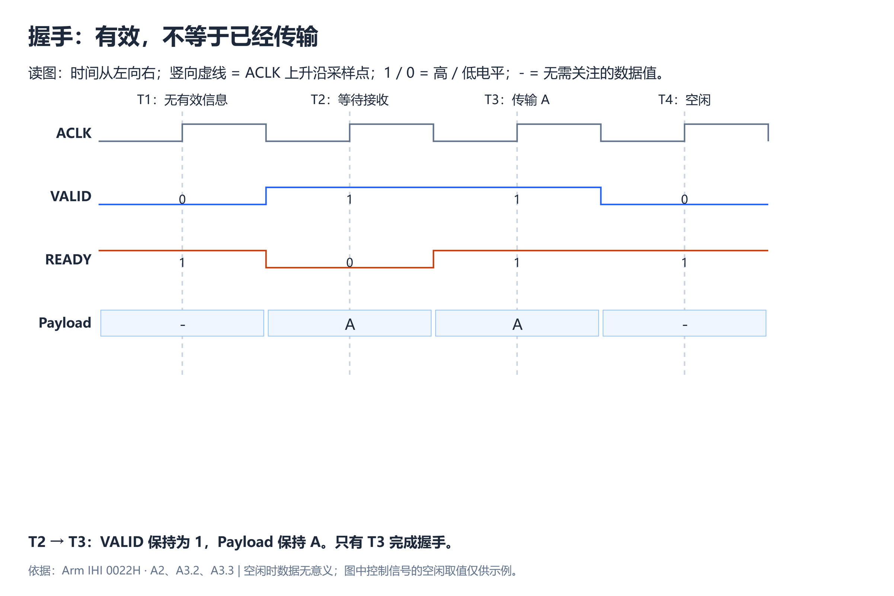
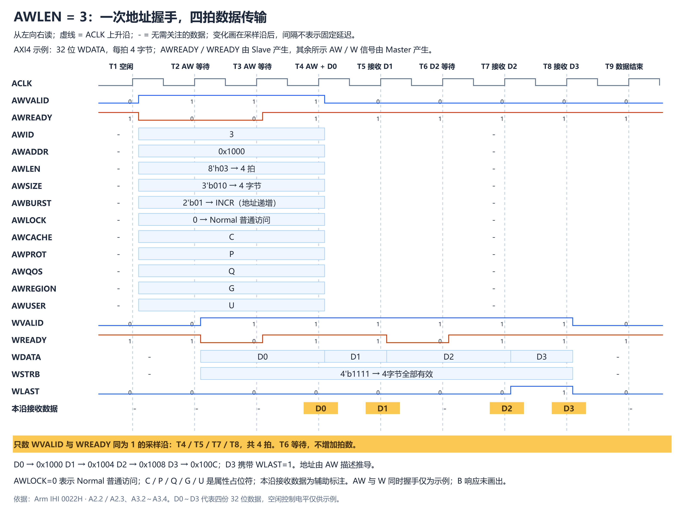
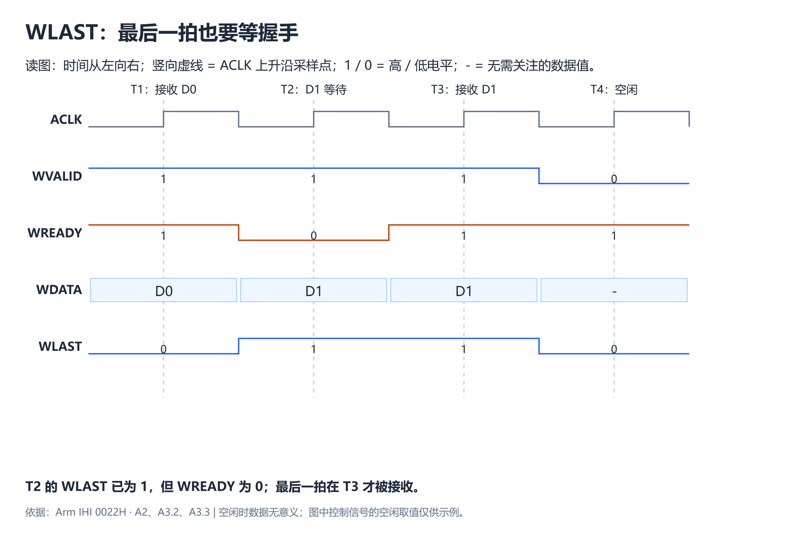
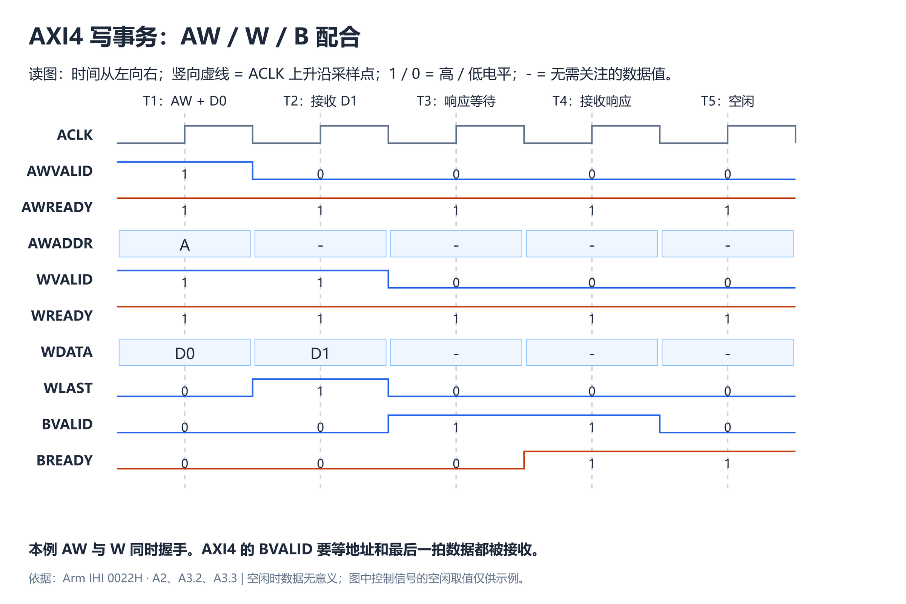
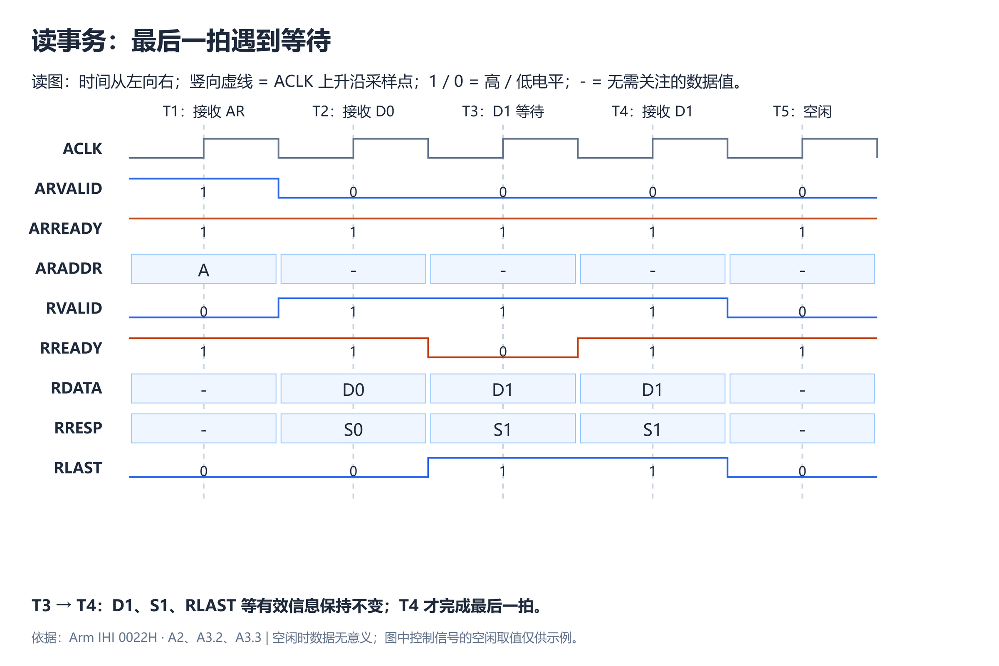

# A2：AXI 接口信号导读

本文依据 *Arm IHI 0022H AMBA AXI and ACE Protocol Specification* 的 Chapter A2 **Signal Descriptions**（A2-31～A2-38），按原文六个小节整理信号含义。阅读目标是看懂：谁发送什么信息，以及一次读写如何经过五个通道。

正文以 AXI4 为主要理解对象，同时标出 A2 中的 AXI3 差异。时序图是辅助理解的原创示例，涉及的握手与通道依赖依据 A3.2、A3.3；完整规则留到 A3 学习。

## 先看全貌：五个通道各管什么

Master（主设备）发起读写，Slave（从设备）接收请求并返回数据或响应。下表的方向指地址、数据或响应的流向；每个通道的 `READY` 方向与之相反。

| 通道 | 信息方向 | 通俗理解 |
| --- | --- | --- |
| AW：写地址 | Master → Slave | 写到哪里，按什么方式写 |
| W：写数据 | Master → Slave | 具体写什么 |
| B：写响应 | Slave → Master | 这笔写事务的响应是什么 |
| AR：读地址 | Master → Slave | 从哪里读，按什么方式读 |
| R：读数据 | Slave → Master | 返回读出的数据，以及每拍的响应 |

1. 写事务使用 AW、W、B 三个通道。
2. 读事务使用 AR、R 两个通道。
3. 这里的“使用”描述通道分工，并不规定 AW 一定早于 W。

每个通道都有自己的 `VALID/READY`：发送方用 `VALID` 表示信息有效，接收方用 `READY` 表示可以接收。<strong>只有在同一个上升沿两者都为 1，这个通道才完成一次传输。</strong>

1. T1：`READY=1`、`VALID=0`。接收方具备接收能力，但发送方还没有提供有效信息，因此没有发生传输。
2. T2：`VALID=1`、`READY=0`。信息 A 已经有效，但接收方暂时无法接收，因此仍然没有发生传输。
3. T3：`VALID=1`、`READY=1`。双方条件同时满足，信息 A 在这个上升沿才真正被接收。
4. T2 到 T3 的等待期间，发送方必须保持 `VALID=1`，并保持信息 A 稳定。发送方不能先等待 `READY=1`，再决定是否拉高 `VALID`。

以上结论依据 A3.2、A3.3.1。

## A2.1 全局信号：什么时候采样，什么时候复位

对应原文 Table A2-1，A2-32。

| 信号 | 来源 | 作用 |
| --- | --- | --- |
| `ACLK` | 时钟源 | 接口时钟，信号在其上升沿采样 |
| `ARESETn` | 复位源 | 低电平有效的复位信号 |

1. 可以把 `ACLK` 上升沿理解为接口统一的“确认时刻”。
2. 观察波形时，应在这个时刻判断是否传输。
3. 不能只看某段时间里信号是否曾经为高。

`ARESETn` 末尾的 `n` 表示它低电平有效。复位的断言、解除以及各通道 VALID 的要求见 A3.1，本节先识别信号用途。

## A2.2 写地址通道 AW：说明这一笔怎么写

对应原文 Table A2-2，A2-33。除 `AWREADY` 来自 Slave 外，本表其他信号均来自 Master。

| 信号 | 作用 | 版本提示或后续章节 |
| --- | --- | --- |
| `AWID` | 写事务的标识，用于关联响应 | A5 |
| `AWADDR` | 本次写事务第一拍的地址 | A3.4 |
| `AWLEN` | 编码表示本次写事务的数据拍数 | AXI3/AXI4 有差异；A3.4 |
| `AWSIZE` | 编码表示每拍传输的字节数 | A3.4 |
| `AWBURST` | 指定各拍地址的变化方式 | A3.4 |
| `AWLOCK` | 指示独占、锁定访问相关属性 | AXI3/AXI4 有差异；A7 |
| `AWCACHE` | 描述事务的内存属性及系统处理方式 | A4 |
| `AWPROT` | 描述权限、安全性和访问类型 | A4 |
| `AWQOS` | 服务质量标识 | AXI3 不定义；A8 |
| `AWREGION` | 地址区域标识 | AXI3 不定义；A8 |
| `AWUSER` | 写地址通道的用户自定义信息 | AXI3 不定义；A8 |
| `AWVALID` | Master 表示写地址及控制信息有效 | A3.2 |
| `AWREADY` | Slave 表示可以接收写地址及控制信息 | A3.2 |

1. AW 传递的是一笔写事务的描述，告诉接收方起始地址、拍数和属性。
2. 实际写入的数据由 W 通道承载。
3. `AWADDR` 给出第一拍的地址，不会为 Burst 的每一拍重复发送地址。
4. Burst 后续地址要结合 `AWLEN/AWSIZE/AWBURST` 计算，具体规则见 A3.4。

### 结合时序图理解 AW 的各个信号

下面以 AXI4 的一笔写请求为例：起始地址为 `0x1000`，准备传输 4 拍，每拍大小为 4 字节，地址按 INCR 方式递增。本例使用 32 位数据总线，`WSTRB=4'b1111` 表示四个字节都写入。时间轴延伸到 T9，把 AW 地址描述和 W 通道的 D0、D1、D2、D3 四拍数据放在一起观察。

先沿着采样点看这笔请求：

1. T1：`AWVALID=0`，Master 还没有提供有效请求。即使 `AWREADY=1`，也没有地址传输。
2. T2：Master 已经给出完整地址描述并拉高 `AWVALID`，但 Slave 的 `AWREADY=0`，本拍不接收。
3. T3：Slave 仍未准备好接收地址。Master 必须继续保持 `AWVALID=1`，并保持全部有效 AW 地址和控制信息不变。 此时 W 通道已提供 D0，但 `WREADY=0`，D0 也尚未被接收。
4. T4：`AWVALID=1`、`AWREADY=1`，整份地址描述被接收；同时 `WVALID=1`、`WREADY=1`，D0 被接收。这是一次 AW 握手和第一次 W 握手，两个通道分别计数。
5. T5：AW 通道没有下一笔请求，`AWVALID=0`；W 通道继续握手，接收 D1，也就是第二拍数据。
6. T6：D2 已有效，但 `WREADY=0`。等待周期不计入已传输拍数，此时仍只接收了 D0、D1 两拍。 Master 保持 D2、`WSTRB`、`WLAST` 和 `WVALID` 稳定。
7. T7：`WREADY` 恢复为 1，与 `WVALID=1` 一起完成握手，D2 被接收，累计三拍。
8. T8：D3 被接收，并且 `WLAST=1`。第四拍完成，满足 `AWLEN+1=4` 的要求。
9. T9：本例 `WVALID=0`，四拍写数据已传输完毕；B 响应没有画在这张图中，不能据此判断响应是否已被 Master 接收。

图中 D0 在 T3、T4 都出现，但只在 T4 被接收一次；D2 在 T6、T7 都出现，但只在 T7 被接收一次。数数据拍要数成功握手，不能数数据保持了多少个时钟周期。

再按信号看，这份描述具体告诉 Slave 什么：

1. **`AWVALID`：这份描述有效吗？** T2～T4 为 1，表示 Master 提供的地址和全部相关属性有效。它不能以先等到 `AWREADY=1` 为条件才拉高。
2. **`AWREADY`：现在能接收吗？** 它由 Slave 产生，T2、T3 为 0 表示暂时不能接收，T4 为 1 表示可以接收。READY 表达接收能力，不能单独证明发生了传输。
3. **`AWID`：这是哪笔事务？** 本例取 3，作为写事务标识；对应写响应通过 `BID` 关联这笔事务。ID 是事务标签，不是数据拍号。
4. **`AWADDR`：从哪里开始写？** 本例为 `0x1000`，描述第一拍的起始地址。它在等待阶段保持不变，后续各拍地址不会逐拍出现在本笔 AW 请求上。
5. **`AWLEN`：一共多少拍？** 本例 `AWLEN=8'h03`。`AWLEN` 字段的数值 3 不等于 3 拍；AXI 的传输拍数为 `AWLEN+1`，所以这里实际传输 4 个数据。 如果要传输 3 个数据，`AWLEN` 应填写 2，也就是 `AWLEN=8'h02`。
6. **`AWSIZE`：每拍多大？** 本例 `AWSIZE=3'b010`，数值为 2，表示每拍大小为 `2^2=4` 字节。实际写入哪些字节还要看 W 通道的 `WSTRB`。
7. **`AWBURST`：后续地址怎么变？** 本例 `2'b01` 表示 INCR。结合对齐的起始地址和每拍 4 字节，四拍地址依次为 `0x1000`、`0x1004`、`0x1008`、`0x100C`。这四个地址由事务描述推导，不表示 AW 通道进行了四次握手。
8. **`AWLOCK`：是不是独占访问？** 本例按 AXI4 的 `AWLOCK=0` 设置，表示 Normal 普通访问；`AWLOCK=1` 才表示 Exclusive 独占访问。AXI3 使用 2 位编码，且包含 Locked 锁定访问，不能直接照搬 AXI4 的 1 位定义。依据 A7.4。
9. **`AWCACHE`：系统怎样处理这笔访问？** 图中 C 表示本笔事务的内存属性值，用来描述缓冲、可修改性和分配等属性。它不是缓存里的数据，具体编码见 A4。
10. **`AWPROT`：这笔访问有什么权限属性？** 图中 P 表示所选权限、安全性和数据/指令访问属性，具体编码见 A4。
11. **`AWQOS`：怎样标识服务质量？** 图中 Q 是本笔事务的 QoS 标识，用于系统的服务质量处理；它不表示数据大小或拍数，具体机制见 A8。
12. **`AWREGION`：访问哪个逻辑区域？** 图中 G 是地址区域标识，用于支持多个逻辑区域的接口，具体含义见 A8。
13. **`AWUSER`：还要附带什么自定义信息？** 图中 U 表示接口双方约定的扩展信息。不能仅凭 AWUSER 的名字推断业务含义，必须查看接口约定。

T4 接收一次地址描述，四拍数据则分别在 T4、T5、T7、T8 被接收。 W 通道与 AW 通道没有固定先后关系，本例 D0 与地址同时握手，只是一种合法时序。

以上说明依据 A2.2、A3.2～A3.4；事务属性、ID、独占访问和扩展信号分别见 A4、A5、A7、A8。

## A2.3 写数据通道 W：发送内容并标出最后一拍

对应原文 Table A2-3，A2-34。除 `WREADY` 来自 Slave 外，本表其他信号均来自 Master。

| 信号 | 作用 | 版本提示 |
| --- | --- | --- |
| `WID` | 写数据的标识 | 仅 AXI3，AXI4 已移除 |
| `WDATA` | 本拍写数据 | AXI3/AXI4 |
| `WSTRB` | 指示本拍哪些字节通道包含有效写入数据 | AXI3/AXI4 |
| `WLAST` | 标记本次写事务的最后一拍 | AXI3/AXI4 |
| `WUSER` | 写数据通道的用户自定义信息 | AXI3 不定义 |
| `WVALID` | 表示本拍写数据及相关信息有效 | AXI3/AXI4 |
| `WREADY` | 表示可以接收本拍写数据 | AXI3/AXI4 |

1. `WDATA` 回答“写什么”。
2. `WSTRB` 回答“哪些字节需要写”。例如 32 位数据总线有 4 个字节通道，`WSTRB=0011` 表示低两个字节通道有效。
3. 字节通道与地址的详细关系见 A3.4 的 Write strobes。

<strong>`WLAST=1` 只是在标记最后一拍，最后一拍仍需握手才能算传输完成。</strong>

1. T1：`WVALID=1`、`WREADY=1`，第一拍 D0 被接收。
2. T2：D1 已经带着 `WLAST=1`，但 `WREADY=0`，所以最后一拍尚未被接收。
3. T3：`WVALID=1`、`WREADY=1`，D1 才作为最后一拍完成传输。
4. T2 到 T3 的等待期间，`WDATA`、`WSTRB`、`WLAST` 等有效信息必须保持稳定。

以上结论依据 A3.2。

## A2.4 写响应通道 B：返回整笔写事务的响应

对应原文 Table A2-4，A2-35。除 `BREADY` 来自 Master 外，本表其他信号均来自 Slave。

| 信号 | 作用 | 版本提示 |
| --- | --- | --- |
| `BID` | 标识响应对应的写事务 | AXI3/AXI4 |
| `BRESP` | 写事务的响应状态 | AXI3/AXI4 |
| `BUSER` | 写响应通道的用户自定义信息 | AXI3 不定义 |
| `BVALID` | 表示写响应有效 | AXI3/AXI4 |
| `BREADY` | 表示 Master 可以接收写响应 | AXI3/AXI4 |

1. 一笔多拍写事务只返回一次 B 响应。
2. `BRESP` 表示这笔写事务的响应状态，编码见 A3.4。
3. “收到写响应”不一定表示最终存储位置已经完成更新，具体完成语义还要结合 A4 的内存类型判断。

### 把 AW、W、B 放到同一张时序图里

下面是一笔两拍 AXI4 写事务，省略 ID、属性和具体响应值，只看通道之间的配合。

1. T1：AW 接收地址，同时 W 接收 D0，两个通道在同一个上升沿分别完成握手。
2. T2：W 接收带有 `WLAST=1` 的 D1，写数据传输结束。
3. T3：Slave 提供有效 B 响应，Master 尚未准备好，响应需要保持。
4. T4：B 通道握手，Master 接收到这笔写事务的响应。

从这张图还能得到三个结论：

1. AW 和 W 是独立通道，可以在同一个周期分别完成传输。
2. 在 AXI4 中，Slave 必须等写地址和最后一拍写数据都被接收后，才能给出有效的 B 响应。
3. AW 可以早于、同时或晚于 W。图中的相对顺序和响应延迟只是一种合法示例，不是固定时序。

以上结论依据 A3.3，尤其 A3-46。

## A2.5 读地址通道 AR：说明这一笔怎么读

对应原文 Table A2-5，A2-36。除 `ARREADY` 来自 Slave 外，本表其他信号均来自 Master。

| 信号 | 作用 | 版本提示或后续章节 |
| --- | --- | --- |
| `ARID` | 读事务的标识，用于关联返回数据 | A5 |
| `ARADDR` | 本次读事务第一拍的地址 | A3.4 |
| `ARLEN` | 编码表示本次读事务的数据拍数 | AXI3/AXI4 有差异；A3.4 |
| `ARSIZE` | 编码表示每拍传输的字节数 | A3.4 |
| `ARBURST` | 指定各拍地址的变化方式 | A3.4 |
| `ARLOCK` | 指示独占、锁定访问相关属性 | AXI3/AXI4 有差异；A7 |
| `ARCACHE` | 描述事务的内存属性及系统处理方式 | A4 |
| `ARPROT` | 描述权限、安全性和访问类型 | A4 |
| `ARQOS` | 服务质量标识 | AXI3 不定义；A8 |
| `ARREGION` | 地址区域标识 | AXI3 不定义；A8 |
| `ARUSER` | 读地址通道的用户自定义信息 | AXI3 不定义；A8 |
| `ARVALID` | Master 表示读地址及控制信息有效 | A3.2 |
| `ARREADY` | Slave 表示可以接收读地址及控制信息 | A3.2 |

1. AR 和 AW 的职责相似，都是发送事务描述。
2. AR 请求读取数据，后续数据由 Slave 从 R 通道返回。

## A2.6 读数据通道 R：数据与响应一起返回

对应原文 Table A2-6，A2-37。除 `RREADY` 来自 Master 外，本表其他信号均来自 Slave。

| 信号 | 作用 | 版本提示 |
| --- | --- | --- |
| `RID` | 标识本拍数据所属的读事务 | AXI3/AXI4 |
| `RDATA` | 本拍读数据 | AXI3/AXI4 |
| `RRESP` | 本拍读传输的响应状态 | AXI3/AXI4 |
| `RLAST` | 标记本次读事务的最后一拍 | AXI3/AXI4 |
| `RUSER` | 读数据通道的用户自定义信息 | AXI3 不定义 |
| `RVALID` | 表示本拍读数据及相关信息有效 | AXI3/AXI4 |
| `RREADY` | 表示 Master 可以接收本拍读数据 | AXI3/AXI4 |

1. 读操作没有独立的响应通道，`RDATA` 与 `RRESP` 在 R 通道一起返回。
2. `RRESP` 描述当前这一拍读传输的响应状态。
3. 写操作的响应方式不同：W 通道发送数据，B 通道返回整笔写事务的响应。

### 把 AR 和 R 放到同一张时序图里

下面是一笔两拍读事务，Master 在最后一拍暂时无法接收。

1. T1：Slave 接收到 AR 读请求。
2. T2：Master 接收第一拍 D0 及其响应 S0。
3. T3：最后一拍 D1 已有效，但 Master 用 `RREADY=0` 暂停接收。Slave 保持 D1、S1 和 `RLAST=1` 等信息。
4. T4：最后一拍握手，这笔读事务的数据返回结束。

从这张图还能得到四个结论：

1. S0、S1 是响应值的占位符，不代表具体的 `RRESP` 编码。
2. Slave 必须在对应的 AR 请求被接收后，才能返回读数据。
3. 返回延迟和各拍数据之间的间隔可以变化。图中下一周期立即返回数据只是一种合法示例。
4. `RLAST=1` 只标记最后一拍；还要在同一个上升沿满足 `RVALID=1`、`RREADY=1`，最后一拍才真正被接收。

以上结论依据 A3.2、A3.3。

## 读完 A2 后，应该能辨认什么

| 观察波形时的问题 | 应关注的信号 |
| --- | --- |
| 写请求是否已被接收？ | `AWVALID && AWREADY`，在 ACLK 上升沿判断 |
| 某拍写数据是否已被接收？ | `WVALID && WREADY`；最后一拍还需 `WLAST=1` |
| 写响应是否已被接收？ | `BVALID && BREADY`，同时查看 `BRESP/BID` |
| 读请求是否已被接收？ | `ARVALID && ARREADY`，在 ACLK 上升沿判断 |
| 某拍读数据是否已被接收？ | `RVALID && RREADY`，同时查看 `RRESP/RID`；最后一拍还需 `RLAST=1` |

1. A2 的学习目标是认识接口信号及其分工。
2. 完整位宽、编码、Burst 约束和通道依赖需要继续阅读后续章节，不能仅凭本篇定义完整 AXI 接口。
3. AXI4 没有 `WID`，但仍有 `AWID/BID/ARID/RID`。
4. AXI4-Lite 是独立的简化接口，不能直接照搬 AXI4 的完整信号表，具体要求见 Part B。

## 原文出处与下一步

参考规范：Arm IHI 0022H，AMBA AXI and ACE Protocol Specification，Issue H，2020。

原文定位：A2.1～A2.6、Table A2-1～A2-6，A2-32～A2-37。本文时序解释的依据是 A3.2（基本传输和握手）及 A3.3（通道关系），不是规范原图的复制。

建议下一步阅读 A3：先掌握时钟复位与握手，再学习通道依赖和 Burst。事务属性看 A4，ID 看 A5，独占与锁定访问看 A7，QoS、Region 和 USER 看 A8，AXI4-Lite 看 Part B。

## 自测题

每题只考一个判断点。先独立作答，再点击题目展开答案。

  
<strong>1. 在 W 写数据通道中，为什么 <code>WREADY</code> 来自 Slave，而 <code>WDATA</code>、<code>WVALID</code>、<code>WLAST</code> 来自 Master？</strong>

  因为在 AXI 的写数据通道 W 中，Master 负责发送数据，Slave 负责接收数据。

  `WREADY` 表示“接收方准备好接收写数据了”，所以它由 Slave 发出。

  | 信号 | 方向 | 含义 |
  | --- | --- | --- |
  | `WDATA` | Master → Slave | 需要写入的数据 |
  | `WVALID` | Master → Slave | Master：“我这边的数据有效了。” |
  | `WREADY` | Slave → Master | Slave：“我现在可以接收。” |
  | `WLAST` | Master → Slave | Master：“这是本次突发写入的最后一拍。” |

  在时钟上升沿，只有 `WVALID=1` 且 `WREADY=1`，这一拍数据才算传输成功。

  例如，Master 已经把数据放到 `WDATA` 上，并拉高 `WVALID`，但 Slave 的缓冲区满了：

  - Slave 让 `WREADY=0`，表示“先等等”。
  - Master 必须保持 `WVALID=1`，并保持这拍的 `WDATA`、`WLAST` 等信息不变。
  - 等 Slave 可以接收、拉高 `WREADY` 后，在两者同时为高的时钟上升沿完成传输。

  记忆规则：`VALID` 由发送方产生，`READY` 由接收方产生。写数据时接收方是 Slave，所以 `WREADY` 来自 Slave。

  
<strong>2. <code>WVALID=1</code>、<code>WREADY=0</code> 时，当前拍的写数据是否已经传输？Master 下一拍能否直接更换 <code>WDATA</code>？</strong>

  还没有传输。Master 必须保持 `WVALID=1`，并保持 `WDATA`、`WSTRB`、`WLAST` 等有效信息稳定，直到某个上升沿同时满足 `WVALID=1` 和 `WREADY=1`。

  
<strong>3. <code>WVALID=1</code>、<code>WREADY=1</code>、<code>WLAST=1</code> 同时在 <code>ACLK</code> 上升沿被采样，说明发生了什么？</strong>

  这一拍完成了最后一拍写数据传输。 `WLAST=1` 只负责标记最后一拍，不能代替 `WVALID/WREADY` 握手。

  
<strong>4. AXI4 的 Slave 在提供有效的 <code>BVALID</code> 前，必须等待哪些传输完成？</strong>

  Slave 必须等写地址握手和最后一拍写数据握手都完成后，才能提供有效的 `BVALID`。

  
<strong>5. <code>BVALID=1</code>、<code>BREADY=0</code> 时，谁在等待谁？<code>BRESP</code> 和 <code>BID</code> 应该怎样处理？</strong>

  Master 尚未准备好接收响应，Slave 必须保持 `BVALID=1`，并保持 `BRESP`、`BID` 等响应信息稳定，直到 B 通道完成握手。

  
<strong>6. 读事务中，哪个通道发送读取地址？哪个通道返回 <code>RDATA</code> 和 <code>RRESP</code>？</strong>

  AR 通道发送读地址和控制信息，R 通道返回 `RDATA`、`RRESP`、`RID` 和 `RLAST`。

  
<strong>7. AXI4 是否还包含 <code>WID</code>？如果要关联写响应，应该关注哪些 ID 信号？</strong>

  AXI4 已经移除 `WID`。写地址使用 `AWID`，写响应使用 `BID`，二者用于关联同一笔写事务。

  
<strong>8. AW 和 W 哪个必须先传输？时序图中的相对顺序能否作为固定协议要求？</strong>

  AW 和 W 没有固定先后关系，可以先后传输，也可以在同一个周期传输。 时序图只展示一种合法示例。

  
<strong>9. 观察任意一个 AXI 通道时，什么条件下才算完成一次传输？判断应该发生在什么时候？</strong>

  只有在同一个 `ACLK` 上升沿同时采样到该通道的 `VALID=1` 和 `READY=1`，才算完成一次传输。

  
<strong>10. 图中 `WLAST=1` 连续保持了两个时钟周期，是否表示传输了两拍？</strong>

  可以连续保持两个周期，但这不表示传输了两拍。`WLAST=1` 表示当前这拍数据是本次突发的最后一拍，只有握手成功后才算完成传输。

  例如图中 D1 在 T2、T3 都保持有效：

  | 采样点 | `WVALID` | `WREADY` | `WLAST` | 结果 |
  | --- | --- | --- | --- | --- |
  | T2 | 1 | 0 | 1 | D1 未被接收，继续保持 |
  | T3 | 1 | 1 | 1 | D1 被接收，最后一拍传输完成 |

  因此，T2 等待期间 Master 必须保持 `WVALID=1`，并保持 `WDATA=D1`、`WLAST=1` 以及 `WSTRB` 不变；T3 握手完成后，才能撤下这拍数据。传输次数要数 `WVALID && WREADY` 同时为 1 的上升沿，不能数 `WLAST` 保持了几个周期。

自测依据：Arm IHI 0022H，A2.2～A2.6；握手和通道关系见 A3.2、A3.3。
