# A3：AXI 单接口要求——从一次握手看懂完整读写与突发地址

> 阅读对象：已经认识 AXI 五通道，希望开始读波形、写驱动和监视器的初学者。
> 依据：Arm IHI 0022H《AMBA AXI and ACE Protocol Specification》，Chapter A3 Single Interface Requirements，A3-39～A3-60；正文规则从 A3-40 开始。
> 范围：覆盖 A3.1～A3.4，以 AXI4 示例串联讲解，单独说明 AXI3 兼容及 Regular 属性的适用范围。
> 前置知识：数字电路的时钟、复位、地址与数据总线。本文配图全部为教学重绘，不是仿真采集波形。

## 学习目标

1. 在时钟采样沿上判断一次通道传输是否发生，并指出等待期间必须保持的信号。
2. 判断复位退出、读数据返回和写响应产生的时机是否合法。
3. 区分五通道的独立握手与读写事务的跨通道依赖。
4. 根据地址、长度、大小和突发类型，计算每拍地址与字节通道。
5. 判断突发长度、WRAP 对齐、4KB 边界和 WSTRB 是否合法。
6. 区分逐拍读响应与整笔写响应，并解释报错后为何还要完成剩余数据拍。

## 1. 先认识 A3 要解决的问题

AXI（Advanced eXtensible Interface，高级可扩展接口）让地址、数据和响应通过不同通道传递。Master（主设备）发起请求，Slave（从设备）接收请求并返回结果；Interconnect（互连）负责把请求送到对应目标。A3 讨论每个接口处应遵守的规则，也适用于互连两侧的接口，不仅限于两块模块直接连线的情况。

Transaction（事务）是一笔完整请求及其数据和响应；Burst（突发传输）用一次地址请求描述多拍数据；Beat（数据拍）是数据通道一次成功握手传递的数据。Transfer（传输）还可以指地址或响应通道上的一次握手，不能把每次握手都当作一笔完整事务。

先看五通道的方向，再把一笔读写放进去。

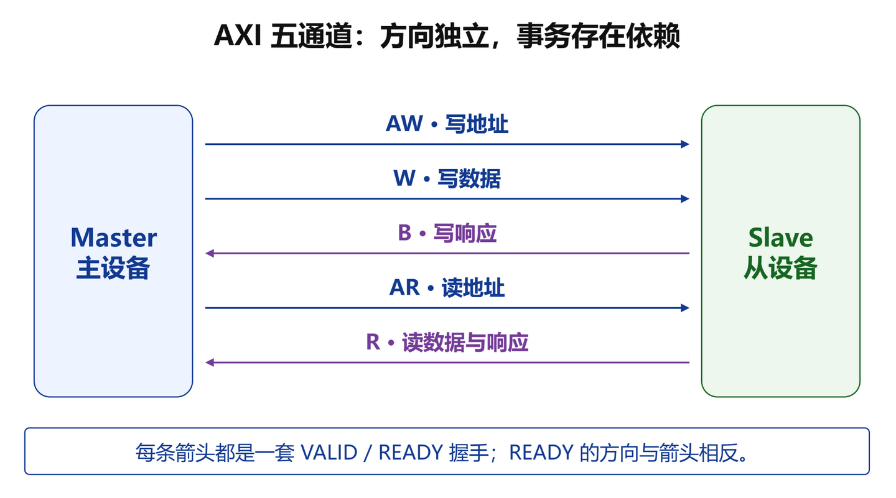

图 1：AXI 五通道与信息方向（教学重绘）

图中 AW（Write Address，写地址）、W（Write Data，写数据）由主设备发出，B（Write Response，写响应）由从设备返回；AR（Read Address，读地址）由主设备发出，R（Read Data，读数据）返回数据及响应。每个通道都由发送方驱动 VALID（有效指示），接收方驱动 READY（接收就绪指示）。

| 通道 | 发送方驱动 | 接收方驱动 |
| --- | --- | --- |
| AW | 主设备：`AWVALID` 和地址/控制 | 从设备：`AWREADY` |
| W | 主设备：`WVALID`、数据、字节使能、末拍标志 | 从设备：`WREADY` |
| B | 从设备：`BVALID` 和写响应 | 主设备：`BREADY` |
| AR | 主设备：`ARVALID` 和地址/控制 | 从设备：`ARREADY` |
| R | 从设备：`RVALID`、数据、响应、末拍标志 | 主设备：`RREADY` |

<span style="background-color:#FBC952;color:#4A3410;font-weight:700;">五个通道各自握手，但属于同一笔事务的请求、数据与响应仍有依赖关系。</span>

依据：A3.2.2，A3-42～A3-43；A3.3，A3-44。

## 2. A3.1：时钟与复位——先确定在哪一刻判断

### 2.1 读图：一次复位退出后的读地址握手

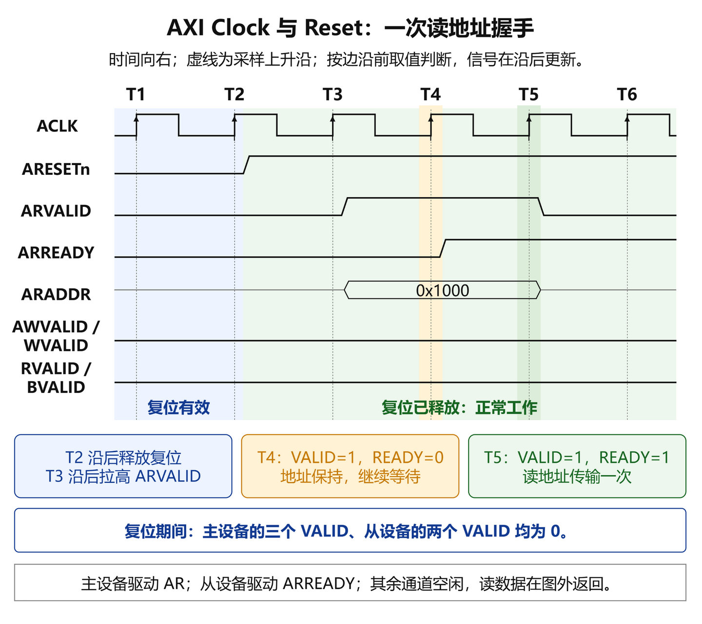

图 2：同步退出复位后的读地址握手（教学重绘）

1. `T1`、`T2` 采样前，`ARESETn=0`，接口处于复位；五个 VALID 都为 0。
2. `T2` 上升沿触发复位同步释放，图中在沿后画出 `ARESETn` 变高。`T3` 是随后确认复位已高的上升沿，主设备在 `T3` 沿后提供地址并拉高 `ARVALID`。
3. `T4` 时 `ARVALID=1`、`ARREADY=0`，没有传输，地址必须继续保持。
4. `T5` 时两者均为 1，地址传输一次；主设备可在该沿之后撤销 `ARVALID` 或提供下一笔地址。本图随后撤销。

这里仅展示地址阶段，R 数据响应在图外返回；不能把 `T5` 解释成整笔读事务已经结束。图中的 `ARREADY` 复位值是示例选择，不是协议要求。

### 2.2 时钟与复位的通用规则

ACLK 是 AXI 接口时钟；ARESETn 是 AXI 低有效复位，后缀 `n` 表示低电平有效。

1. <span style="background-color:#FBC952;color:#4A3410;font-weight:700;">输入在 ACLK 上升沿采样；正常运行的输出变化只能发生在上升沿之后。</span>
2. 主设备、从设备接口的输入与输出之间不能有组合逻辑通路。因此，“READY 可以等待 VALID”描述的是协议依赖许可，不表示可以直接组合连接两者。
3. 复位允许异步置为有效，释放必须与 `ACLK` 上升沿同步。异步复位动作应与正常时钟驱动的信号更新区分。
4. 复位期间主设备必须将 `ARVALID/AWVALID/WVALID` 拉低，从设备必须将 `RVALID/BVALID` 拉低；其他信号没有统一的复位取值要求。
5. 主设备最早只能在 `ARESETn` 已经为高之后的上升沿开始驱动 VALID 为高，不能在复位仍有效时发出请求。

依据：A3.1.1～A3.1.2，A3-40。

## 3. A3.2：VALID / READY——握手只看采样沿

### 3.1 VALID 先到：等待不等于多次传输

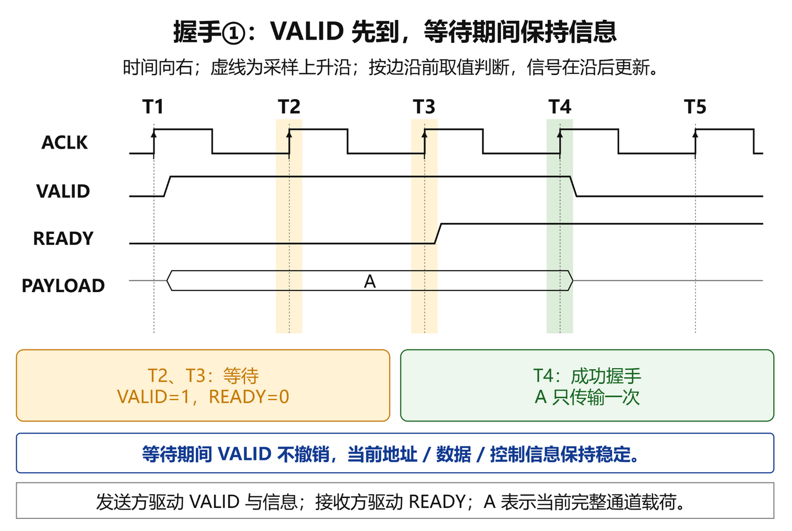

图 3：VALID 先到，等待期间载荷保持（教学重绘）

1. `T1` 沿后，发送方提供载荷 A 并拉高 VALID。
2. `T2`、`T3` 都只有 VALID 为 1，接收方没有接收；A 必须保持，不能换成下一份信息。
3. `T4` 两者均为 1，A 成功传输一次。A 虽跨越多个周期，成功握手只有一次。

Payload（载荷）指该通道本次发送的全部地址、数据或控制字段。在 W 通道，等待时不仅 `WDATA` 不能变，`WSTRB`、`WLAST` 也要保持；R 通道同样包括 `RDATA`、`RRESP`、`RLAST` 及适用的 ID（Identifier，事务标识）。

<span style="background-color:#FBC952;color:#4A3410;font-weight:700;">VALID 一旦拉高，就必须连同当前载荷保持到成功握手；等待期间不能撤销或替换当前拍。</span>

### 3.2 READY 先到：先声明接收能力

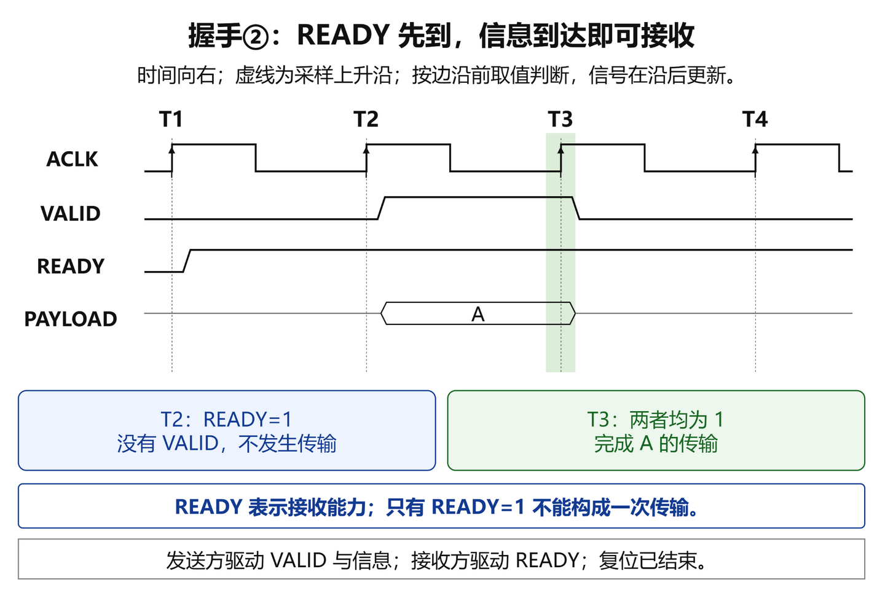

图 4：接收方先就绪（教学重绘）

1. `T2` 时 READY 已为 1，但 VALID 为 0，没有传输。
2. `T2` 沿后，发送方提供 A 并拉高 VALID；`T3` 完成一次握手。

READY 可以先拉高，也可以在尚未出现 VALID 时撤销。它不承担“必须保持到将来某次传输”的义务；但在某个采样沿两者均为 1 时，接收方就必须接收本次信息。

### 3.3 同时就绪与连续传输

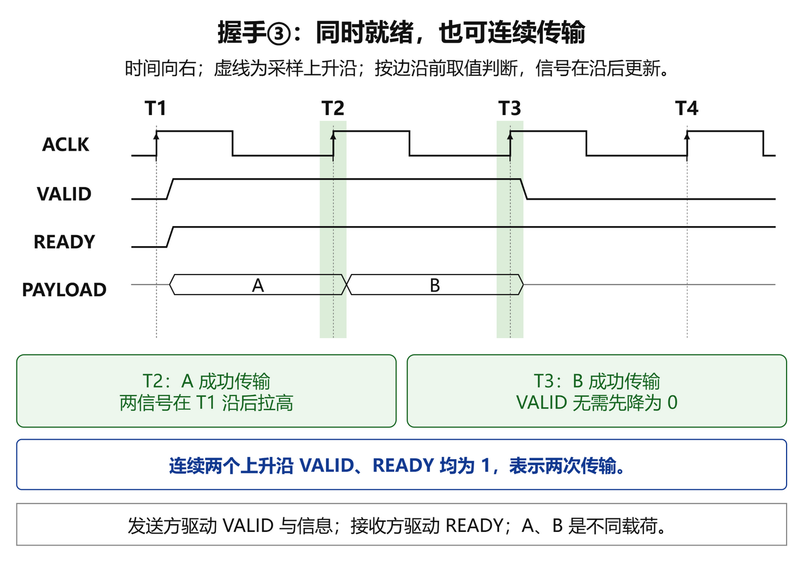

图 5：同时就绪后连续传输两份载荷（教学重绘）

1. `T1` 沿后双方都就绪，`T2` 传输 A。
2. `T2` 沿后发送方换成 B，VALID 保持高；`T3` 传输 B。
3. `T3` 沿后 VALID 降低，后面没有继续传输。

<span style="background-color:#FBC952;color:#4A3410;font-weight:700;">VALID 不需要在两次握手之间先降为 0；连续每个采样沿满足 VALID 与 READY 同为 1，就连续传输。</span>

三种时序都使用同一个判断表达式。下面的表达式应在 `ACLK` 上升沿求值：

```systemverilog
transfer = VALID && READY;
```

它只表示本通道本次传输，不自动代表整个读写事务完成。

依据：A3.2.1，A3-41～A3-42。

### 3.4 依赖方向与五通道的具体要求

1. <span style="background-color:#FBC952;color:#4A3410;font-weight:700;">发送方不能等待对应 READY 才产生 VALID；接收方可以等待 VALID 再产生 READY。</span>
2. AW、AR 只有在地址及控制有效时才能拉高 VALID；W、R 只有在当前数据有效时才能拉高 VALID；B 只有在响应有效时才能拉高 VALID。
3. 规范推荐 `AWREADY/ARREADY` 默认高，以减少等待开销；这是推荐，不是必须恒高。
4. `WREADY/BREADY/RREADY` 可以默认高，前提是接收方确实能立即接受相应数据或响应。READY 不能虚报接收能力。
5. 最后一拍写数据必须带 `WLAST=1`，最后一拍读数据必须带 `RLAST=1`。LAST 是随数据拍一起握手的末拍标志，不是独立的结束脉冲。
6. 即使从设备只有一种读数据来源，也不能无请求主动拉高 RVALID。规范推荐将不参与传输的读写字节通道数据置零，但这不是有效数据的判断依据。

Backpressure（反压）指接收方用 READY 为低暂缓接收。没有超时上限的基本握手规则不等于系统可以无限等待；超时策略需要由具体系统另外定义。

依据：A3.2.2，A3-42～A3-43；A3.3.1，A3-44。

## 4. A3.3：通道之间——可以独立走，但不能乱返回

### 4.1 AW 与 W 的三种先后顺序

下面三图均是 AXI4 单拍写，地址、写数据和写响应各握手一次。AW 和 W 的载荷在各自 VALID 有效期间保持；图中固定 `AWLEN=0`，唯一数据拍就是末拍，数据和地址的具体数值不影响先后关系。

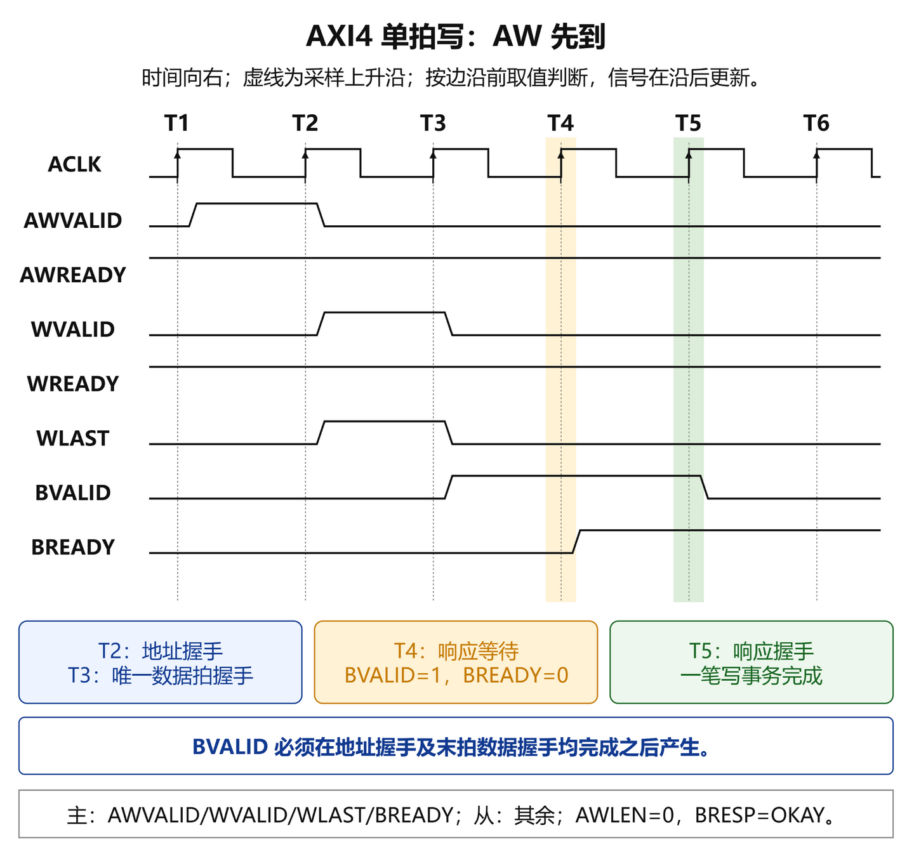

图 6：AW 先于 W 握手（教学重绘）

1. `T2` 地址被接收，`T3` 接收末拍写数据。
2. `T4` 响应已经有效，但 `BREADY=0`，响应保持。
3. `T5` 写响应被接收，本笔写事务在接口处完成。

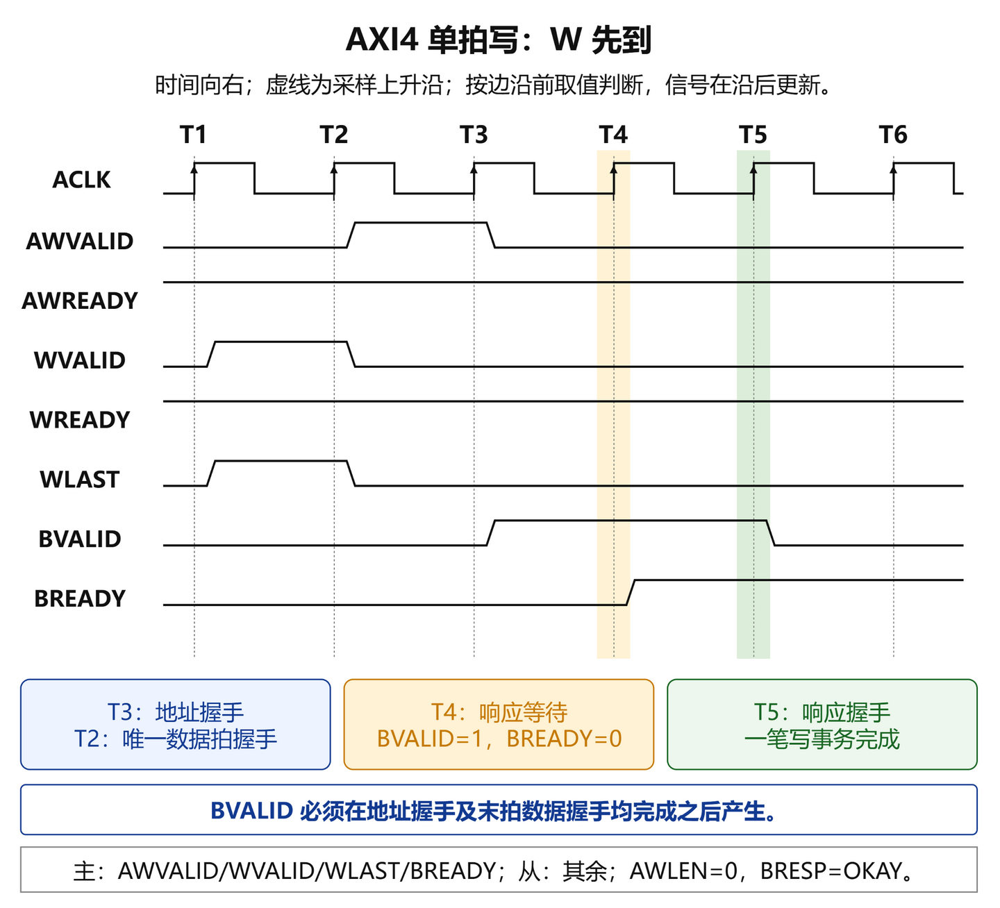

图 7：W 先于 AW 握手（教学重绘）

1. `T2` 从设备先接收唯一写数据拍，`T3` 才接收地址。
2. 从设备具备暂存这份数据的能力；收到末拍数据并不允许它绕过地址接收条件提前返回 AXI4 写响应。
3. `T4` 等待响应接收，`T5` 完成 B 握手。

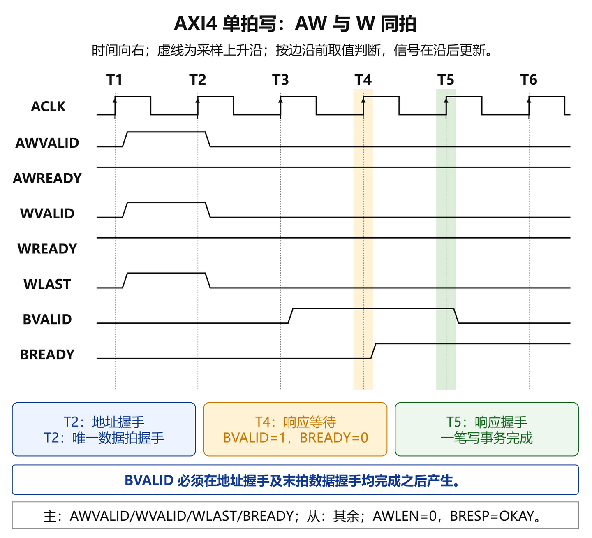

图 8：AW 与 W 在同一采样沿握手（教学重绘）

1. `T2` 两个独立通道都完成握手。
2. 本例从设备在 `T3` 沿后产生 BVALID，`T4` 等待，`T5` 完成响应。这里插入的处理延迟是示例选择；条件满足后，也可以更早产生响应。

<span style="background-color:#FBC952;color:#4A3410;font-weight:700;">AXI 不要求 AW 一定先于 W；AXI4 的 BVALID 必须在对应 AW 握手和带 WLAST 的末拍 W 握手都完成之后产生。</span>

不同通道可能经过不同数量的 Register Slice（寄存器切片，用寄存器分段传递接口信号），因此数据可能比地址更早到达。互连需要根据地址选择从设备时，必须重新配对地址与数据，只向正确目标发送有效写数据。通道独立不能省掉路由和配对。

### 4.2 两拍读：最后一拍被反压

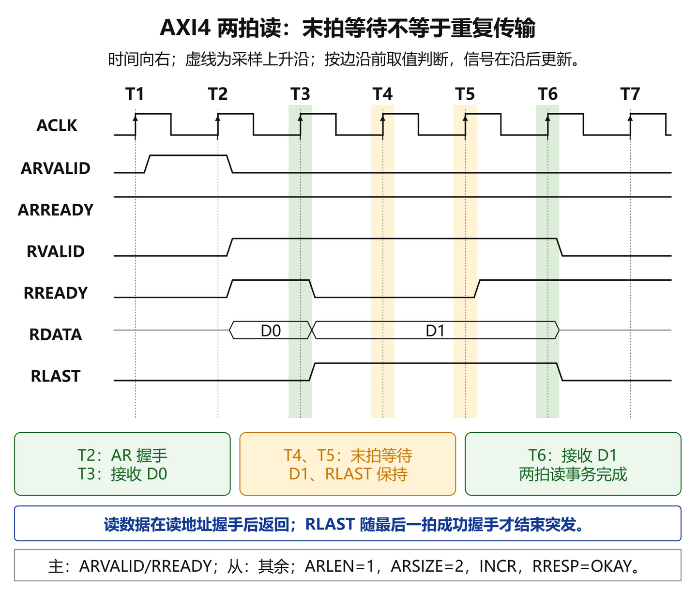

图 9：地址握手、两拍读数据及末拍反压（教学重绘）

1. `T2` 完成 AR 握手，从设备随后提供第一拍 D0。
2. `T3` 接收 D0；它不是末拍，`RLAST=0`。
3. `T4`、`T5` 的 `RREADY=0`，D1 和 `RLAST=1` 保持；此时不能增加已接收拍数。
4. `T6` 接收 D1，带末拍标志的读数据握手使这笔两拍读事务完成。

<span style="background-color:#FBC952;color:#4A3410;font-weight:700;">RVALID 只能在对应读地址握手之后产生，且不能等待 RREADY 才产生；RLAST 只有随末拍成功握手才表示读突发完成。</span>

### 4.3 防死锁规则与版本差异

Deadlock（死锁）是双方都在等对方先动作，导致事务无法继续。

1. 主设备的 `AWVALID/WVALID` 不能以从设备的 `AWREADY/WREADY` 为前提。例如主设备等 AWREADY 才给 WVALID，而从设备等 WVALID 才给 AWREADY，就会形成死锁。
2. 从设备允许等待 `AWVALID`、`WVALID` 或两者后才给 `AWREADY/WREADY`，也允许提前就绪。
3. 从设备不能等待 `BREADY` 才拉高 BVALID；主设备可以等待 BVALID 才拉高 BREADY。读通道对应的 AR、R 依赖规则同理。
4. 发出写请求后，主设备必须能够提供该事务的全部写数据，不能依赖自己另一笔事务先完成；发出读请求后，也必须能够接收其全部读数据，不能造成跨事务循环等待。
5. 相同 ID 的读数据返回顺序可以作为主设备安排接收资源的依据；不同 ID 的接收资源和排序需要相应处理，详见 A5。

| 版本 | 对 BVALID 的关键依赖 | 兼容含义 |
| --- | --- | --- |
| AXI3 | 必须已经接收末拍写数据 | A3 的旧依赖图没有额外明确要求地址先被接收 |
| AXI4、AXI5 | 地址握手及末拍数据握手均已完成 | 两个条件都要属于对应事务 |

旧 AXI3 从设备若在接收地址前就返回响应，需要 Wrapper（适配封装）延迟响应，确保该地址已被从设备接收，才能满足新版本要求。规范也强烈推荐新 AXI3 从设备采用这项附加依赖。AXI3 主设备满足这里的 AXI4/AXI5 写响应要求，不代表其他信号差异无需适配。

AXI4/AXI5 从设备发出写响应意味着承担对后续事务的相关冲突检查责任；响应不必然等于数据已写入最终存储介质，具体完成保证还涉及 A4 属性。

原文依赖图的单箭头表示允许前后任意顺序，双箭头表示必须等待前置条件；不能把所有箭头都读成固定流水线时序。

依据：A3.3～A3.3.2，A3-44～A3-47。

## 5. A3.4.1：事务结构——一次地址描述多拍数据

`AxADDR/AxLEN/AxSIZE/AxBURST` 中的 `x` 代表 W 或 R，例如 AxLEN 代表 AWLEN 或 ARLEN，不是另一套物理信号。

### 5.1 长度、大小与类型

| 字段 | 解码方式 | 示例 |
| --- | --- | --- |
| `AxLEN` | 数据拍数为编码值加 1 | `3` 表示 4 拍，`0` 表示 1 拍 |
| `AxSIZE` | 每拍最大字节数为 `2 ** AxSIZE` | `2` 表示最大 4 Byte/拍 |
| `AxBURST` | `00` FIXED，`01` INCR，`10` WRAP | `11` 保留，不是第四种突发 |

Byte（字节）为 8 bit（位）。AxSIZE 的 3 位编码 `0～7` 依次表示 `1、2、4、8、16、32、64、128` 字节；传输大小不能超过事务任一端的数据总线宽度。

<span style="background-color:#FBC952;color:#4A3410;font-weight:700;">AxSIZE 是每拍最大传输字节数，不保证每拍都写这么多字节；非对齐首拍和 WSTRB 都可能减少有效字节。</span>

| 版本 / 类型 | 合法拍数 | 编码注意 |
| --- | --- | --- |
| AXI3 | INCR、FIXED 为 1～16，WRAP 为 2/4/8/16 | LEN 使用 4 位 |
| AXI4 INCR | 1～256 | LEN 使用 8 位 |
| AXI4 FIXED | 1～16 | 不能因为 LEN 是 8 位就使用 256 拍 |
| AXI4 WRAP | 2、4、8、16 | 起始地址还必须按每拍大小对齐 |

FIXED（固定地址突发）重复访问同一地址，适合 FIFO（First In First Out，先进先出队列）。INCR（Incrementing，递增突发）用于顺序地址。WRAP（Wrapping，回绕突发）在固定窗口内回到低地址，常用于缓存行访问。

### 5.2 从具体地址看三种规则

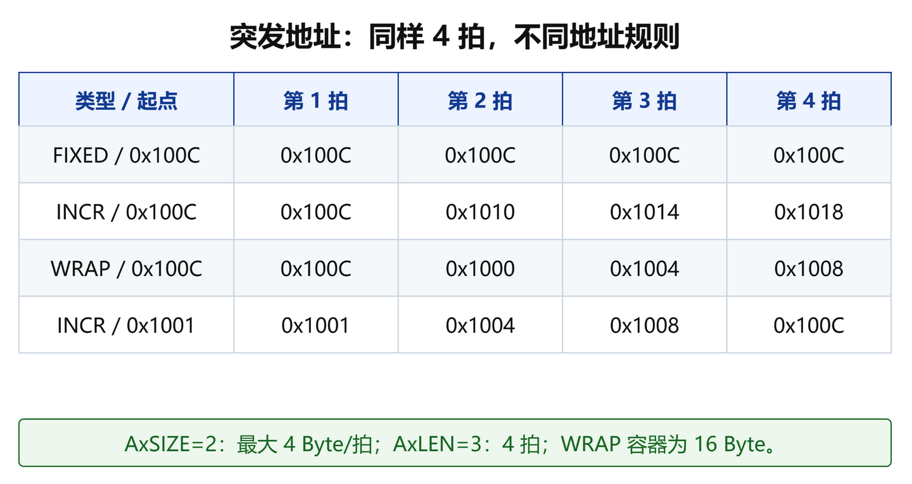

图 10：三种突发及非对齐 INCR 的逐拍地址（教学重绘）

先比较前三行：同样 4 拍、最大 4 字节/拍，FIXED 不移动，INCR 向高地址走，WRAP 则在 16 字节窗口内回绕。WRAP 从 `0x100C` 开始，窗口为 `0x1000～0x100F`；下一拍回到 `0x1000`，不访问 `0x1010`。

最后一行的起点是 `0x1001`，第二拍为 `0x1004`，不是 `0x1005`。后续地址从对齐后的边界计算。

为便于手算，定义 `S` 为起始地址、`B` 为每拍最大字节数、`L` 为拍数、`A` 为向下对齐地址、`C` 为容器大小。下面所有除法向下取整，`n` 从 1 开始：

```text
B = 2 ** AxSIZE
L = AxLEN + 1
A = floor(S / B) * B
C = B * L
W = floor(S / C) * C

FIXED：address(n) = S
INCR ：address(1) = S
       address(n) = A + (n - 1) * B，n >= 2
WRAP ：address(n) = W + ((S - W + (n - 1) * B) mod C)
```

WRAP 公式以合法 WRAP 为前提：`S` 按 B 对齐，L 只能为 `2/4/8/16`。它要求按每拍大小对齐，不要求从回绕窗口最低地址开始。

Transaction Container（事务容器）表示规范用于描述事务潜在字节范围的窗口，以上界不包含在内的区间表示：INCR 为 `[A, A+C)`；WRAP 为 `[W, W+C)`。不要把容器大小直接当作非对齐事务的实际有效字节数。

### 5.3 4KB 边界与不能提前结束

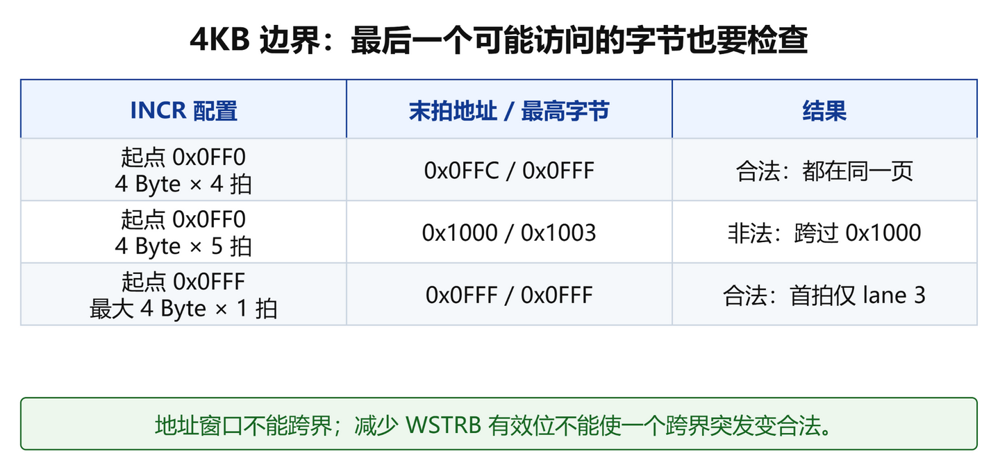

图 11：按完整地址范围检查 4KB 边界（教学重绘）

第一行最后可能访问 `0x0FFF`，合法；第二行访问到下一页，非法；第三行的非对齐单拍只覆盖 `0x0FFF`，不能用“起点直接加 4 字节”误判跨界。

对合法大小和长度的 INCR，最高可能访问字节是 `A + B*L - 1`；用它与起点比较 4KB 页号。WRAP 检查回绕窗口，FIXED 检查重复访问的同一拍字节范围，不能把 INCR 的累计递增公式直接套到 FIXED。

1. <span style="background-color:#FBC952;color:#4A3410;font-weight:700;">任何突发都不能跨 4KB 地址边界，也不能提前终止。</span>
2. 不再需要后续写入时，可将后续 WSTRB 全部置 0，但剩余数据拍仍要完成握手，并在真正末拍给 WLAST。
3. 读数据即使被主设备丢弃，仍必须完成所有数据传输。对读取就弹出的 FIFO，发出多余读取再丢弃会造成数据丢失，因此长度必须精确匹配需求。
4. AXI4 大于 16 拍的 INCR 可被转换为多个短突发，即使它标记为 Non-modifiable（不可修改事务）；拆分时除长度与相应地址外，要保留原事务特征。这是兼容长突发的规则，不是提前终止许可。
5. Exclusive Access（独占访问，用于条件式原子更新）还有 A7 规定的附加限制；不能只用本节普通突发条件判断独占访问是否合法。

依据：A3.4.1，A3-48～A3-51。

## 6. A3.4.2：把地址与字节通道计算连起来

Byte Lane（字节通道）是数据总线中固定的 8 位分组。设总线宽度为 D 字节，对某拍地址 `addr`：所在总线字的基址为 `floor(addr/D)*D`，最低有效 lane 为 `addr mod D`。

下面是依据规范重新组织的教学算法，不涉及握手调度。输入需先通过类型、长度、大小、对齐及 4KB 合法性检查；每个输出元素描述一拍允许访问的字节范围。

```python
def describe_beats(start, size, length, bus_bytes, burst):
    step = 1 << size
    aligned_start = (start // step) * step
    span = step * length
    wrap_low = (start // span) * span
    address = start
    result = []
    for index in range(length):
        word_base = (address // bus_bytes) * bus_bytes
        low_lane = address - word_base
        high_lane = (address // step) * step + step - 1 - word_base
        result.append((address, low_lane, high_lane))
        if burst == "INCR":
            address = aligned_start + (index + 1) * step
        elif burst == "WRAP":
            address = wrap_low + ((address - wrap_low + step) % span)
        # FIXED 保持 address，非对齐时每拍也保持原字节窗口。
    return result
```

`high_lane` 通过按传输大小向下对齐，正确处理非对齐首拍；INCR 后续拍对齐，FIXED 则每拍重复同一个窗口。写传输的 WSTRB 只能在 `low_lane～high_lane` 中选取子集；读传输按地址和大小确定有效字节，没有读字节使能信号。

原文伪代码中的读写操作分别表示对当前允许字节范围执行一次数据操作，并不意味着可以跳过 VALID/READY 握手。写监视器应在 W 握手时增加拍数，读监视器应在 R 握手时增加拍数，而不是每个时钟无条件推进这里的循环。

依据：A3.4.1 地址及字节通道公式，A3-50～A3-51；A3.4.2，A3-52～A3-53。

## 7. A3.4.3：Regular 属性——接口可以约定只使用规则子集

Regular（规则事务）描述一组受限的事务形状，目的是让特定接口简化译码。它不是新增的逐事务物理信号，也不是允许普通 AXI4 随意拒绝合法突发的开关。

本地 IHI 0022H 的 A3-53 将筛选项写为：`AxLEN` 取 `1、2、4、8、16`；大于 1 时，`AxSIZE` 与数据总线宽度一致；类型为 INCR 或 WRAP；INCR 起点按事务容器对齐；WRAP 起点按传输大小对齐。

**版本文字核对说明：**这里的原文使用了 `AxLEN/AxSIZE` 字段名称描述长度和大小，存在编码与解码量混用的歧义。例如前文明确规定拍数为 `AxLEN+1`，不能在此悄悄把原句改写成一条编码约束。本文保留其定义范围及互操作含义，但不据这段含混文字提供 Regular 判定代码；实现该属性时应核对适用版本及其勘误。普通突发仍严格按第 5 节的 LEN/SIZE 编码计算。

| `Regular_Transactions_Only` | 接口声明的含义 |
| --- | --- |
| `True` | 主设备只发 Regular，或从设备只支持 Regular |
| `False` | 不以 Regular 子集限制合法的突发类型、大小和长度组合 |
| 未声明 | 按 `False` 处理 |

IHI 0022H 只允许 AXI5、ACE5、ACE5-Lite、ACE5-LiteDVM 接口将该属性设为 True。ACE（AXI Coherency Extensions，AXI 缓存一致性扩展）相关接口在这里仅用于说明属性适用范围，不展开一致性机制；DVM（Distributed Virtual Memory，分布式虚拟内存）为相应接口名称的一部分。

| 主设备声明 | 从设备 False | 从设备 True |
| --- | --- | --- |
| False | 兼容 | 不兼容，可能收到非 Regular 事务 |
| True | 兼容 | 兼容 |

<span style="background-color:#FBC952;color:#4A3410;font-weight:700;">只支持 Regular 的从设备不能直接接收可能发出非 Regular 事务的主设备，否则可能出现数据损坏或死锁。</span>

依据：A3.4.3，A3-53，表 A3-4。此节为版本限定内容，不作为本文 AXI4 示例的裁剪依据。

## 8. A3.4.4：数据布局——哪些字节真正参与传输

### 8.1 WSTRB：地址范围内再选择要写的字节

WSTRB（Write Strobes，写字节选通）每一位控制 WDATA 的一个字节。先看 32 位总线的对应关系。

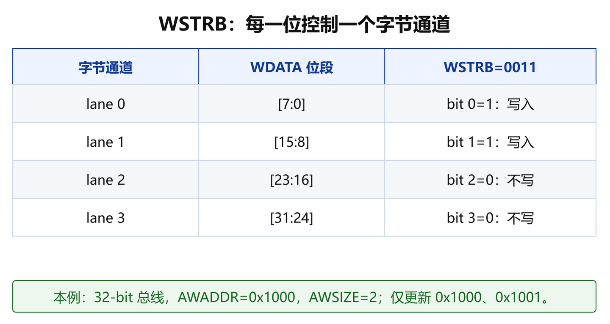

图 12：WSTRB 与 WDATA 字节通道（教学重绘）

本例地址 `0x1000`、大小 4 字节允许 lane 0～3；`WSTRB=0011` 只选择其中两个，所以仅写 `0x1000` 和 `0x1001`。未选中字节不写入，不是把存储器中的这些字节写成 0。

1. <span style="background-color:#FBC952;color:#4A3410;font-weight:700;">WSTRB[n] 对应 WDATA[8n+7:8n]，只能在当前地址和大小允许的字节通道范围内置 1。</span>
2. 有效写拍可以使用全零 WSTRB；该拍仍需要握手并计入长度。
3. `WVALID=0` 时 WSTRB 可取任意值，规范推荐全零或保持先前值。
4. FIXED 的允许字节窗口每拍相同，但窗口内具体哪些 WSTRB 位为 1 可以随拍改变。

### 8.2 Narrow Transfer：传输比总线窄

Narrow Transfer（窄传输）表示 `2 ** AxSIZE` 小于数据总线字节数。先把总线想成一排固定的字节槽位：32-bit 总线有 lane 0～3，64-bit 总线有 lane 0～7。某个内存地址落在哪个槽位，由它在当前总线字内的位置决定：

```text
lane = 地址 mod 总线字节数
```

例如 32-bit 总线一次覆盖 4 个连续地址：`0x00、0x01、0x02、0x03` 分别落在 lane `0、1、2、3`；下一个总线字从 `0x04` 开始，所以 `0x04 mod 4 = 0`，又回到 lane 0。lane 回到 0 不表示地址回退，而是进入了下一个 32-bit 总线字。

| 总线 / 每拍大小 | INCR 地址序列 | 使用的 lane |
| --- | --- | --- |
| 总线 / 每拍大小 | 每拍访问的地址 | 当前拍使用的 lane |
| --- | --- | --- |
| 32-bit / 1 Byte，5 拍 | `0`、`1`、`2`、`3`、`4` | `0`、`1`、`2`、`3`、`0` |
| 64-bit / 4 Byte，3 拍 | `4～7`、`8～11`、`12～15` | `4～7`、`0～3`、`4～7` |
| 64-bit / 4 Byte，WRAP 4 拍 | `4～7`、`8～11`、`12～15`、`0～3` | `4～7`、`0～3`、`4～7`、`0～3` |

逐行读表时，只做两步：

1. 先看这一拍实际访问的地址范围；地址范围有几个字节，就需要几个连续 lane。
2. 再用地址对总线字节数取模，确定它在总线中的位置；跨过总线字边界时，lane 会从 0 重新编号。

因此第一行的第 5 拍地址虽然是 `4`，它落在第二个 32-bit 总线字的第一个字节，使用 lane 0。第二行的 64-bit 总线有 8 个 lane，但每拍只有 4 Byte，所以一次只占连续 4 个 lane；起点 `4` 占 lane 4～7，地址 `8` 进入下一个总线字后占 lane 0～3。第三行只是把同样的 16 字节窗口按 WRAP 顺序重新排列。INCR/WRAP 会按每拍地址选择 lane；FIXED 保持相同 lane 窗口。不能误以为 64 位总线就要求每拍 8 字节。

### 8.2.1 逐周期案例：32-bit 总线上的 1 Byte INCR

下面只画 W 通道，接收方每拍都准备好。这样可以把“地址递增”和“lane 重新编号”分开看。

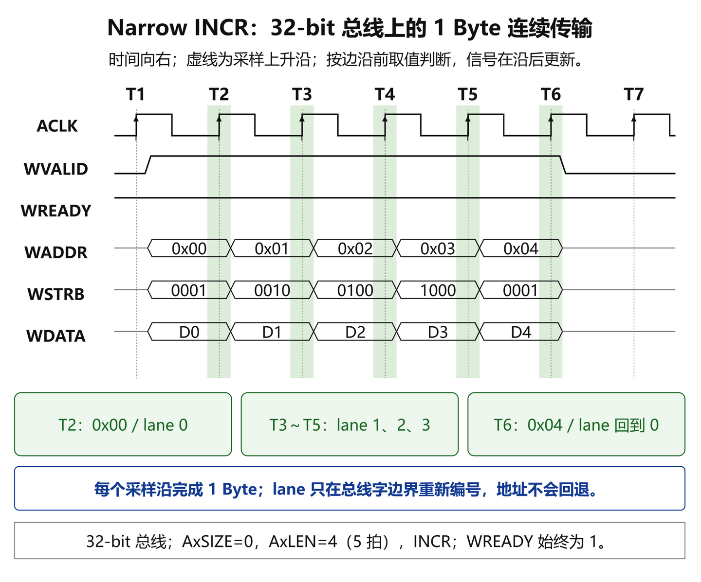

图 14：32-bit 总线、1 Byte/拍的窄传输时序（教学重绘）

1. `T2`：`WVALID=1`、`WREADY=1`，地址 `0x00` 在 lane 0，`WSTRB=0001`，完成第 1 拍。
2. `T3`：地址变为 `0x01`，落在 lane 1，`WSTRB=0010`，完成第 2 拍。
3. `T4`：地址 `0x02` 对应 lane 2，`WSTRB=0100`，完成第 3 拍。
4. `T5`：地址 `0x03` 对应 lane 3，`WSTRB=1000`，完成第 4 拍。
5. `T6`：地址进入下一个 32-bit 总线字，变为 `0x04`；`0x04 mod 4 = 0`，所以 lane 回到 0，`WSTRB` 又是 `0001`，完成第 5 拍。

这里的 `WADDR` 是教学标注，用来说明每拍目标地址；AXI 实际只在地址通道发送一次 `AWADDR`，后续地址由从设备按 `AxBURST`、`AxSIZE` 和 `AxLEN` 计算。图中的 `WSTRB` 是 4 位，从左到右按 `lane 3..lane 0` 书写，因此 lane 0 对应右侧最低位 1。

<span style="background-color:#FBC952;color:#4A3410;font-weight:700;">lane 回到 0 只说明跨过了一个总线字边界；判断地址是否连续，必须看地址序列而不是只看 lane 序列。</span>

### 8.2.2 逐周期案例：64-bit 总线上的 4 Byte INCR

截图中的第二行可以这样逐拍读。64-bit 总线有 8 个字节 lane（`lane 0～7`），但 `AxSIZE=2` 只表示每拍最多传 4 Byte，因此每拍只占其中连续 4 个 lane。

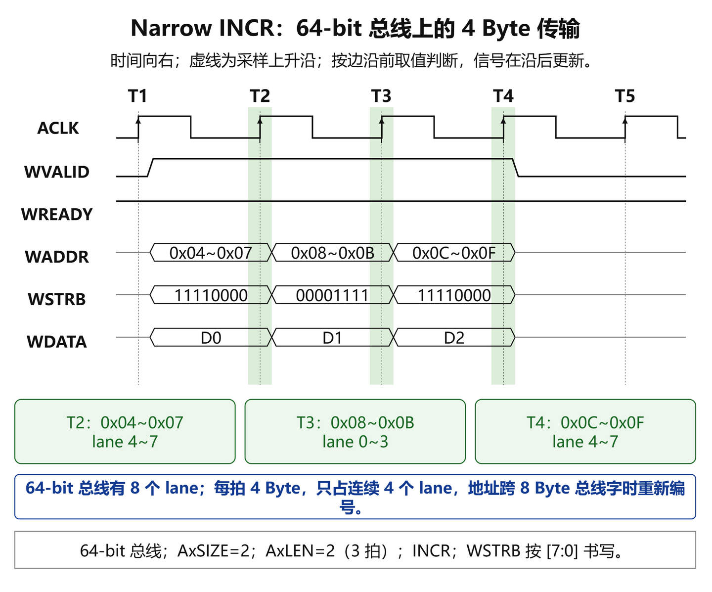

图 15：64-bit 总线、4 Byte/拍的窄传输时序（教学重绘）

1. `T2`：目标地址范围为 `0x04～0x07`，位于第一个 64-bit 总线字的高 4 个字节，因此使用 lane 4～7。按 `WSTRB[7:0]` 书写时，对应 `11110000`。
2. `T3`：地址范围为 `0x08～0x0B`，进入下一个 64-bit 总线字的低 4 个字节，因此使用 lane 0～3，对应 `00001111`。
3. `T4`：地址范围为 `0x0C～0x0F`，又位于该总线字的高 4 个字节，因此回到 lane 4～7，对应 `11110000`。

这里 lane 的变化是 `4～7`、`0～3`、再回到 `4～7`，但地址始终按 4 Byte 递增。原因是一个 64-bit 总线字覆盖 8 个连续地址，地址每增加 8，lane 编号就从 0 重新开始。`WSTRB` 的二进制位从左到右是 `lane 7..lane 0`，所以高 4 个 lane 写成 `11110000`，低 4 个 lane 写成 `00001111`。

<span style="background-color:#FBC952;color:#4A3410;font-weight:700;">总线宽度决定 lane 总数，AxSIZE 决定每拍占用的 lane 数；64-bit 总线不等于每拍必须传 8 Byte。</span>

### 8.3 Byte Invariance：端序不改变地址与 lane 的对应

Byte Invariance（字节不变性）保证某个字节地址在同一接口上总通过相同的 8 根数据线传输。Endianness（端序）决定多字节数值的各字节按什么顺序放入地址空间，不改变字节地址本身。

以数值 `0x0A0B0C0D` 为例，MSB（Most Significant Byte，最高有效字节）是 `0x0A`，LSB（Least Significant Byte，最低有效字节）是 `0x0D`：

| 内存地址 | Big-endian（大端） | Little-endian（小端） |
| --- | --- | --- |
| `Addr` | `0x0A` | `0x0D` |
| `Addr+1` | `0x0B` | `0x0C` |
| `Addr+2` | `0x0C` | `0x0B` |
| `Addr+3` | `0x0D` | `0x0A` |

两种布局占用同一段连续字节地址，只是数值中字节的顺序不同。一段结构可以让头部使用小端、载荷使用大端；访问载荷不应错误地交换或覆盖头部的字节。原图的混合端序示例还包含跨字段边界的连续 16 位字段，强调应按字节地址理解结构，而不是整条总线统一翻转。

### 8.3.1 逐周期理解：同一地址始终走同一 lane

只看上面的地址表，容易把“字节放在哪个地址”和“这个地址通过哪根数据线”混为一谈。下面把一笔 32-bit 写拆成地址握手和数据握手，再分别标出大端、小端端点送出的 `WDATA`。

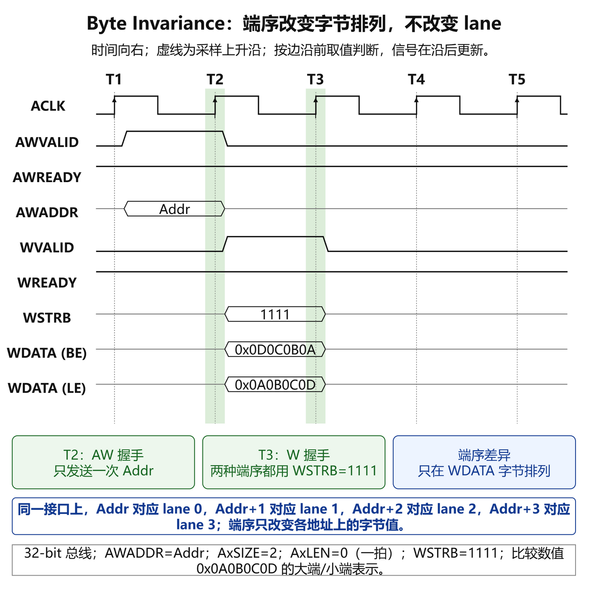

图 16：同一地址在大端、小端表示下使用相同 lane（教学重绘）

1. `T2`：`AWVALID=1` 且 `AWREADY=1`，地址 `Addr` 完成一次地址握手。AXI 的地址通道只发送一次起始地址，不会为 `Addr+1`、`Addr+2`、`Addr+3` 再发送 3 个 AW。
2. `T3`：`WVALID=1` 且 `WREADY=1`，一拍 4 Byte 的数据完成握手；`WSTRB=1111` 表示 lane 0～3 都有效。此时固定的地址到 lane 映射是：`Addr` 对应 lane 0，`Addr+1` 对应 lane 1，`Addr+2` 对应 lane 2，`Addr+3` 对应 lane 3。
3. 若端点按大端解释数值 `0x0A0B0C0D`，最低地址 `Addr` 放 `0x0A`，因此总线上的 lane 3..0 可写成 `0D 0C 0B 0A`；若按小端解释，`Addr` 放 `0x0D`，lane 3..0 可写成 `0A 0B 0C 0D`。
4. 两行 `WDATA` 的字节排列不同，但 `Addr` 仍然经过 lane 0，`Addr+1` 仍然经过 lane 1。也就是说，端序改变的是“这个地址上的字节值”，不是“这个地址选择哪根 8 位数据线”。

这里的两个 `WDATA` 只是对同一个数值的两种端点表示，用来说明端序差异；它们不是要求互连器无条件翻转整条总线。只有当连接的端点不是字节不变的，才需要额外的端序转换。

<span style="background-color:#FBC952;color:#4A3410;font-weight:700;">记忆方法：先由地址决定 lane，再由端序决定该地址放 MSB 还是 LSB；不要把整条 WDATA 按端序整体翻转来代替地址到 lane 的映射。</span>

固定访问宽度的组件要接到正确 lane；支持多种宽度的非字节不变接口可能需要转换。多数小端组件可直接连接，只支持大端传输的组件需要相应转换功能。

### 8.4 Unaligned Transfer：首拍有效字节可以少于大小

Unaligned Transfer（非对齐传输）表示起点不落在每拍大小的自然边界。下图将 `0x1001` 开始的四拍写展开。

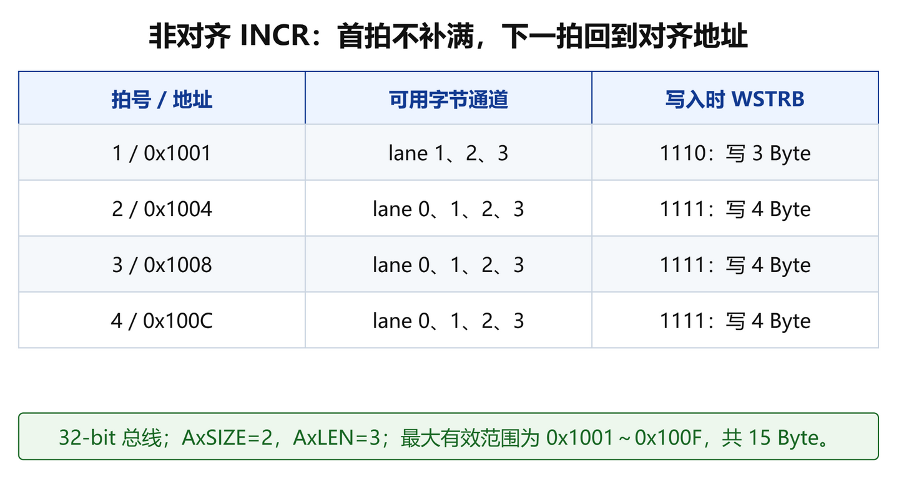

图 13：非对齐 INCR 的逐拍有效字节（教学重绘）

1. 首拍只允许 `0x1001～0x1003`，所以 lane 0 不参与，最多写 3 字节。
2. 第二拍从 `0x1004` 开始，随后为 `0x1008`、`0x100C`；后三拍各最多 4 字节。
3. 四拍最多访问 15 字节，不会为了凑满 16 字节而在首拍偷偷跨到 `0x1004`。

写操作可以用非对齐低位地址描述起点，也可以给对齐地址并用 WSTRB 屏蔽开头不写的字节；地址信息与 WSTRB 必须一致。例如 `AWADDR=0x1001、AWSIZE=2` 时首拍不能使用 `WSTRB=1111`。

<span style="background-color:#FBC952;color:#4A3410;font-weight:700;">读通道没有 WSTRB，也没有 RSTRB；读的有效字节范围由地址与大小确定，主设备只使用请求所需的字节。</span>

从设备不必为了非对齐请求自动拼出一拍“满宽连续数据”；主设备如需组合多个返回拍，应自行组织。非对齐支持也不取消 WRAP 的起点对齐要求。

为覆盖 32/64 位总线上的不同起点，下面列出规范原图对应的代表性窗口。窗口均为该拍潜在访问范围，写入仍可由 WSTRB 进一步缩小：

| 总线 / 起点 / 拍数 | 每拍大小 | 逐拍可用字节地址 |
| --- | --- | --- |
| 32-bit / `0x00` / 4 | 4 Byte | `00～03、04～07、08～0B、0C～0F` |
| 32-bit / `0x01` / 4 | 4 Byte | `01～03、04～07、08～0B、0C～0F` |
| 32-bit / `0x01` / 5 | 4 Byte | 上行后再加 `10～13` |
| 32-bit / `0x07` / 5 | 4 Byte | `07、08～0B、0C～0F、10～13、14～17` |
| 64-bit / `0x00` / 4 | 4 Byte | `00～03、04～07、08～0B、0C～0F` |
| 64-bit / `0x07` / 4 或 5 | 4 Byte | `07、08～0B、0C～0F、10～13`，5 拍再加 `14～17` |

地址序列相同不表示总线位段相同。例如地址 `0x07` 在 32 位总线上走 lane 3，在 64 位总线上走 lane 7。具体 lane 始终由地址对总线字节数取模确定。

依据：A3.4.4，A3-54～A3-58；图 A3-8～A3-15。

## 9. A3.4.5：响应——握手完成与访问成功是两个判断

RRESP（Read Response，读响应码）随每拍 R 数据返回；BRESP（Write Response，写响应码）通过 B 通道返回整笔写突发的结果。

| 编码 / 名称 | 含义 | 不能误解为 |
| --- | --- | --- |
| `00` OKAY | 普通访问成功；也可能是独占访问失败或目标不支持独占 | 所有独占操作都成功 |
| `01` EXOKAY（Exclusive Okay） | 独占读或独占写阶段成功 | 普通访问也能随意返回 |
| `10` SLVERR（Slave Error） | 已到达从设备，从设备报告错误 | 地址一定没译码到目标 |
| `11` DECERR（Decode Error） | 无法成功译码到从设备 | 可以直接丢掉整个事务 |

SLVERR 的例子包括 FIFO/缓冲上溢或下溢、不支持的传输大小、写只读地址、从设备内部超时、访问禁用或掉电功能。规范推荐只用错误响应报告错误，不把正常预期事件当作报错。

互连无法成功译码时必须返回 DECERR，规范推荐将访问送到 Default Slave（默认从设备，负责接收未映射访问并返回错误）。

1. <span style="background-color:#FBC952;color:#4A3410;font-weight:700;">一个写突发只返回一份 B 响应；一个读突发的各数据拍可以返回不同 RRESP。</span>
2. 一个 4 拍读可以返回 `OKAY、SLVERR、OKAY、OKAY`，但必须完成 4 次 R 握手，第 4 拍带 RLAST。
3. 如果整个 8 拍读请求都因目标错误而无法正常读取，仍应完成 8 拍错误响应；不能第一拍报错后取消其余 7 拍。
4. 写数据仍要完成规定拍数，产生 DECERR 的组件也要遵守完整事务要求。报错不会修改 LEN。

读下面的时序图时，始终分开问两个问题：这一拍有没有完成握手？这一拍的响应码是什么？前者由 `RVALID && RREADY` 决定，后者由 `RRESP` 或 `BRESP` 表示；握手成功不等于访问成功。

### 9.1 逐拍读响应：错误和反压都不会减少拍数

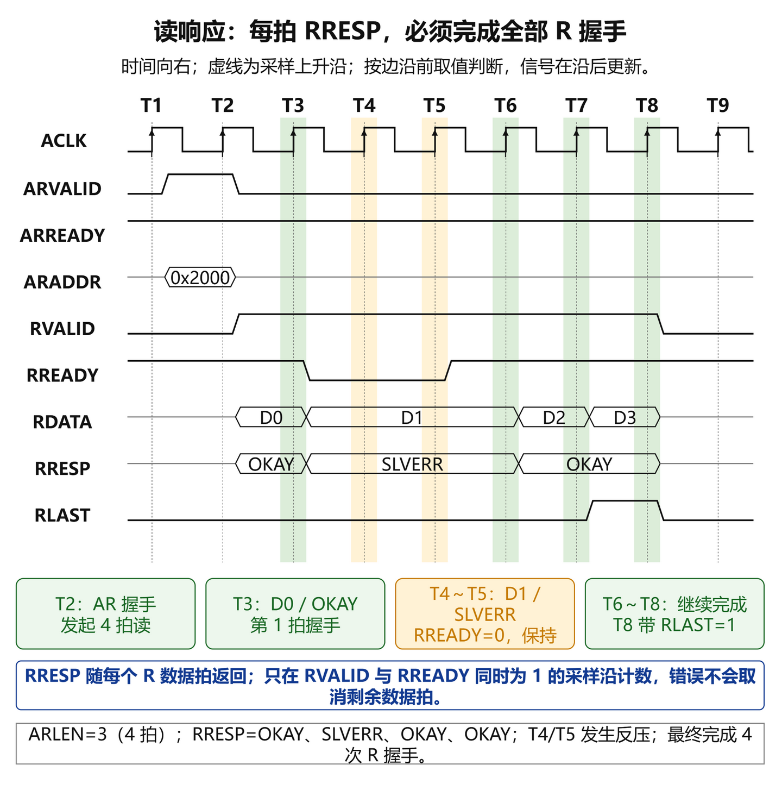

图 17：4 拍读中某一拍返回 SLVERR，并在等待后完成全部 R 握手（教学重绘）

1. `T2` 完成读地址握手；`ARLEN=3` 表示后面必须接收 4 拍 R 数据。
2. `T3` 接收 `D0`，响应为 `OKAY`。`T4`、`T5` 虽然 `RVALID=1`，但 `RREADY=0`，所以没有新的 R 握手；`D1`、`SLVERR` 和 `RLAST=0` 必须保持不变。
3. `T6` 接收 `D1`，这一拍的访问结果是 `SLVERR`，但它只是第 2 拍的结果，不会取消第 3、4 拍。
4. `T7` 接收 `D2`，`T8` 接收 `D3`；只有 `T8` 的 `RLAST=1` 随 R 握手被接收后，4 拍读突发才完整结束。

### 9.2 整笔写响应：多拍 W 数据只返回一份 B 响应

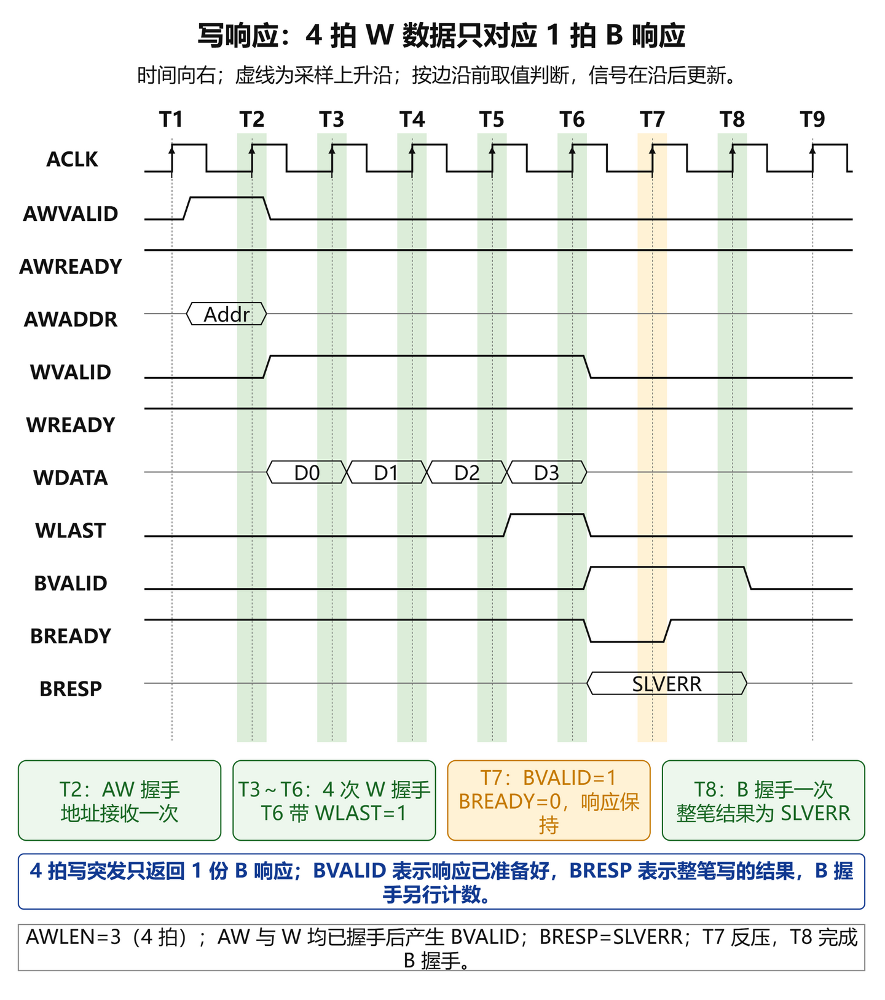

图 18：4 拍写完成后只返回一份 B 响应，B 通道单独握手（教学重绘）

1. `T2` 接收写地址，`T3`～`T6` 接收 4 拍写数据；`T6` 的 `WLAST=1` 表示这是最后一拍 W 数据。
2. `T7` 时从设备已经把 `BRESP=SLVERR` 放到 B 通道并拉高 `BVALID`，但主设备 `BREADY=0`，所以这不是 B 握手；响应必须保持。
3. `T8` 同时满足 `BVALID=1` 和 `BREADY=1`，完成唯一一次 B 握手。这个 `SLVERR` 描述整笔 4 拍写，而不是只描述 `D3`。

因此，读事务要数 R 通道成功握手的拍数，写事务要先数完 W 数据拍，再等待唯一的 B 响应握手；不要用 `SLVERR/DECERR` 代替握手计数，也不要看到错误后提前结束事务。

依据：A3.4.5，A3-59～A3-60；独占访问细节见 A7。

## 10. 易错点：把“允许”与“必须”分清

| 常见误解 | 正确理解与误解原因 | 回看位置 |
| --- | --- | --- |
| READY 一高就算传输 | 还需同一上升沿 VALID 为高；单看电平容易漏掉有效条件 | A3.2.1 |
| 等待时只需数据稳定 | 当前通道全部有效载荷都应保持；侧带控制也属于同一拍 | A3.2.1～A3.2.2 |
| READY 可等 VALID，所以可组合直连 | 协议许可与电路时序约束不同，接口输入输出无组合路径 | A3.1.1、A3.2.1 |
| WLAST 高了多个周期就是多拍 | 只数 WVALID 与 WREADY 同高的采样沿；等待可能延长末拍 | A3.2.2 |
| 地址章节先讲 AW，所以必须 AW 先到 | 教学顺序不是协议先后顺序；W 可以先到 | A3.3 |
| 看见 WLAST 就能发 AXI4 BVALID | 需要末拍已握手且地址也已握手；LAST 本身不等于接收完成 | A3.3.1 |
| AxLEN=4 表示 4 拍 | 编码加一才是拍数；实际为 5 拍 | A3.4.1 |
| 非对齐 INCR 每次从原地址加 SIZE | 第二拍起从对齐基址递增；SIZE 还是指数编码 | A3.4.1～A3.4.2 |
| WSTRB=0 就不算一拍 | 不写字节与不传输不同；有效握手仍计数 | A3.4.1、A3.4.4 |
| 报错后可以提前结束 | 响应状态与事务长度独立；剩余拍数必须完成 | A3.4.5 |

## 11. 原文覆盖对照表

| PDF 章节或页码 | 原文知识点 | 本文位置 |
| --- | --- | --- |
| A3.1.1 / A3-40 | 上升沿采样、输出更新、无组合路径 | 第 2 节 |
| A3.1.2 / A3-40，图 A3-1 | 异步置位、同步释放、复位 VALID、最早请求时刻 | 第 2 节、图 2 |
| A3.2.1 / A3-41～42，图 A3-2～4 | 三种握手顺序、保持规则、READY 撤销 | 第 3 节、图 3～5 |
| A3.2.2 / A3-42～43，表 A3-1 | 五通道握手、READY 默认值、LAST、无效 lane 推荐 | 第 1、3 节 |
| A3.3 / A3-44 | 地址数据独立、互连重新配对、跨事务资源依赖 | 第 4 节 |
| A3.3.1 / A3-44～46，图 A3-5～7 | 读依赖、AXI3 写依赖、AXI4/5 附加依赖及防死锁 | 第 4 节、图 6～9 |
| A3.3.2 / A3-47 | 旧从设备适配及新 AXI3 实现建议 | 第 4.3 节 |
| A3.4.1 / A3-48～49 | 长度、4KB、禁止提前结束、长 INCR 拆分、大小 | 第 5.1、5.3 节 |
| A3.4.1 / A3-49～51，表 A3-2～3 | 类型编码、WRAP 对齐、地址公式、字节通道、容器 | 第 5～6 节、图 10～11 |
| A3.4.2 / A3-52～53 | 逐拍地址与字节范围算法、非对齐后续拍 | 第 6 节 |
| A3.4.3 / A3-53，表 A3-4 | Regular 定义、默认属性、适用接口及互操作 | 第 7 节，含原文编码歧义说明 |
| A3.4.4 / A3-54～55，图 A3-8～9 | WSTRB、32/64 位窄传输、FIXED lane | 第 8.1～8.2 节、图 12 |
| A3.4.4 / A3-55～56，图 A3-10～12 | 大端、小端、混合端序、字节不变性与组件连接 | 第 8.3 节 |
| A3.4.4 / A3-56～58，图 A3-13～15 | 非对齐表示、32/64 位例子、64 位 WRAP | 第 8.2、8.4 节、图 13 |
| A3.4.5 / A3-59～60，表 A3-5 | 响应编码、独占含义、逐拍读/整笔写、错误不取消 | 第 9 节 |

## 12. 自测题

<details>
  <summary>1. 复位期间 ARREADY 为 1，是否违反 A3 的复位要求？</summary>

  <span style="background-color:#FBC952;color:#4A3410;font-weight:700;">不违反。复位强制为 0 的是五个 VALID，其他信号可取任意值。</span>依据：A3.1.2。

</details>

<details>
  <summary>2. VALID 连续三个采样沿为 1，READY 为 0、0、1，共传输了几次？</summary>

  <span style="background-color:#FBC952;color:#4A3410;font-weight:700;">只传输一次。</span>前两个沿是等待，当前载荷应保持到第三个沿的握手。依据：A3.2.1。

</details>

<details>
  <summary>3. WVALID=1、WREADY=0 时，能只改变 WSTRB 而保持 WDATA 不变吗？</summary>

  <span style="background-color:#FBC952;color:#4A3410;font-weight:700;">不能。WSTRB 是当前写数据拍的控制信息，等待期间也必须保持。</span>依据：A3.2.1～A3.2.2。

</details>

<details>
  <summary>4. AXI4 从设备收到末拍写数据，但还没有接收地址，可以产生 BVALID 吗？</summary>

  <span style="background-color:#FBC952;color:#4A3410;font-weight:700;">不可以。还必须等待对应 AW 握手完成。</span>依据：A3.3.1。

</details>

<details>
  <summary>5. 从设备能等 RREADY=1 之后才决定拉高 RVALID 吗？</summary>

  <span style="background-color:#FBC952;color:#4A3410;font-weight:700;">不能以 RREADY 为产生 RVALID 的前提。</span>收到读请求且数据准备好后，应独立提供有效数据。依据：A3.3.1。

</details>

<details>
  <summary>6. AXI4 的 FIXED 突发能用 AxLEN=255 发 256 拍吗？</summary>

  <span style="background-color:#FBC952;color:#4A3410;font-weight:700;">不能。256 拍扩展适用于 INCR，FIXED 最多 16 拍。</span>依据：A3.4.1。

</details>

<details>
  <summary>7. WRAP 起点 0x100C、AxSIZE=2、AxLEN=3，第二拍地址是什么？</summary>

  <span style="background-color:#FBC952;color:#4A3410;font-weight:700;">0x1000。</span>4 拍乘每拍 4 字节形成 16 字节窗口，递增到窗口上界时回绕。依据：A3.4.1。

</details>

<details>
  <summary>8. 32 位总线，INCR 起点 0x1001、AxSIZE=2，首拍可以用 WSTRB=1111 吗？</summary>

  <span style="background-color:#FBC952;color:#4A3410;font-weight:700;">不可以。lane 0 对应 0x1000，在首拍允许范围之外；全选可用字节时应为 1110。</span>依据：A3.4.4。

</details>

<details>
  <summary>9. INCR 起点 0x0FF0、AxSIZE=2、AxLEN=4，是否跨 4KB？</summary>

  <span style="background-color:#FBC952;color:#4A3410;font-weight:700;">跨界，非法。</span>这是 5 拍，末拍地址为 0x1000，最高可能访问 0x1003。依据：A3.4.1。

</details>

<details>
  <summary>10. 四拍读的第二拍返回 SLVERR，能省略第三、第四拍吗？</summary>

  <span style="background-color:#FBC952;color:#4A3410;font-weight:700;">不能。必须完成四拍，在第四拍标记 RLAST。</span>错误响应不会取消剩余数据传输。依据：A3.4.5。

</details>

## 13. 下一章：事务属性为何影响完成含义

A3 解决“什么时候接收了一拍、整笔事务如何组织”。A4 Transaction Attributes（事务属性）进一步说明请求经过缓存、缓冲和互连时允许怎样处理，以及某些访问的写响应意味着什么。进入 A4 前，应能独立判断握手、AW/W/B 与 AR/R 依赖，并算出突发的地址和有效字节范围。

参考来源：Arm IHI 0022H《AMBA AXI and ACE Protocol Specification》，Chapter A3，A3-39～A3-60；相关补充章节为 A4、A5、A7。本文以本地 ID040120 版本核对，Regular 小节的编码歧义已在第 7 节显式标记。

本文为个人学习导读，不是 Arm 官方文档。协议设计与实现应以适用版本的官方规范为准。
