# A3：单接口要求 / Single Interface Requirements

> <span style="color:#D9822B;">译文性质：Arm 规范的非官方中英双语对照翻译。</span>
>
> <span style="color:#D9822B;">原始文档：Arm IHI 0022H《AMBA AXI and ACE Protocol Specification》。</span>
>
> <span style="color:#D9822B;">版本：Issue H，ID040120。</span>
>
> <span style="color:#D9822B;">范围：Chapter A3，原文章节页码 A3-39～A3-60。</span>
>
> <span style="color:#D9822B;">说明：中文与对应英文原文按原文顺序完整保留；省略每页重复的页眉、页脚、版权行和物理页码。</span>

本章说明单个 Master 与 Slave 之间的基本 AXI 协议 transaction 要求。本章包含以下各节：

- 时钟与复位，见第 A3-40 页。
- 基本读写 transaction，见第 A3-41 页。
- 通道之间的关系，见第 A3-44 页。
- Transaction 结构，见第 A3-48 页。

> **原文（English）**
>
> This chapter describes the basic AXI protocol transaction requirements between a single master and slave. It contains the following sections:
>
> - Clock and reset on page A3-40
> - Basic read and write transactions on page A3-41
> - Relationships between the channels on page A3-44
> - Transaction structure on page A3-48

## A3.1 时钟与复位 / Clock and reset

本节说明实现 AXI 全局时钟信号 `ACLK` 和复位信号 `ARESETn` 的要求。

> **原文（English）**
>
> This section describes the requirements for implementing the AXI global clock and reset signals ACLK and ARESETn.

### A3.1.1 时钟 / Clock

每个 AXI 接口都有一个时钟信号 `ACLK`。所有输入信号都在 `ACLK` 的上升沿采样。所有输出信号只能在 `ACLK` 的上升沿之后发生变化。

> **原文（English）**
>
> Each AXI interface has a single clock signal, ACLK. All input signals are sampled on the rising edge of ACLK. All output signal changes can only occur after the rising edge of ACLK.

<a id="a3-no-combinational-path"></a>

Master 和 Slave 接口的输入信号与输出信号之间不得存在组合路径。

> **原文（English）**
>
> On master and slave interfaces, there must be no combinatorial paths between input and output signals.

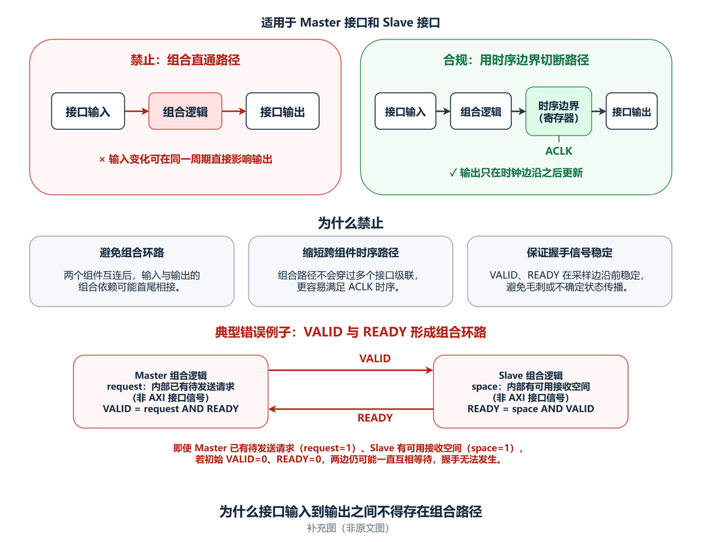


### A3.1.2 复位 / Reset

AXI 协议使用单个低电平有效的复位信号 `ARESETn`。复位信号可以异步置位，但只能与 `ACLK` 的上升沿同步撤销。

> **原文（English）**
>
> The AXI protocol uses a single active-LOW reset signal, ARESETn. The reset signal can be asserted asynchronously, but deassertion can only be synchronous with a rising edge of ACLK.

> <strong style="color:#D9822B;">思考：为什么复位可以异步置位，却必须与 <code style="color:#D9822B;">ACLK</code> 的上升沿同步释放？</strong> [查看《复位同步释放专题》](README_复位同步释放.md)


复位期间适用以下接口要求：

- Master 接口必须将 `ARVALID`、`AWVALID` 和 `WVALID` 驱动为 LOW。
- Slave 接口必须将 `RVALID` 和 `BVALID` 驱动为 LOW。
- 所有其他信号可以驱动为任意值。

> **原文（English）**
>
> During reset the following interface requirements apply:
>
> - A master interface must drive ARVALID, AWVALID, and WVALID LOW.
> - A slave interface must drive RVALID and BVALID LOW.
> - All other signals can be driven to any value.

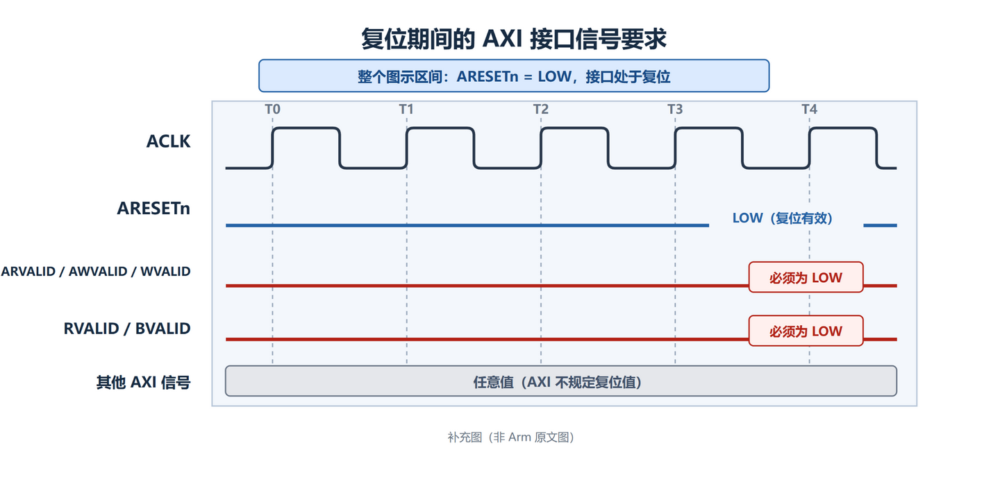


复位后，允许 Master 开始将 `ARVALID`、`AWVALID` 或 `WVALID` 驱动为 HIGH 的最早时刻，是 `ARESETn` 为 HIGH 之后的一个 `ACLK` 上升沿。图 A3-1 展示了复位后可将 `ARVALID`、`AWVALID` 或 `WVALID` 驱动为 HIGH 的最早时刻。

> **原文（English）**
>
> The earliest point after reset that a master is permitted to begin driving ARVALID, AWVALID, or WVALID HIGH is at a rising ACLK edge after ARESETn is HIGH. Figure A3-1 shows the earliest point after reset that ARVALID, AWVALID, or WVALID, can be driven HIGH.


> **原文图题（English）**：Figure A3-1 Exit from reset

## A3.2 基本读写 transaction / Basic read and write transactions

本节定义 AXI 协议 transaction 的基本机制。这些基本机制为：

- 握手过程。
- 通道信号要求，见第 A3-42 页。

> **原文（English）**
>
> This section defines the basic mechanisms for AXI protocol transactions. The basic mechanisms are:
>
> - The Handshake process
> - The Channel signaling requirements on page A3-42

### A3.2.1 握手过程 / Handshake process

全部五个 transaction 通道都使用相同的 `VALID/READY` 握手过程来传输地址、数据和控制信息。这种双向流控机制意味着 Master 和 Slave 都可以控制信息在两者之间移动的速率。源端生成 `VALID` 信号，指示地址、数据或控制信息何时可用。目的端生成 `READY` 信号，指示其可以接收该信息。只有 `VALID` 和 `READY` 信号同时为 HIGH 时才发生传输。

> **原文（English）**
>
> All five transaction channels use the same VALID/READY handshake process to transfer address, data, and control information. This two-way flow control mechanism means both the master and slave can control the rate that the information moves between master and slave. The source generates the VALID signal to indicate when the address, data, or control information is available. The destination generates the READY signal to indicate that it can accept the information. Transfer occurs only when both the VALID and READY signals are HIGH.


Master 和 Slave 接口的输入信号与输出信号之间不得存在组合路径。

<span style="color:#D9822B;">该要求的原因与结构示意见</span>[前文讲解](#a3-no-combinational-path)<span style="color:#D9822B;">。</span>

> **原文（English）**
>
> On master and slave interfaces, there must be no combinatorial paths between input and output signals.


图 A3-2 至图 A3-4 展示了握手过程的示例。

> **原文（English）**
>
> Figure A3-2 to Figure A3-4 on page A3-42 show examples of the handshake process.

如图 A3-2 所示，源端在 T1 之后给出信息并置位 `VALID` 信号。目的端在 T2 之后置位 `READY` 信号。源端必须保持其信息稳定，直到 T3 发生传输，即该置位状态被识别之时。

> **原文（English）**
>
> The source presents information after T1 and asserts the VALID signal as shown in Figure A3-2. The destination asserts the READY signal after T2. The source must keep its information stable until the transfer occurs at T3, when this assertion is recognized.


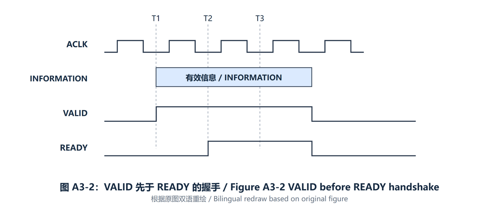

> **原文图题（English）**：Figure A3-2 VALID before READY handshake

源端不允许等到 `READY` 置位后才置位 `VALID`。

> **原文（English）**
>
> A source is not permitted to wait until READY is asserted before asserting VALID.

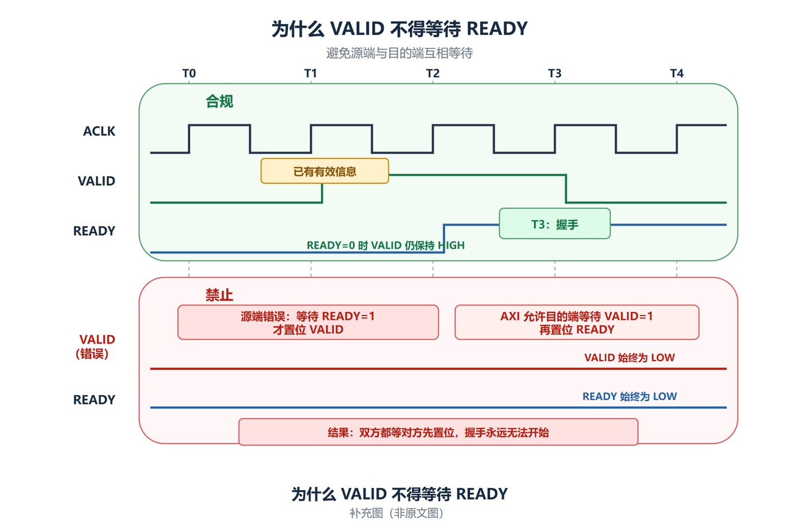

<span style="color:#D9822B;">原因：AXI 允许目的端等待 <code style="color:#D9822B;">VALID</code> 置位后再置位 <code style="color:#D9822B;">READY</code>。如果源端也等待 <code style="color:#D9822B;">READY</code> 才置位 <code style="color:#D9822B;">VALID</code>，双方就可能一直保持 LOW，形成互相等待，握手永远无法开始。因此，源端必须独立于 <code style="color:#D9822B;">READY</code> 产生 <code style="color:#D9822B;">VALID</code>。</span>


`VALID` 一旦置位，就必须保持置位，直到在某个 `VALID` 与 `READY` 同时置位的时钟上升沿发生握手。

> **原文（English）**
>
> When VALID is asserted, it must remain asserted until the handshake occurs, at a rising clock edge when VALID and READY are both asserted.


在图 A3-3 中，目的端在 T1 之后、地址、数据或控制信息有效之前置位 `READY`。该置位表示目的端可以接收信息。源端在 T2 之后给出信息并置位 `VALID`，随后在 T3 该置位状态被识别时发生传输。在此情况下，传输在一个周期内完成。

> **原文（English）**
>
> In Figure A3-3 the destination asserts READY after T1, before the address, data, or control information is valid. This assertion indicates that it can accept the information. The source presents the information and asserts VALID after T2, then the transfer occurs at T3, when this assertion is recognized. In this case, transfer occurs in a single cycle.

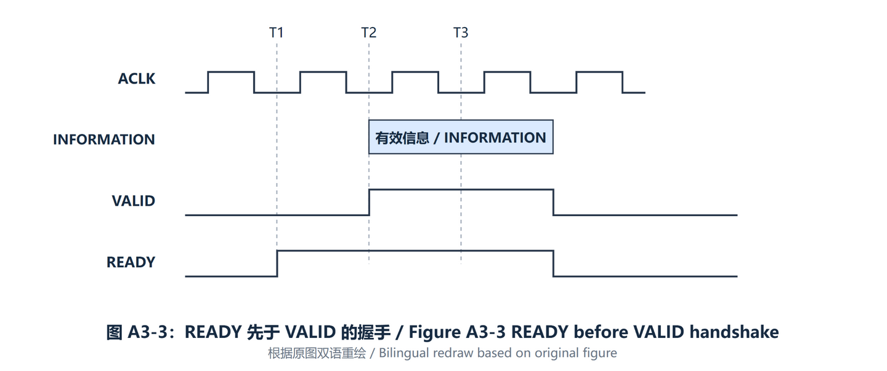

> **原文图题（English）**：Figure A3-3 READY before VALID handshake

允许目的端等待 `VALID` 置位后再置位相应的 `READY`。

> **原文（English）**
>
> A destination is permitted to wait for VALID to be asserted before asserting the corresponding READY.


如果 `READY` 已置位，则允许在 `VALID` 置位之前撤销 `READY`。

> **原文（English）**
>
> If READY is asserted, it is permitted to deassert READY before VALID is asserted.


在图 A3-4 中，源端和目的端都恰好在 T1 之后表明它们可以传输地址、数据或控制信息。在此情况下，传输发生在能够识别 `VALID` 与 `READY` 同时置位的时钟上升沿。因此，传输发生在 T2。

> **原文（English）**
>
> In Figure A3-4, both the source and destination happen to indicate that they can transfer the address, data, or control information after T1. In this case, the transfer occurs at the rising clock edge when the assertion of both VALID and READY can be recognized. These assertions means that the transfer occurs at T2.

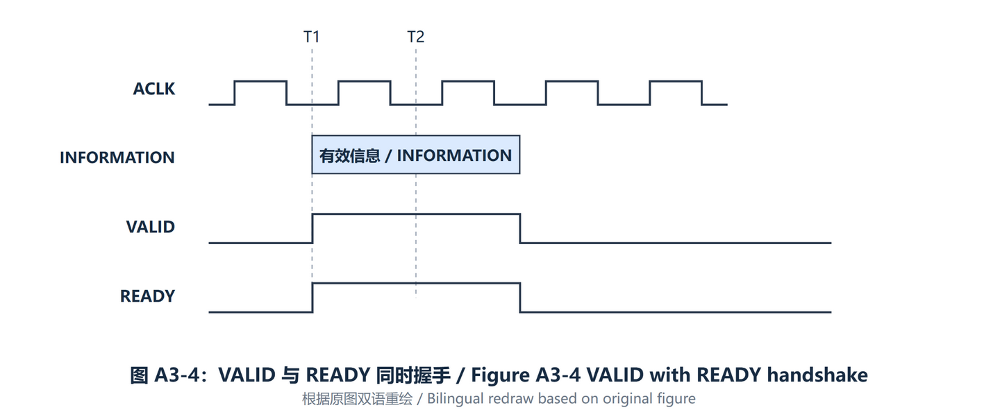

> **原文图题（English）**：Figure A3-4 VALID with READY handshake

各个 AXI 协议通道的握手机制在“通道信号要求”中说明。

> **原文（English）**
>
> The individual AXI protocol channel handshake mechanisms are described in Channel signaling requirements.

### A3.2.2 通道信号要求 / Channel signaling requirements

以下各节定义每个通道的握手信号和握手规则：

- 通道握手信号。
- 写地址通道。
- 写数据通道，见第 A3-43 页。
- 写响应通道，见第 A3-43 页。
- 读地址通道，见第 A3-43 页。
- 读数据通道，见第 A3-43 页。

> **原文（English）**
>
> The following sections define the handshake signals and the handshake rules for each channel:
>
> - Channel handshake signals
> - Write address channel
> - Write data channel on page A3-43
> - Write response channel on page A3-43
> - Read address channel on page A3-43
> - Read data channel on page A3-43

#### 通道握手信号 / Channel handshake signals

每个通道都有自己的 `VALID/READY` 握手信号对。表 A3-1 给出了每个通道的信号。

> **原文（English）**
>
> Each channel has its own VALID/READY handshake signal pair. Table A3-1 shows the signals for each channel.

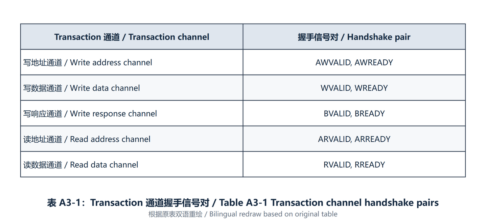

> **原文表题（English）**：Table A3-1 Transaction channel handshake pairs

#### 写地址通道 / Write address channel

仅当 Master 正在驱动有效的地址和控制信息时，才可以置位 `AWVALID` 信号。`AWVALID` 一旦置位，就必须保持置位，直到 Slave 置位 `AWREADY` 之后的时钟上升沿。

> **原文（English）**
>
> The master can assert the AWVALID signal only when it drives valid address and control information. When asserted, AWVALID must remain asserted until the rising clock edge after the slave asserts AWREADY.

`AWREADY` 的默认状态可以是 HIGH 或 LOW。本规范建议默认状态为 HIGH。当 `AWREADY` 为 HIGH 时，Slave 必须能够接收向其给出的任何有效地址。

> **原文（English）**
>
> The default state of AWREADY can be either HIGH or LOW. This specification recommends a default state of HIGH. When AWREADY is HIGH, the slave must be able to accept any valid address that is presented to it.


> **注（Note）**
>
> 本规范不建议将 `AWREADY` 的默认状态设为 LOW，因为这会迫使传输至少占用两个周期：一个周期置位 `AWVALID`，另一个周期置位 `AWREADY`。

> **原文（English）**
>
> This specification does not recommend a default AWREADY state of LOW, because it forces the transfer to take at least two cycles, one to assert AWVALID and another to assert AWREADY.

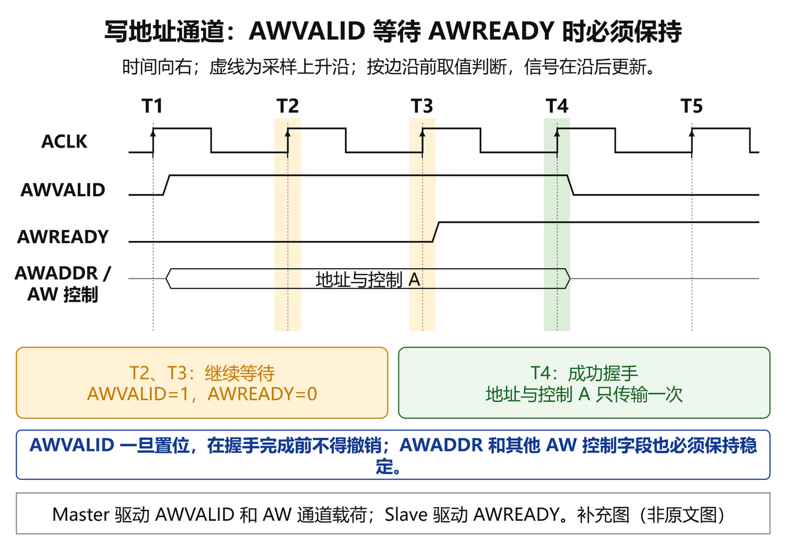

#### 写数据通道 / Write data channel

在写突发传输期间，仅当 Master 正在驱动有效写数据时，才可以置位 `WVALID` 信号。`WVALID` 一旦置位，就必须保持置位，直到 Slave 置位 `WREADY` 之后的时钟上升沿。

> **原文（English）**
>
> During a write burst, the master can assert the WVALID signal only when it drives valid write data. When asserted, WVALID must remain asserted until the rising clock edge after the slave asserts WREADY.


`WREADY` 的默认状态可以是 HIGH，但前提是 Slave 始终能够在单个周期内接收写数据。

> **原文（English）**
>
> The default state of WREADY can be HIGH, but only if the slave can always accept write data in a single cycle.


Master 在驱动突发传输中的最后一次写传输时，必须置位 `WLAST` 信号。

> **原文（English）**
>
> The master must assert the WLAST signal while it is driving the final write transfer in the burst.


本规范建议，对于不活动的字节通道，将 `WDATA` 驱动为零。

> **原文（English）**
>
> This specification recommends that WDATA is driven to zero for inactive byte lanes.

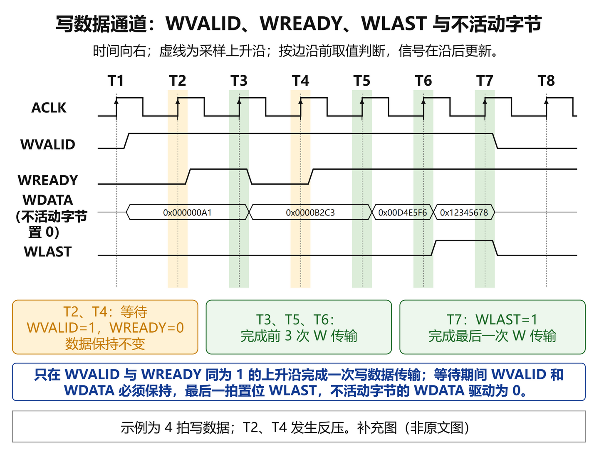

#### 写响应通道 / Write response channel

仅当 Slave 正在驱动有效写响应时，才可以置位 `BVALID` 信号。`BVALID` 一旦置位，就必须保持置位，直到 Master 置位 `BREADY` 之后的时钟上升沿。

> **原文（English）**
>
> The slave can assert the BVALID signal only when it drives a valid write response. When asserted, BVALID must remain asserted until the rising clock edge after the master asserts BREADY.


`BREADY` 的默认状态可以是 HIGH，但前提是 Master 始终能够在单个周期内接收写响应。

> **原文（English）**
>
> The default state of BREADY can be HIGH, but only if the master can always accept a write response in a single cycle.

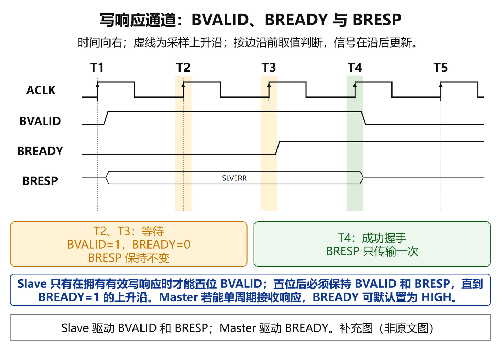


#### 读地址通道 / Read address channel

仅当 Master 正在驱动有效的地址和控制信息时，才可以置位 `ARVALID` 信号。`ARVALID` 一旦置位，就必须保持置位，直到 Slave 置位 `ARREADY` 信号之后的时钟上升沿。

> **原文（English）**
>
> The master can assert the ARVALID signal only when it drives valid address and control information. When asserted, ARVALID must remain asserted until the rising clock edge after the slave asserts the ARREADY signal.


`ARREADY` 的默认状态可以是 HIGH 或 LOW。本规范建议默认状态为 HIGH。如果 `ARREADY` 为 HIGH，则 Slave 必须能够接收向其给出的任何有效地址。

> **原文（English）**
>
> The default state of ARREADY can be either HIGH or LOW. This specification recommends a default state of HIGH. If ARREADY is HIGH, then the slave must be able to accept any valid address that is presented to it.


> **注（Note）**
>
> 本规范不建议将 `ARREADY` 的默认值设为 LOW，因为这会迫使传输至少占用两个周期：一个周期置位 `ARVALID`，另一个周期置位 `ARREADY`。

> **原文（English）**
>
> This specification does not recommend a default ARREADY value of LOW, because it forces the transfer to take at least two cycles, one to assert ARVALID and another to assert ARREADY.

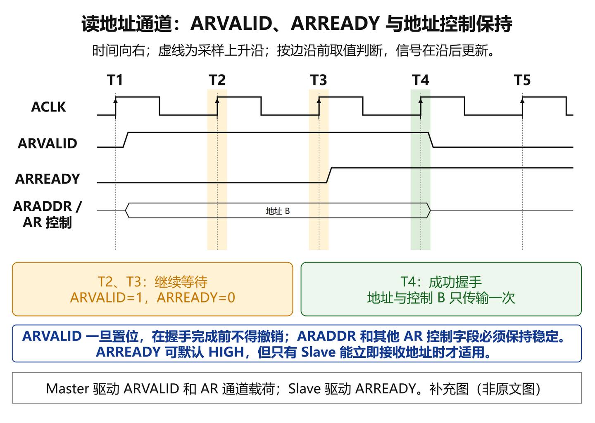

#### 读数据通道 / Read data channel

仅当 Slave 正在驱动有效读数据时，才可以置位 `RVALID` 信号。`RVALID` 一旦置位，就必须保持置位，直到 Master 置位 `RREADY` 之后的时钟上升沿。即使 Slave 只有一个读数据源，也必须仅为响应数据请求而置位 `RVALID` 信号。

> **原文（English）**
>
> The slave can assert the RVALID signal only when it drives valid read data. When asserted, RVALID must remain asserted until the rising clock edge after the master asserts RREADY. Even if a slave has only one source of read data, it must assert the RVALID signal only in response to a request for data.


Master 接口使用 `RREADY` 信号指示其接收数据。`RREADY` 的默认状态可以是 HIGH，但前提是 Master 能够在开始读 transaction 时立即接收读数据。

> **原文（English）**
>
> The master interface uses the RREADY signal to indicate that it accepts the data. The default state of RREADY can be HIGH, but only if the master is able to accept read data immediately when it starts a read transaction.


Slave 在驱动突发传输中的最后一次读传输时，必须置位 `RLAST` 信号。

> **原文（English）**
>
> The slave must assert the RLAST signal when it is driving the final read transfer in the burst.


本规范建议，对于不活动的字节通道，将 `RDATA` 驱动为零。

> **原文（English）**
>
> This specification recommends that RDATA is driven to zero for inactive byte lanes.

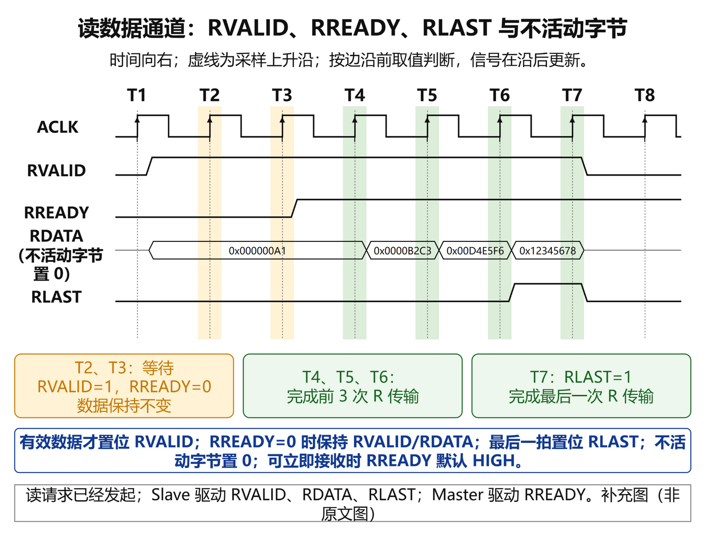

## A3.3 通道之间的关系 / Relationships between the channels

AXI 协议要求保持以下关系：

- 写响应必须始终在写 transaction 的最后一次写传输之后。
- 读数据必须始终在该数据的读地址之后。
- 通道握手必须符合“通道握手信号之间的依赖关系”中定义的依赖关系。

> **原文（English）**
>
> The AXI protocol requires the following relationships to be maintained:
>
> - A write response must always follow the last write transfer in a write transaction.
> - Read data must always follow the read address of the data.
> - Channel handshakes must conform to the dependencies defined in Dependencies between channel handshake signals.

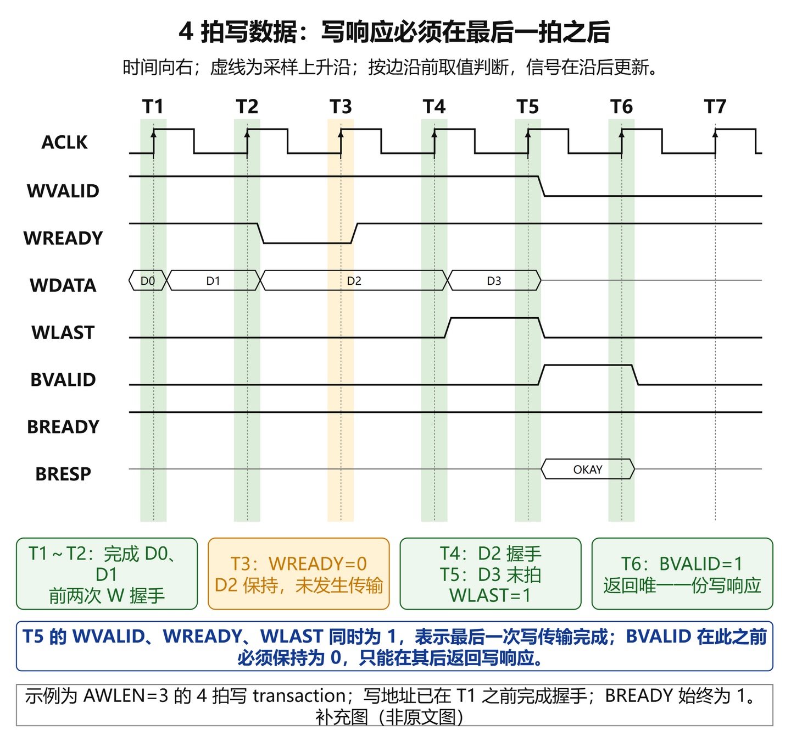

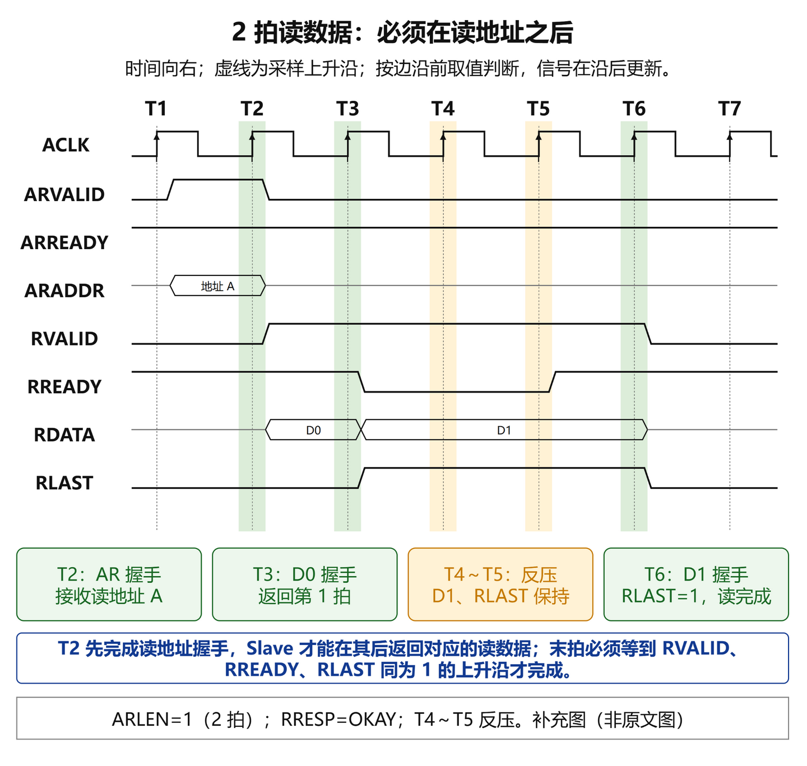

协议没有定义通道之间的任何其他关系。

> **原文（English）**
>
> The protocol does not define any other relationship between the channels.


缺少其他关系意味着，例如，一个 transaction 的写数据可能先于写地址出现在接口上。如果写地址通道包含的寄存器级数多于写数据通道，就可能出现这种情况。同样，写数据也可能与地址出现在同一周期。

> **原文（English）**
>
> The lack of relationship means, for example, that the write data can appear at an interface before the write address for the transaction. This can occur if the write address channel contains more register stages than the write data channel. Similarly, the write data might appear in the same cycle as the address.

> **注（Note）**
>
> 当互连需要确定目的地址空间或 Slave 空间时，必须重新对齐地址和写数据。要求进行此重新对齐，是为了确保仅向写数据所要到达的 Slave 表明该写数据有效。

> **原文（English）**
>
> When the interconnect is required to determine the destination address space or slave space, it must realign the address and write data. This realignment is required to assure that the write data is signaled as being valid only to the slave that it is destined for.


Master 发出写请求时，必须能够提供该 transaction 的所有写数据，并且不依赖该 Master 的其他 transaction。

> **原文（English）**
>
> When a master issues a write request, it must be able to provide all write data for that transaction, without dependency on other transactions from that master.


Master 发出读请求时，必须能够接收该 transaction 的所有读数据，并且不依赖该 Master 的其他 transaction。

> **原文（English）**
>
> When a master issues a read request, it must be able to accept all read data for that transaction, without dependency on other transactions from that master.
>


请注意，Master 可以依赖使用相同 ID 的 transaction 按顺序返回读数据，因此 Master 只需为不同 ID 的 transaction 所返回的读数据准备足够的存储空间。

> **原文（English）**
>
> Note that a master can rely on read data returning in order from transactions that use the same ID, so the master only needs enough storage for read data from transactions with different IDs.

### A3.3.1 通道握手信号之间的依赖关系 / Dependencies between channel handshake signals

为防止死锁，必须遵守握手信号之间存在的依赖规则。

> **原文（English）**
>
> To prevent a deadlock situation, the dependency rules that exist between the handshake signals must be observed.


如第 A3-42 页“通道信号要求”所概述，在任何 transaction 中：

- 发送信息的 AXI 接口，其 `VALID` 信号不得依赖接收该信息的 AXI 接口的 `READY` 信号。
- 接收信息的 AXI 接口可以等到检测到 `VALID` 信号后，再置位相应的 `READY` 信号。

> **原文（English）**
>
> As summarized in Channel signaling requirements on page A3-42, in any transaction:
>
> - The VALID signal of the AXI interface sending information must not be dependent on the READY signal of the AXI interface receiving that information.
> - An AXI interface that is receiving information can wait until it detects a VALID signal before it asserts its corresponding READY signal.


> **注（Note）**
>
> 可以等到 `VALID` 置位后再置位 `READY`。也可以在检测到相应的 `VALID` 之前置位 `READY`。后者可以得到更高效的设计。

> **原文（English）**
>
> It is acceptable to wait for VALID to be asserted before asserting READY. It is also acceptable to assert READY before detecting the corresponding VALID. This can result in a more efficient design.

此外，不同通道上的握手信号之间也存在依赖关系，并且 AXI4 定义了一项额外的写响应依赖关系。以下小节定义这些依赖关系：

- 读 transaction 依赖关系，见第 A3-45 页。
- AXI3 写 transaction 依赖关系，见第 A3-45 页。
- AXI4 和 AXI5 写 transaction 依赖关系，见第 A3-46 页。

> **原文（English）**
>
> In addition, there are dependencies between the handshake signals on different channels, and AXI4 defines an additional write response dependency. The following subsections define these dependencies:
>
> - Read transaction dependencies on page A3-45
> - AXI3 write transaction dependencies on page A3-45
> - AXI4 and AXI5 write transaction dependencies on page A3-46

在依赖关系图中：

- 单箭头指向的信号可以在箭头起点信号之前或之后置位。
- 双箭头指向的信号必须仅在箭头起点信号置位之后置位。

> **原文（English）**
>
> In the dependency diagrams:
>
> - Single-headed arrows point to signals that can be asserted before or after the signal at the start of the arrow.
> - Double-headed arrows point to signals that must be asserted only after assertion of the signal at the start of the arrow.


#### 读 transaction 依赖关系 / Read transaction dependencies

图 A3-5 展示了读 transaction 握手信号的依赖关系，并表明在一次读 transaction 中：

- Master 在置位 `ARVALID` 之前，不得等待 Slave 置位 `ARREADY`。
- Slave 可以等到 `ARVALID` 置位后再置位 `ARREADY`。
- Slave 可以在 `ARVALID` 置位之前置位 `ARREADY`。
- Slave 必须等到 `ARVALID` 和 `ARREADY` 均置位后，才能置位 `RVALID` 以指示有效数据可用。<span style="color:#D9822B;">（Slave 必须先真正接收到一个读地址请求，之后才有资格返回读数据。）</span>

- Slave 在置位 `RVALID` 之前，不得等待 Master 置位 `RREADY`。
- Master 可以等到 `RVALID` 置位后再置位 `RREADY`。
- Master 可以在 `RVALID` 置位之前置位 `RREADY`。

> **原文（English）**
>
> Figure A3-5 shows the read transaction handshake signal dependencies, and shows that, in a read transaction:
>
> - The master must not wait for the slave to assert ARREADY before asserting ARVALID.
> - The slave can wait for ARVALID to be asserted before it asserts ARREADY.
> - The slave can assert ARREADY before ARVALID is asserted.
> - The slave must wait for both ARVALID and ARREADY to be asserted before it asserts RVALID to indicate that valid data is available.
> - The slave must not wait for the master to assert RREADY before asserting RVALID.
> - The master can wait for RVALID to be asserted before it asserts RREADY.
> - The master can assert RREADY before RVALID is asserted.


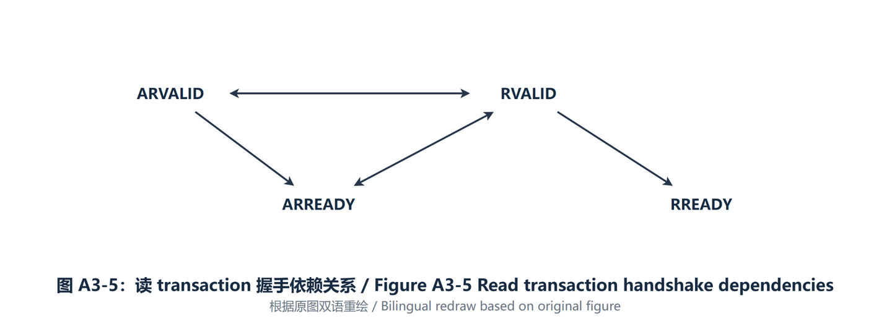

> **原文图题（English）**：Figure A3-5 Read transaction handshake dependencies

#### AXI3 写 transaction 依赖关系 / AXI3 write transaction dependencies

图 A3-6 展示了写 transaction 握手信号的依赖关系，并表明在一次写 transaction 中：

- Master 在置位 `AWVALID` 或 `WVALID` 之前，不得等待 Slave 置位 `AWREADY` 或 `WREADY`。
- Slave 可以等到 `AWVALID` 或 `WVALID` 中任一信号或两者均置位后，再置位 `AWREADY`。
- Slave 可以在 `AWVALID` 或 `WVALID` 中任一信号或两者均置位之前，置位 `AWREADY`。
- Slave 可以等到 `AWVALID` 或 `WVALID` 中任一信号或两者均置位后，再置位 `WREADY`。
- Slave 可以在 `AWVALID` 或 `WVALID` 中任一信号或两者均置位之前，置位 `WREADY`。
- Slave 必须等到 `WVALID` 和 `WREADY` 均置位后才能置位 `BVALID`。Slave 还必须等到 `WLAST` 置位后才能置位 `BVALID`。之所以需要等待，是因为写响应 `BRESP` 必须仅在写 transaction 的最后一次数据传输之后发出。
- Slave 在置位 `BVALID` 之前，不得等待 Master 置位 `BREADY`。
- Master 可以等到 `BVALID` 置位后再置位 `BREADY`。
- Master 可以在 `BVALID` 置位之前置位 `BREADY`。

> **原文（English）**
>
> Figure A3-6 shows the write transaction handshake signal dependencies, and shows that in a write transaction:
>
> - The master must not wait for the slave to assert AWREADY or WREADY before asserting AWVALID or WVALID.
> - The slave can wait for AWVALID or WVALID, or both before asserting AWREADY.
> - The slave can assert AWREADY before AWVALID or WVALID, or both, are asserted.
> - The slave can wait for AWVALID or WVALID, or both, before asserting WREADY.
> - The slave can assert WREADY before AWVALID or WVALID, or both, are asserted.
> - The slave must wait for both WVALID and WREADY to be asserted before asserting BVALID.
>   The slave must also wait for WLAST to be asserted before asserting BVALID. Waiting is required because the write response, BRESP, must be signaled only after the last data transfer of a write transaction.
> - The slave must not wait for the master to assert BREADY before asserting BVALID.
> - The master can wait for BVALID before asserting BREADY.
> - The master can assert BREADY before BVALID is asserted.


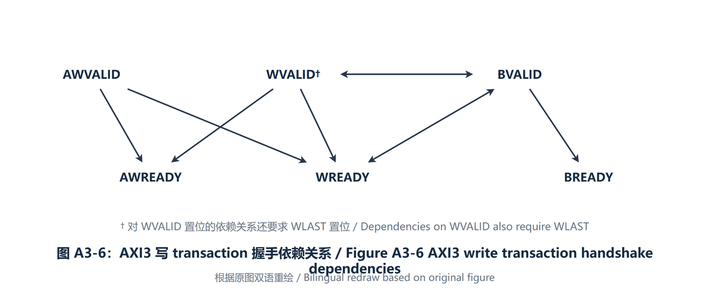

> **原文图题（English）**：Figure A3-6 AXI3 write transaction handshake dependencies

> **注意（Caution）**
>
> 必须遵守这些依赖规则，以防止死锁。例如，Master 在驱动 `WVALID` 之前不得等待 `AWREADY` 置位。如果 Slave 正在等待 `WVALID` 后才置位 `AWREADY`，就可能发生死锁。

> **原文（English）**
>
> The dependency rules must be observed to prevent a deadlock condition. For example, a master must not wait for AWREADY to be asserted before driving WVALID. A deadlock condition can occur if the slave is waiting for WVALID before asserting AWREADY.


#### AXI4 和 AXI5 写 transaction 依赖关系 / AXI4 and AXI5 write transaction dependencies

AXI4 和 AXI5 定义了一项额外的 Slave 写响应依赖关系。Slave 必须等到 `AWVALID`、`AWREADY`、`WVALID` 和 `WREADY` 均置位后，才能置位 `BVALID`。通过发出写响应，Slave 对该写 transaction 与后续所有 transaction 之间的冒险检查承担责任。

> **原文（English）**
>
> AXI4 and AXI5 define an additional slave write response dependency. The slave must wait for AWVALID, AWREADY, WVALID, and WREADY to be asserted before asserting BVALID. By issuing a write response, the slave takes responsibility for hazard checking the write transaction against all subsequent transactions.


> **注（Note）**
>
> 这项额外依赖关系反映了 AXI3 中的预期使用方式，因为并不预期任何组件会在地址被接收之前接收所有写数据并给出写响应。

> **原文（English）**
>
> This additional dependency reflects the expected use in AXI3, because it is not expected that any components would accept all write data and provide a write response before the address is accepted.

图 A3-7 展示了 AXI4 和 AXI5 要求的全部 Slave 写响应握手依赖关系。单箭头指向的信号可以在前一个信号置位之前或之后置位。双箭头指向的信号必须仅在前一个信号置位之后置位。

> **原文（English）**
>
> Figure A3-7 shows all the AXI4 and AXI5 required slave write response handshake dependencies. The single-headed arrows point to signals that can be asserted before or after the previous signal is asserted. Double-headed arrows point to signals that must be asserted only after assertion of the previous signal.


这些依赖关系为：

- Master 在置位 `AWVALID` 或 `WVALID` 之前，不得等待 Slave 置位 `AWREADY` 或 `WREADY`。
- Slave 可以等到 `AWVALID` 或 `WVALID` 中任一信号或两者均置位后，再置位 `AWREADY`。
- Slave 可以在 `AWVALID` 或 `WVALID` 中任一信号或两者均置位之前，置位 `AWREADY`。
- Slave 可以等到 `AWVALID` 或 `WVALID` 中任一信号或两者均置位后，再置位 `WREADY`。
- Slave 可以在 `AWVALID` 或 `WVALID` 中任一信号或两者均置位之前，置位 `WREADY`。
- Slave 必须等到 `AWVALID`、`AWREADY`、`WVALID` 和 `WREADY` 均置位后，才能置位 `BVALID`。Slave 还必须等到 `WLAST` 置位后才能置位 `BVALID`。之所以等待，是因为写响应 `BRESP` 必须仅在写 transaction 的最后一次数据传输之后发出。
- Slave 在置位 `BVALID` 之前，不得等待 Master 置位 `BREADY`。
- Master 可以等到 `BVALID` 置位后再置位 `BREADY`。
- Master 可以在 `BVALID` 置位之前置位 `BREADY`。

> **原文（English）**
>
> These dependencies are:
>
> - The master must not wait for the slave to assert AWREADY or WREADY before asserting AWVALID or WVALID.
> - The slave can wait for AWVALID or WVALID, or both, before asserting AWREADY.
> - The slave can assert AWREADY before AWVALID or WVALID, or both, are asserted.
> - The slave can wait for AWVALID or WVALID, or both, before asserting WREADY.
> - The slave can assert WREADY before AWVALID or WVALID, or both, are asserted.
> - The slave must wait for AWVALID, AWREADY, WVALID, and WREADY to be asserted before asserting BVALID.
>   The slave must also wait for WLAST to be asserted before asserting BVALID. This wait is because the write response, BRESP, must be signaled only after the last data transfer of a write transaction.
> - The slave must not wait for the master to assert BREADY before asserting BVALID.
> - The master can wait for BVALID before asserting BREADY.
> - The master can assert BREADY before BVALID is asserted.


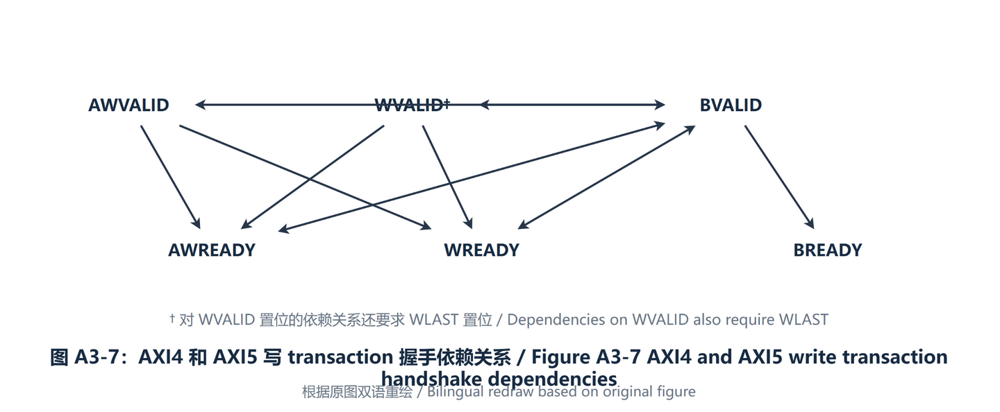

> **原文图题（English）**：Figure A3-7 AXI4 and AXI5 write transaction handshake dependencies

### A3.3.2 旧版兼容性考虑 / Legacy considerations

第 A3-46 页“AXI4 和 AXI5 写 transaction 依赖关系”中说明的额外依赖关系意味着：如果某个 AXI3 Slave 在接收地址之前就接收全部写数据并给出写响应，则该 Slave 不符合 AXI4 或 AXI5。将旧版 AXI3 Slave 转换为 AXI4 或 AXI5 需要增加一个封装器。该封装器确保在 Slave 接收相应地址之前，不会提供返回的写响应。

> **原文（English）**
>
> The additional dependency that is described in AXI4 and AXI5 write transaction dependencies on page A3-46 means that an AXI3 slave that accepts all write data and provides a write response before accepting the address is not compliant with AXI4 or AXI5. Converting an AXI3 legacy slave to AXI4 or AXI5 requires the addition of a wrapper. That wrapper ensures a returning write response is not provided until the appropriate address has been accepted by the slave.


> **注（Note）**
>
> 本规范强烈建议任何新的 AXI3 Slave 实现都包含这项额外依赖关系。

> **原文（English）**
>
> This specification strongly recommends that any new AXI3 slave implementation includes this additional dependency.

任何 AXI3 Master 都符合 AXI4 和 AXI5 写响应要求。

> **原文（English）**
>
> Any AXI3 master complies with the AXI4 and AXI5 write response requirements.


## A3.4 Transaction 结构 / Transaction structure

本节说明 transaction 的结构。以下各节定义地址、数据和响应结构：

- 地址结构。
- 传输的伪代码说明，见第 A3-52 页。
- 数据读写结构，见第 A3-54 页。
- 读写响应结构，见第 A3-59 页。

> **原文（English）**
>
> This section describes the structure of transactions. The following sections define the address, data, and response structures:
>
> - Address structure
> - Pseudocode description of the transfers on page A3-52
> - Data read and write structure on page A3-54
> - Read and write response structure on page A3-59

本节所用术语的定义，见第 Glossary-493 页的“术语表”。

> **原文（English）**
>
> For the definitions of terms that are used in this section, see Glossary on page Glossary-493.

### A3.4.1 地址结构 / Address structure

AXI 协议以突发传输为基础。Master 通过向 Slave 驱动控制信息和 transaction 中第一个字节的地址来开始每个突发传输。随着突发传输推进，Slave 必须计算突发传输中后续传输的地址。

> **原文（English）**
>
> The AXI protocol is burst-based. The master begins each burst by driving control information and the address of the first byte in the transaction to the slave. As the burst progresses, the slave must calculate the addresses of subsequent transfers in the burst.


一次突发传输不得跨越 4KB 地址边界。

> **原文（English）**
>
> A burst must not cross a 4KB address boundary.


> **注（Note）**
>
> 该禁止条件防止一次突发传输跨越两个 Slave 之间的边界。它还限制了 Slave 必须支持的地址递增次数。

> **原文（English）**
>
> This prohibition prevents a burst from crossing a boundary between two slaves. It also limits the number of address increments that a slave must support.

> <strong style="color:#D9822B;">思考：为什么 AXI burst 不能跨越 4KB 地址边界？它与 AHB 的 1KB 边界有什么区别？</strong> [查看《AXI 4KB 与 AHB 1KB 突发边界专题》](README_突发传输地址边界.md)


#### 突发长度 / Burst length

突发长度由以下信号指定：

- 对于读传输，为 `ARLEN[7:0]`。
- 对于写传输，为 `AWLEN[7:0]`。

> **原文（English）**
>
> The burst length is specified by:
>
> - ARLEN[7:0], for read transfers
> - AWLEN[7:0], for write transfers

在本规范中，`AxLEN` 表示 `ARLEN` 或 `AWLEN`。

> **原文（English）**
>
> In this specification, AxLEN indicates ARLEN or AWLEN.

AXI3 对所有突发类型支持 1～16 次传输的突发长度。

> **原文（English）**
>
> AXI3 supports burst lengths of 1-16 transfers, for all burst types.

AXI4 将 INCR 突发类型的突发长度支持扩展为 1～256 次传输。AXI4 对所有其他突发类型仍支持 1～16 次传输。

> **原文（English）**
>
> AXI4 extends burst length support for the INCR burst type to 1-256 transfers. Support for all other burst types in AXI4 remains at 1-16 transfers.

AXI3 的突发长度定义为：

```text
Burst_Length = AxLEN[3:0] + 1
```

> **原文（English）**
>
> The burst length for AXI3 is defined as:
>
>     Burst_Length = AxLEN[3:0] + 1

为了容纳 AXI4 中 INCR 突发类型扩展后的突发长度，AXI4 的突发长度定义为：

```text
Burst_Length = AxLEN[7:0] + 1
```

> **原文（English）**
>
> To accommodate the extended burst length of the INCR burst type in AXI4, the burst length for AXI4 is defined as:
>
>     Burst_Length = AxLEN[7:0] + 1

AXI 对突发传输的使用规定了以下规则：

- 对于回绕突发传输，突发长度必须为 2、4、8 或 16。
- 一次突发传输不得跨越 4KB 地址边界。
- 不支持提前终止突发传输。

> **原文（English）**
>
> AXI has the following rules governing the use of bursts:
>
> - For wrapping bursts, the burst length must be 2, 4, 8, or 16.
> - A burst must not cross a 4KB address boundary.
> - Early termination of bursts is not supported.


任何组件都不能提前终止突发传输。不过，为减少一次写突发传输中的数据传输次数，Master 可以通过撤销所有写选通信号来禁止后续写入。在此情况下，Master 必须完成该突发传输中剩余的传输。在一次读突发传输中，Master 可以丢弃读数据，但必须完成该突发传输中的全部传输。

> **原文（English）**
>
> No component can terminate a burst early. However, to reduce the number of data transfers in a write burst, the master can disable further writing by deasserting all the write strobes. In this case, the master must complete the remaining transfers in the burst. In a read burst, the master can discard read data, but it must complete all transfers in the burst.


> **注（Note）**
>
> 访问 FIFO 等读敏感设备时，丢弃不需要的读数据可能造成数据丢失。访问此类设备时，Master 必须使用与所需数据传输大小完全匹配的突发长度。

> **原文（English）**
>
> Discarding read data that is not required can result in lost data when accessing a read-sensitive device such as a FIFO. When accessing such a device, a master must use a burst length that exactly matches the size of the required data transfer.


第 A7-97 页“独占访问限制”定义了在独占访问期间影响突发传输的其他规则。

> **原文（English）**
>
> Exclusive access restrictions on page A7-97 defines additional rules affecting bursts during an exclusive access.

在 AXI4 中，INCR 突发类型且长度大于 16 的 transaction 可以转换为多个更短的突发传输，即使 transaction 属性表明该 transaction 为 Non-modifiable。参见第 A4-64 页“AXI4 对内存属性信号的更改”。在此情况下，所生成的突发传输必须保留与原 transaction 相同的 transaction 特性，唯一例外为：

- 突发长度缩短。
- 对所生成突发传输的地址进行适当调整。

> **原文（English）**
>
> In AXI4, transactions with INCR burst type and length greater than 16 can be converted to multiple smaller bursts, even if the transaction attributes indicate that the transaction is Non-modifiable. See AXI4 changes to memory attribute signaling on page A4-64. In this case, the generated bursts must retain the same transaction characteristics as the original transaction, the only exception is that:
>
> - The burst length is reduced.
> - The address of the generated bursts is adapted appropriately.


> **注（Note）**
>
> 为实现与 AXI3 的兼容，要求具备将较长突发传输拆分为多个较短突发传输的能力。为了降低较长突发传输对 QoS 保证的影响，也可能需要此能力。

> **原文（English）**
>
> The ability to break longer bursts into multiple shorter bursts is required for AXI3 compatibility. This ability might also be needed to reduce the impact of longer bursts on the QoS guarantees.


#### 突发大小 / Burst size

一次突发传输中每次数据传输（即每个数据拍）能够传输的最大字节数，由以下信号指定：

- 对于读传输，为 `ARSIZE[2:0]`。
- 对于写传输，为 `AWSIZE[2:0]`。

> **原文（English）**
>
> The maximum number of bytes to transfer in each data transfer, or beat, in a burst, is specified by:
>
> - ARSIZE[2:0], for read transfers
> - AWSIZE[2:0], for write transfers

在本规范中，`AxSIZE` 表示 `ARSIZE` 或 `AWSIZE`。

> **原文（English）**
>
> In this specification, AxSIZE indicates ARSIZE or AWSIZE.

表 A3-2 给出了 `AxSIZE` 编码。

> **原文（English）**
>
> Table A3-2 shows the AxSIZE encoding.

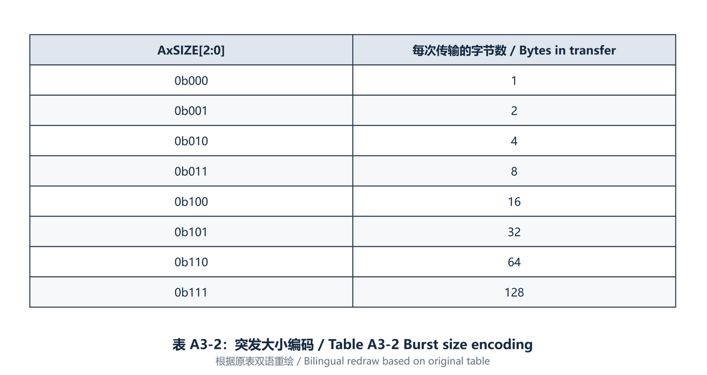

> **原文表题（English）**：Table A3-2 Burst size encoding

如果 AXI 总线比突发大小更宽，则 AXI 接口必须根据传输地址确定每次传输使用数据总线的哪些字节通道。参见第 A3-54 页“数据读写结构”。

> **原文（English）**
>
> If the AXI bus is wider than the burst size, the AXI interface must determine from the transfer address which byte lanes of the data bus to use for each transfer. See Data read and write structure on page A3-54.


任何传输的大小都不得超过该 transaction 中任一 agent 的数据总线宽度。

> **原文（English）**
>
> The size of any transfer must not exceed the data bus width of either agent in the transaction.


#### 突发类型 / Burst type

AXI 协议定义了三种突发类型：

> **原文（English）**
>
> The AXI protocol defines three burst types:

`FIXED`  在固定突发传输中：

- 突发传输中每次传输的地址都相同。
- 突发传输中所有数据拍的有效字节通道保持不变。不过，在这些字节通道内，每个数据拍实际置位 `WSTRB` 的字节可以不同。

> **原文（English）**
>
> FIXED In a fixed burst:
>
> - The address is the same for every transfer in the burst.
> - The byte lanes that are valid are constant for all beats in the burst. However, within those byte lanes, the actual bytes that have WSTRB asserted can differ for each beat in the burst.

这种突发类型用于重复访问同一位置，例如装载或清空 FIFO。

> **原文（English）**
>
> This burst type is used for repeated accesses to the same location such as when loading or emptying a FIFO.

`INCR`  递增。在递增突发传输中，突发传输中每次传输的地址都在前一次传输地址的基础上递增。递增值取决于传输大小。例如，对于对齐的起始地址，在传输大小为 4 字节的突发传输中，每次传输的地址等于前一次地址加四。

> **原文（English）**
>
> INCR Incrementing. In an incrementing burst, the address for each transfer in the burst is an increment of the address for the previous transfer. The increment value depends on the size of the transfer. For example, for an aligned start address, the address for each transfer in a burst with a size of 4 bytes is the previous address plus four.

这种突发类型用于访问普通顺序存储器。

> **原文（English）**
>
> This burst type is used for accesses to normal sequential memory.

`WRAP`  回绕突发传输与递增突发传输相似，但如果到达地址上限，地址会回绕到较低地址。

> **原文（English）**
>
> WRAP A wrapping burst is similar to an incrementing burst, except that the address wraps around to a lower address if an upper address limit is reached.

回绕突发传输适用以下限制：

- 起始地址必须与每次传输的大小对齐。
- 突发长度必须为 2、4、8 或 16 次传输。

> **原文（English）**
>
> The following restrictions apply to wrapping bursts:
>
> - The start address must be aligned to the size of each transfer.
> - The length of the burst must be 2, 4, 8, or 16 transfers.


回绕突发传输的行为为：

- 突发传输所使用的最低地址与待传输数据的总大小对齐，即与（突发传输中每次传输的大小）×（突发传输中的传输次数）对齐。该地址定义为回绕边界。
- 每次传输之后，地址以与 INCR 突发传输相同的方式递增。但是，如果递增后的地址等于（回绕边界）＋（待传输数据的总大小），则地址回绕到回绕边界。
- 突发传输中的第一次传输可以使用高于回绕边界的地址，但须遵守回绕突发传输的限制。对于任何 WRAP 突发传输，如果第一个地址高于回绕边界，地址都会发生回绕。

> **原文（English）**
>
> The behavior of a wrapping burst is:
>
> - The lowest address that is used by the burst is aligned to the total size of the data to be transferred, that is, to ((size of each transfer in the burst) × (number of transfers in the burst)). This address is defined as the wrap boundary.
> - After each transfer, the address increments in the same way as for an INCR burst. However, if this incremented address is ((wrap boundary) + (total size of data to be transferred)), then the address wraps round to the wrap boundary.
> - The first transfer in the burst can use an address that is higher than the wrap boundary, subject to the restrictions that apply to wrapping bursts. The address wraps for any WRAP burst when the first address is higher than the wrap boundary.

这种突发类型用于访问 cache line。

> **原文（English）**
>
> This burst type is used for cache line accesses.

突发类型由以下信号指定：

- 对于读传输，为 `ARBURST[1:0]`。
- 对于写传输，为 `AWBURST[1:0]`。

> **原文（English）**
>
> The burst type is specified by:
>
> - ARBURST[1:0], for read transfers
> - AWBURST[1:0], for write transfers

在本规范中，`AxBURST` 表示 `ARBURST` 或 `AWBURST`。

> **原文（English）**
>
> In this specification, AxBURST indicates ARBURST or AWBURST.

表 A3-3 给出了 `AxBURST` 信号编码。

> **原文（English）**
>
> Table A3-3 shows the AxBURST signal encoding.

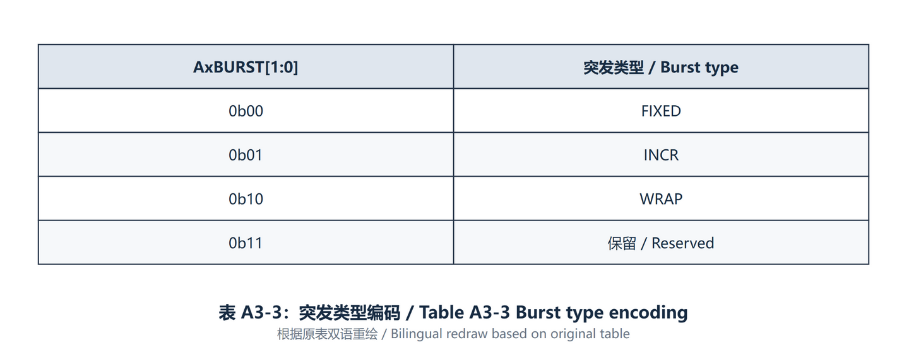

> **原文表题（English）**：Table A3-3 Burst type encoding

#### 突发地址 / Burst address

本节给出确定突发传输中各次传输的地址和字节通道的方法。公式使用以下变量：

> **原文（English）**
>
> This section provides methods for determining the address and byte lanes of transfers within a burst. The equations use the following variables:

`Start_Address`  Master 发出的起始地址。

`Number_Bytes`  每次数据传输的最大字节数。

`Data_Bus_Bytes`  数据总线中的字节通道数。

`Aligned_Address`  起始地址的对齐版本。

`Burst_Length`  一次突发传输中的数据传输总数。

`Address_N`  一次突发传输中第 N 次传输的地址。对于突发传输中的第一次传输，N 为 1。

`Wrap_Boundary`  回绕突发传输中的最低地址。

`Lower_Byte_Lane`  一次传输中最低地址字节所在的字节通道。

`Upper_Byte_Lane`  一次传输中最高地址字节所在的字节通道。

`INT(x)`  x 向下取整后的整数值。

> **原文（English）**
>
> Start_Address The start address that is issued by the master.
>
> Number_Bytes The maximum number of bytes in each data transfer.
>
> Data_Bus_Bytes The number of byte lanes in the data bus.
>
> Aligned_Address The aligned version of the start address.
>
> Burst_Length The total number of data transfers within a burst.
>
> Address_N The address of transfer N in a burst. N is 1 for the first transfer in a burst.
>
> Wrap_Boundary The lowest address within a wrapping burst.
>
> Lower_Byte_Lane The byte lane of the lowest addressed byte of a transfer.
>
> Upper_Byte_Lane The byte lane of the highest addressed byte of a transfer.
>
> INT(x) The rounded-down integer value of x.

以下公式确定突发传输中各次传输的地址：

```text
Start_Address   = AxADDR
Number_Bytes    = 2 ^ AxSIZE
Burst_Length    = AxLEN + 1
Aligned_Address = (INT(Start_Address / Number_Bytes)) × Number_Bytes
```

以下公式确定一次突发传输中第一次传输的地址：

```text
Address_1 = Start_Address
```

对于 INCR 突发传输，以及地址尚未回绕的 WRAP 突发传输，以下公式确定突发传输中第一次传输之后任意一次传输的地址：

```text
Address_N = Aligned_Address + (N - 1) × Number_Bytes
```

对于 WRAP 突发传输，`Wrap_Boundary` 变量定义回绕边界：

```text
Wrap_Boundary = (INT(Start_Address / (Number_Bytes × Burst_Length))) × (Number_Bytes × Burst_Length)
```

对于 WRAP 突发传输，如果 `Address_N = Wrap_Boundary + (Number_Bytes × Burst_Length)`，则：

- 当前传输使用以下公式：

  ```text
  Address_N = Wrap_Boundary
  ```

- 任何后续传输使用以下公式：

  ```text
  Address_N = Start_Address + ((N - 1) × Number_Bytes) - (Number_Bytes × Burst_Length)
  ```

以下公式确定一次突发传输中第一次传输所使用的字节通道：

```text
Lower_Byte_Lane = Start_Address - (INT(Start_Address / Data_Bus_Bytes)) × Data_Bus_Bytes
Upper_Byte_Lane = Aligned_Address + (Number_Bytes - 1) -
                  (INT(Start_Address / Data_Bus_Bytes)) × Data_Bus_Bytes
```

以下公式确定一次突发传输中第一次传输之后的所有传输所使用的字节通道：

```text
Lower_Byte_Lane = Address_N - (INT(Address_N / Data_Bus_Bytes)) × Data_Bus_Bytes
Upper_Byte_Lane = Lower_Byte_Lane + Number_Bytes - 1
```

数据在以下位段上传输：

```text
DATA((8 × Upper_Byte_Lane) + 7: (8 × Lower_Byte_Lane))
```

如果地址对齐且选通信号置位，transaction 容器描述该 transaction 中可能访问的所有字节：

```text
Container_Size = Number_Bytes × Burst_Length
```

对于 INCR 突发传输：

```text
Container_Lower = Aligned_Address
Container_Upper = Aligned_Address + Container_Size
```

对于 WRAP 突发传输：

```text
Container_Lower = Wrap_Boundary
Container_Upper = Wrap_Boundary + Container_Size
```

> **原文（English）**
>
> These equations determine addresses of transfers within a burst:
>
>     Start_Address = AxADDR
>     Number_Bytes = 2 ^ AxSIZE
>     Burst_Length = AxLEN + 1
>     Aligned_Address = (INT(Start_Address / Number_Bytes)) × Number_Bytes
>
> This equation determines the address of the first transfer in a burst:
>
>     Address_1 = Start_Address
>
> For an INCR burst, and for a WRAP burst for which the address has not wrapped, this equation determines the address of any transfer after the first transfer in a burst:
>
>     Address_N = Aligned_Address + (N - 1) × Number_Bytes
>
> For a WRAP burst, the Wrap_Boundary variable defines the wrapping boundary:
>
>     Wrap_Boundary = (INT(Start_Address / (Number_Bytes × Burst_Length))) × (Number_Bytes × Burst_Length)
>
> For a WRAP burst, if Address_N = Wrap_Boundary + (Number_Bytes × Burst_Length), then:
>
> - Use this equation for the current transfer:
>
>       Address_N = Wrap_Boundary
>
> - Use this equation for any subsequent transfers:
>
>       Address_N = Start_Address + ((N - 1) × Number_Bytes) - (Number_Bytes × Burst_Length)
>
> These equations determine the byte lanes to use for the first transfer in a burst:
>
>     Lower_Byte_Lane = Start_Address - (INT(Start_Address / Data_Bus_Bytes)) × Data_Bus_Bytes
>     Upper_Byte_Lane = Aligned_Address + (Number_Bytes - 1) -
>                       (INT(Start_Address / Data_Bus_Bytes)) × Data_Bus_Bytes
>
> These equations determine the byte lanes to use for all transfers after the first transfer in a burst:
>
>     Lower_Byte_Lane = Address_N - (INT(Address_N / Data_Bus_Bytes)) × Data_Bus_Bytes
>     Upper_Byte_Lane = Lower_Byte_Lane + Number_Bytes - 1
>
> Data is transferred on:
>
>     DATA((8 × Upper_Byte_Lane) + 7: (8 × Lower_Byte_Lane))
>
> The transaction container describes all the bytes that could be accessed in that transaction, if the address is aligned and strobes are asserted:
>
>     Container_Size = Number_Bytes x Burst_Length
>
> For INCR bursts:
>
>     Container_Lower = Aligned_Address
>     Container_Upper = Aligned_Address + Container_Size
>
> For WRAP bursts:
>
>     Container_Lower = Wrap_Boundary
>     Container_Upper = Wrap_Boundary + Container_Size

### A3.4.2 传输的伪代码说明 / Pseudocode description of the transfers

```text
// DataTransfer()
// ==============

DataTransfer(Start_Address, Number_Bytes, Burst_Length, Data_Bus_Bytes, Mode, IsWrite)

// Data_Bus_Bytes 是总线中 8-bit 字节通道的数量
// Mode 是 AXI 传输模式
// IsWrite 对写操作为 TRUE，对读操作为 FALSE

assert Mode IN {FIXED, WRAP, INCR};

addr = Start_Address;                         // 当前地址变量
Aligned_Address = (INT(addr/Number_Bytes) * Number_Bytes);
aligned = (Aligned_Address == addr);          // 检查 addr 是否与 nbytes 对齐
dtsize = Number_Bytes * Burst_Length;         // 最大数据 transaction 总大小

if mode == WRAP then
    Lower_Wrap_Boundary = (INT(addr/dtsize) * dtsize);
                                                // 对于回绕突发传输，addr 必须对齐
    Upper_Wrap_Boundary = Lower_Wrap_Boundary + dtsize;

for n = 1 to Burst_Length
    Lower_Byte_Lane = addr - (INT(addr/Data_Bus_Bytes)) * Data_Bus_Bytes;
    if aligned then
        Upper_Byte_Lane = Lower_Byte_Lane + Number_Bytes - 1
    else
        Upper_Byte_Lane = Aligned_Address + Number_Bytes - 1
                          - (INT(addr/Data_Bus_Bytes)) * Data_Bus_Bytes;

    // 执行数据传输
    if IsWrite then
        dwrite(addr, low_byte, high_byte)
    else
        dread(addr, low_byte, high_byte);

    // 必要时递增地址
    if mode != FIXED then
        if aligned then
            addr = addr + Number_Bytes;
            if mode == WRAP then
                // WRAP 模式始终对齐
                if addr >= Upper_Wrap_Boundary then addr = Lower_Wrap_Boundary;
        else
            addr = Aligned_Address + Number_Bytes;
            aligned = TRUE;                    // 第一次传输之后的所有传输均对齐

return;
```

> **原文（English）**
>
> // DataTransfer()
> // ==============
>
> DataTransfer(Start_Address, Number_Bytes, Burst_Length, Data_Bus_Bytes, Mode, IsWrite)
>
> // Data_Bus_Bytes is the number of 8-bit byte lanes in the bus
> // Mode is the AXI transfer mode
> // IsWrite is TRUE for a write, and FALSE for a read
>
> assert Mode IN {FIXED, WRAP, INCR};
>
> addr = Start_Address; // Variable for current address
> Aligned_Address = (INT(addr/Number_Bytes) * Number_Bytes);
> aligned = (Aligned_Address == addr); // Check whether addr is aligned to nbytes
> dtsize = Number_Bytes * Burst_Length; // Maximum total data transaction size
>
> if mode == WRAP then
>     Lower_Wrap_Boundary = (INT(addr/dtsize) * dtsize);
>     // addr must be aligned for a wrapping burst
>     Upper_Wrap_Boundary = Lower_Wrap_Boundary + dtsize;
>
> for n = 1 to Burst_Length
>     Lower_Byte_Lane = addr - (INT(addr/Data_Bus_Bytes)) * Data_Bus_Bytes;
>     if aligned then
>         Upper_Byte_Lane = Lower_Byte_Lane + Number_Bytes - 1
>     else
>         Upper_Byte_Lane = Aligned_Address + Number_Bytes - 1
>                           - (INT(addr/Data_Bus_Bytes)) * Data_Bus_Bytes;
>
>     // Peform data transfer
>     if IsWrite then
>         dwrite(addr, low_byte, high_byte)
>     else
>         dread(addr, low_byte, high_byte);
>
>     // Increment address if necessary
>     if mode != FIXED then
>         if aligned then
>             addr = addr + Number_Bytes;
>             if mode == WRAP then
>                 // WRAP mode is always aligned
>                 if addr >= Upper_Wrap_Boundary then addr = Lower_Wrap_Boundary;
>         else
>             addr = Aligned_Address + Number_Bytes;
>             aligned = TRUE; // All transfers after the first are aligned
>
> return;

### A3.4.3 Regular transaction / Regular transactions

Transaction 的突发类型、大小和长度有许多选项。不过，某些接口和 transaction 类型可能只使用这些选项的一个子集。如果某个 Slave 组件连接到只使用 transaction 选项子集的 Master，则可使用简化的解码逻辑设计该 Slave 组件。

> **原文（English）**
>
> There are many options of burst, size, and length for a transaction. However, some interfaces and transaction types might only use a subset of these options. If a slave component is attached to a master which uses only a subset of transaction options, it can be designed with simplified decode logic.

定义 Regular 属性，用于标识满足以下条件的 transaction：

- `AxLEN` 为 1、2、4、8 或 16。
- 如果 `AxLEN` 大于 1，则 `AxSIZE` 与数据总线宽度相同。
- `AxBURST` 为 INCR 或 WRAP，而不是 FIXED。
- 对于 INCR transaction，`AxADDR` 与 transaction 容器对齐。
- 对于 WRAP transaction，`AxADDR` 与 `AxSIZE` 对齐。

> **原文（English）**
>
> The Regular attribute is defined, to identify transactions which meet the following criteria:
>
> - AxLEN is 1, 2, 4, 8, or 16.
> - AxSIZE is the same as the data bus width, if AxLEN is greater than 1.
> - AxBURST is INCR or WRAP, not FIXED.
> - AxADDR is aligned to the transaction container for INCR transactions.
> - AxADDR is aligned to AxSIZE for WRAP transactions.

#### Regular transaction 属性 / Regular transactions property

`Regular_Transactions_Only` 属性用于定义 Master 是否仅发出 Regular 类型的 transaction，以及 Slave 是否仅支持 Regular transaction：

`TRUE`  仅支持 Regular transaction。

`FALSE`  支持 `AxBURST`、`AxSIZE` 和 `AxLEN` 的所有合法组合。

> **原文（English）**
>
> The Regular_Transactions_Only property is used to define whether a master issues only Regular type transactions and if a slave only supports Regular transactions:
>
> TRUE Only Regular transactions are supported.
>
> FALSE All legal combinations of AxBURST, AxSIZE, and AxLEN are supported.

如果未声明 `Regular_Transactions_Only`，则将其视为 False。

> **原文（English）**
>
> If Regular_Transactions_Only is not declared, it is considered to be False.

对于以下接口，`Regular_Transactions_Only` 属性可以为 True：

- AXI5。
- ACE5。
- ACE5-Lite。
- ACE5-LiteDVM。

> **原文（English）**
>
> The Regular_Transactions_Only property can be True for the following interfaces:
>
> - AXI5
> - ACE5
> - ACE5-Lite
> - ACE5-LiteDVM

#### 互操作性 / Interoperability

表 A3-4 给出了连接属性值不同的 Master 和 Slave 组件时适用的指导。

> **原文（English）**
>
> Table A3-4 gives guidance applies for connecting master and slave components with different property values:

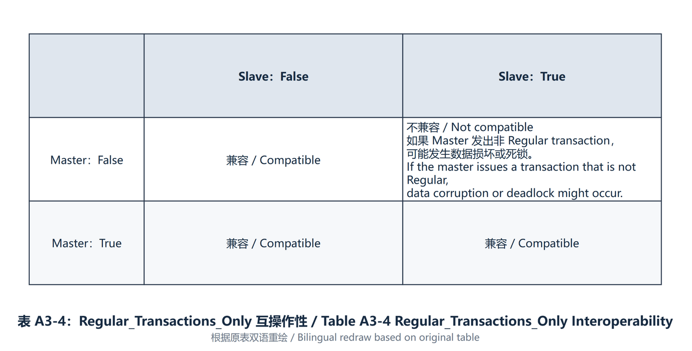

> **原文表题（English）**：Table A3-4 Regular_Transactions_Only Interoperability

### A3.4.4 数据读写结构 / Data read and write structure

本节说明 AXI 读写数据总线上不同大小的传输，以及接口如何执行混合端序和非对齐传输。本节包含以下各节：

- 写选通。
- 窄传输。
- 字节不变性，见第 A3-55 页。
- 非对齐传输，见第 A3-56 页。

> **原文（English）**
>
> This section describes the transfers of varying sizes on the AXI read and write data buses and how the interface performs mixed-endian and unaligned transfers. It contains the following sections:
>
> - Write strobes
> - Narrow transfers
> - Byte invariance on page A3-55
> - Unaligned transfers on page A3-56

#### 写选通 / Write strobes

`WSTRB[n:0]` 信号为 HIGH 时，指定数据总线上包含有效信息的字节通道。写数据总线每 8 位对应一个写选通信号，因此 `WSTRB[n]` 对应 `WDATA[(8n)+7:(8n)]`。

> **原文（English）**
>
> The WSTRB[n:0] signals when HIGH, specify the byte lanes of the data bus that contain valid information. There is one write strobe for each 8 bits of the write data bus, therefore WSTRB[n] corresponds to WDATA[(8n)+7: (8n)].

Master 必须确保，只有包含有效数据的字节通道所对应的写选通信号才为 HIGH。

> **原文（English）**
>
> A master must ensure that the write strobes are HIGH only for byte lanes that contain valid data.


当 `WVALID` 为 LOW 时，写选通信号可以取任意值，不过本规范建议将其驱动为 LOW 或保持为前一个值。

> **原文（English）**
>
> When WVALID is LOW, the write strobes can take any value, although this specification recommends that they are either driven LOW or held at their previous value.

#### 窄传输 / Narrow transfers

当 Master 生成比其数据总线更窄的传输时，地址和控制信息决定该传输使用的字节通道：

- 在递增或回绕突发传输中，突发传输的每个数据拍使用不同的字节通道。
- 在固定突发传输中，每个数据拍都使用相同的字节通道。

> **原文（English）**
>
> When a master generates a transfer that is narrower than its data bus, the address and control information determine the byte lanes that the transfer uses:
>
> - In incrementing or wrapping bursts, different byte lanes are used on each beat of the burst.
> - In a fixed burst, the same byte lanes are used on each beat.

图 A3-8 和第 A3-55 页的图 A3-9 给出了两个字节通道使用示例。阴影单元格表示不传输的字节。

> **原文（English）**
>
> Figure A3-8 and Figure A3-9 on page A3-55 give two examples of byte lanes use. The shaded cells indicate bytes that are not transferred.

图 A3-8 中：

- 突发传输包含五次传输。
- 起始地址为 0。
- 每次传输为 8 位。
- 传输在 32 位总线上进行。
- 突发类型为 INCR。

> **原文（English）**
>
> In Figure A3-8:
>
> - The burst has five transfers.
> - The starting address is 0.
> - Each transfer is 8 bits.
> - The transfers are on a 32-bit bus.
> - The burst type is INCR.

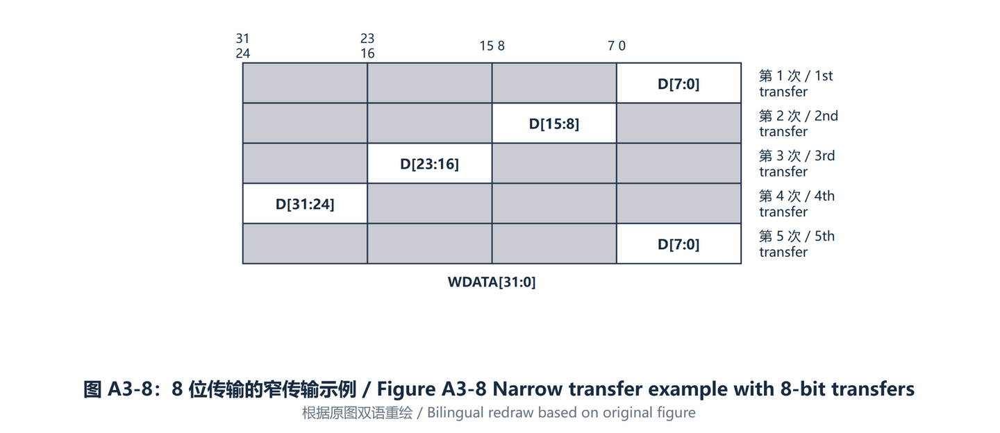

> **原文图题（English）**：Figure A3-8 Narrow transfer example with 8-bit transfers

图 A3-9 中：

- 突发传输包含三次传输。
- 起始地址为 4。
- 每次传输为 32 位。
- 传输在 64 位总线上进行。

> **原文（English）**
>
> In Figure A3-9:
>
> - The burst has three transfers.
> - The starting address is 4.
> - Each transfer is 32 bits.
> - The transfers are on a 64-bit bus.

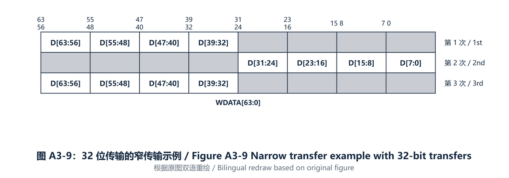

> **原文图题（English）**：Figure A3-9 Narrow transfer example with 32-bit transfers

#### 字节不变性 / Byte invariance

为了在单个存储空间中访问混合端序数据结构，AXI 协议使用字节不变端序方案。

> **原文（English）**
>
> To access mixed-endian data structures in a single memory space, the AXI protocol uses a byte-invariant endianness scheme.

字节不变端序意味着，对于数据结构中的任何多字节元素：

- 无论数据采用何种端序，该元素都使用相同的一组连续存储字节。
- 端序决定这些字节在存储器中的次序，即决定存储器中的第一个字节是该元素的最高有效字节（MSB）还是最低有效字节（LSB）。
- 无论某个字节属于何种端序的更大数据元素，对某地址的任何字节传输，都会在相同的数据总线导线上将这 8 位数据传送到相同的地址位置。

> **原文（English）**
>
> Byte-invariant endianness means that, for any multi-byte element in a data structure:
>
> - The element uses the same continuous bytes of memory, regardless of the endianness of the data.
> - The endianness determines the order of those bytes in memory, meaning it determines whether the first byte in memory is the most significant byte (MSB) or the least significant byte (LSB) of the element.
> - Any byte transfer to an address passes the 8 bits of data on the same data bus wires, to the same address location, regardless of the endianness of any larger data element that it is a constituent of.

仅有一种传输宽度的组件，其字节通道必须连接到数据总线的相应字节通道。支持多种传输宽度的组件可能需要更复杂的接口，才能将天然不具备字节不变性的接口转换为字节不变接口。

> **原文（English）**
>
> Components that have only one transfer width must have their byte lanes that are connected to the appropriate byte lanes of the data bus. Components that support multiple transfer widths might require a more complex interface to convert an interface that is not naturally byte-invariant.


大多数小端组件可以直接连接到字节不变接口。仅支持大端传输的组件需要转换功能，才能实现字节不变操作。

> **原文（English）**
>
> Most little-endian components can connect directly to a byte-invariant interface. Components that support only big-endian transfers require a conversion function for byte-invariant operation.

图 A3-10 和第 A3-56 页的图 A3-11 展示了一个存储在寄存器和存储器中的 32 位数 `0x0A0B0C0D`。

> **原文（English）**
>
> The examples in Figure A3-10 and on page A3-56 show a 32-bit number 0x0A0B0C0D, stored in a register and in a memory.

图 A3-10 展示了大端、字节不变数据结构的示例。在该结构中：

- 数据的最高有效字节（MSB）`0x0A` 存储在寄存器的 MSB 位置。
- 数据的 MSB 存储在地址最低的存储位置。
- 其他数据字节按有效性递减的顺序排列。

> **原文（English）**
>
> Figure A3-10 shows an example of the big-endian, byte-invariant, data structure. In this structure:
>
> - The most significant byte (MSB) of the data, which is 0x0A, is stored in the MSB position in the register.
> - The MSB of the data is stored in the memory location with the lowest address.
> - The other data bytes are positioned in decreasing order of significance.

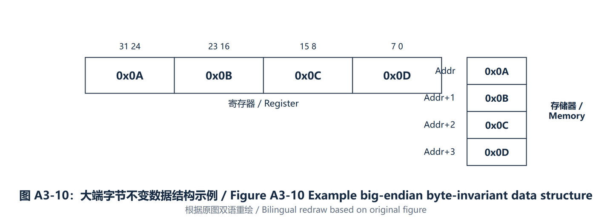

> **原文图题（English）**：Figure A3-10 Example big-endian byte-invariant data structure

图 A3-11 展示了小端、字节不变数据结构的示例。在该结构中：

- 数据的最低有效字节（LSB）`0x0D` 存储在寄存器的 LSB 位置。
- 数据的 LSB 存储在地址最低的存储位置。
- 其他数据字节按有效性递增的顺序排列。

> **原文（English）**
>
> Figure A3-11 shows an example of the little-endian, byte-invariant, data structure. In this structure:
>
> - The least significant byte (LSB) of the data, which is 0x0D, is stored in the LSB position in the register.
> - The LSB of the data is stored in the memory location with the lowest address.
> - The other data bytes are positioned in increasing order of significance.

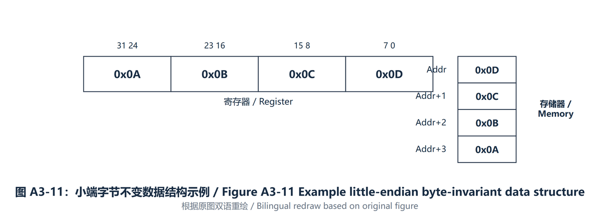

> **原文图题（English）**：Figure A3-11 Example little-endian byte-invariant data structure

第 A3-55 页的图 A3-10 和图 A3-11 中的示例表明，字节不变性确保大端和小端结构可以共存于同一个存储空间而不会损坏数据。图 A3-12 展示了需要字节不变访问的数据结构示例。在该示例中，头部字段使用小端次序，有效载荷使用大端次序。

> **原文（English）**
>
> The examples in Figure A3-10 on page A3-55 and Figure A3-11 show that byte invariance ensures that big-endian and little-endian structures can coexist in a single memory space without corruption. Figure A3-12 shows an example of a data structure that requires byte-invariant access. In this example, the header fields use little-endian ordering, and the payload uses big-endian ordering.

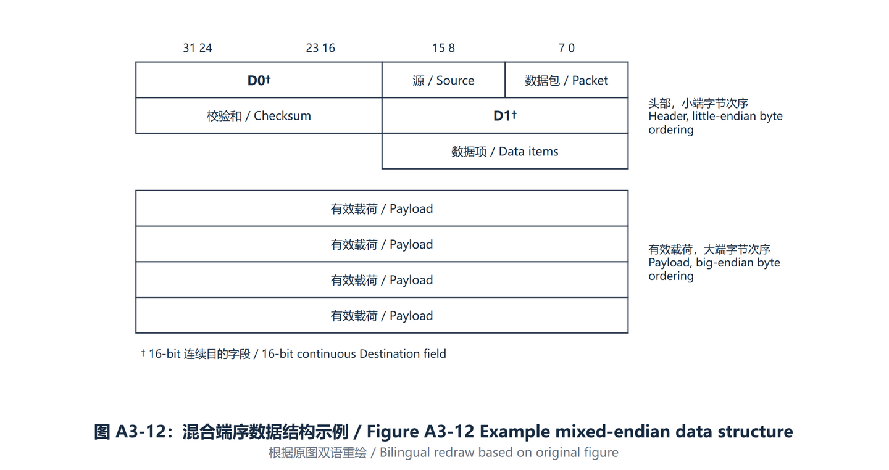

> **原文图题（English）**：Figure A3-12 Example mixed-endian data structure

例如，在该结构中，数据项是一个双字节小端元素，这意味着其最低地址是其 LSB。使用字节不变性可以确保对有效载荷的大端访问不会损坏这个小端元素。

> **原文（English）**
>
> In this structure, for example, Data items is a two-byte little-endian element, meaning its lowest address is its LSB. The use of byte invariance ensures that a big-endian access to the payload does not corrupt the little-endian element.

#### 非对齐传输 / Unaligned transfers

AXI 支持非对齐传输。对于由宽于 1 字节的数据传输组成的任何突发传输，最先访问的字节可能未与自然地址边界对齐。例如，从字节地址 `0x1002` 开始的 32 位数据包未与自然的 32 位地址边界对齐。

> **原文（English）**
>
> AXI supports unaligned transfers. For any burst that is made up of data transfers wider than 1 byte, the first bytes accessed might be unaligned with the natural address boundary. For example, a 32-bit data packet that starts at a byte address of 0x1002 is not aligned to the natural 32-bit address boundary.

Master 可以：

- 使用低位地址线指示非对齐起始地址。
- 提供对齐地址，并使用字节通道选通信号指示非对齐起始地址。

> **原文（English）**
>
> A master can:
>
> - Use the low-order address lines to signal an unaligned start address.
> - Provide an aligned address and use the byte lane strobes to signal the unaligned start address.

> **注（Note）**
>
> 低位地址线上的信息必须与字节通道选通信号上的信息一致。

> **原文（English）**
>
> The information on the low-order address lines must be consistent with the information on the byte lane strobes.


不要求 Slave 根据来自 Master 的任何对齐信息采取特殊操作。

> **原文（English）**
>
> The slave is not required to take special action based on any alignment information from the master.


图 A3-13 展示了在 32 位总线上进行对齐和非对齐 32 位传输的递增突发传输示例。图中的每一行表示一次传输，阴影单元格表示不传输的字节。

> **原文（English）**
>
> Figure A3-13 shows examples of incrementing bursts, with aligned and unaligned 32-bit transfers, on a 32-bit bus. Each row in the figure represents a transfer and the shaded cells indicate bytes that are not transferred.

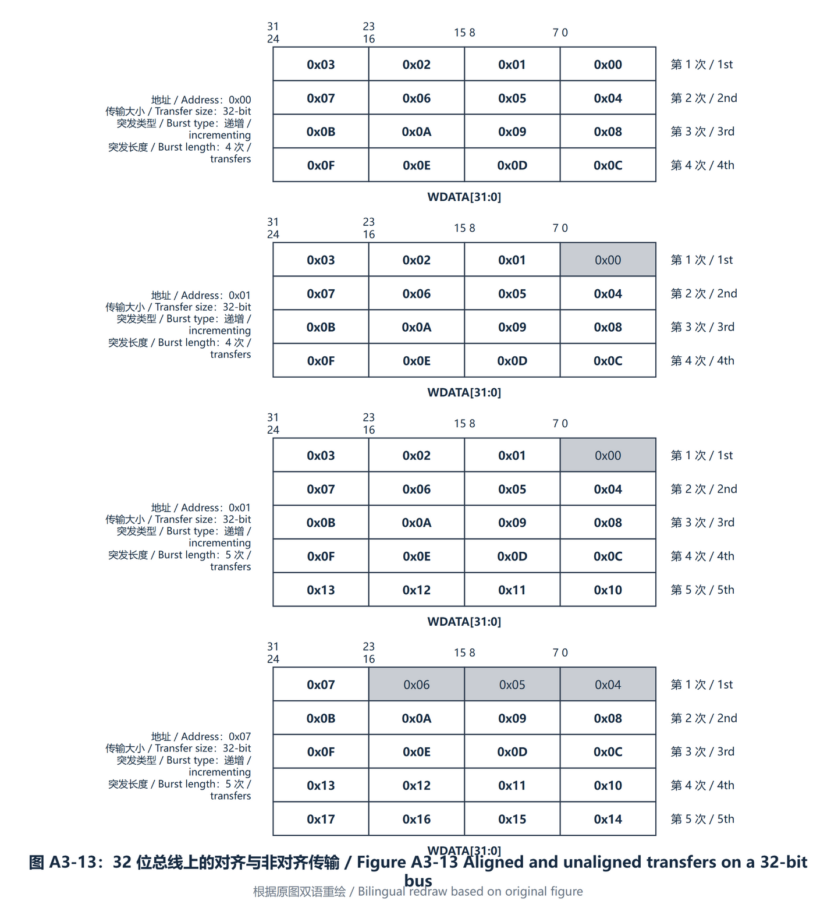

> **原文图题（English）**：Figure A3-13 Aligned and unaligned transfers on a 32-bit bus

图 A3-14 展示了在 64 位总线上进行对齐和非对齐 32 位传输的递增突发传输示例。图中的每一行表示一次传输，阴影单元格表示不传输的字节。

> **原文（English）**
>
> Figure A3-14 shows examples of incrementing bursts, with aligned and unaligned 32-bit transfers, on a 64-bit bus. Each row in the figure represents a transfer and the shaded cells indicate bytes that are not transferred.

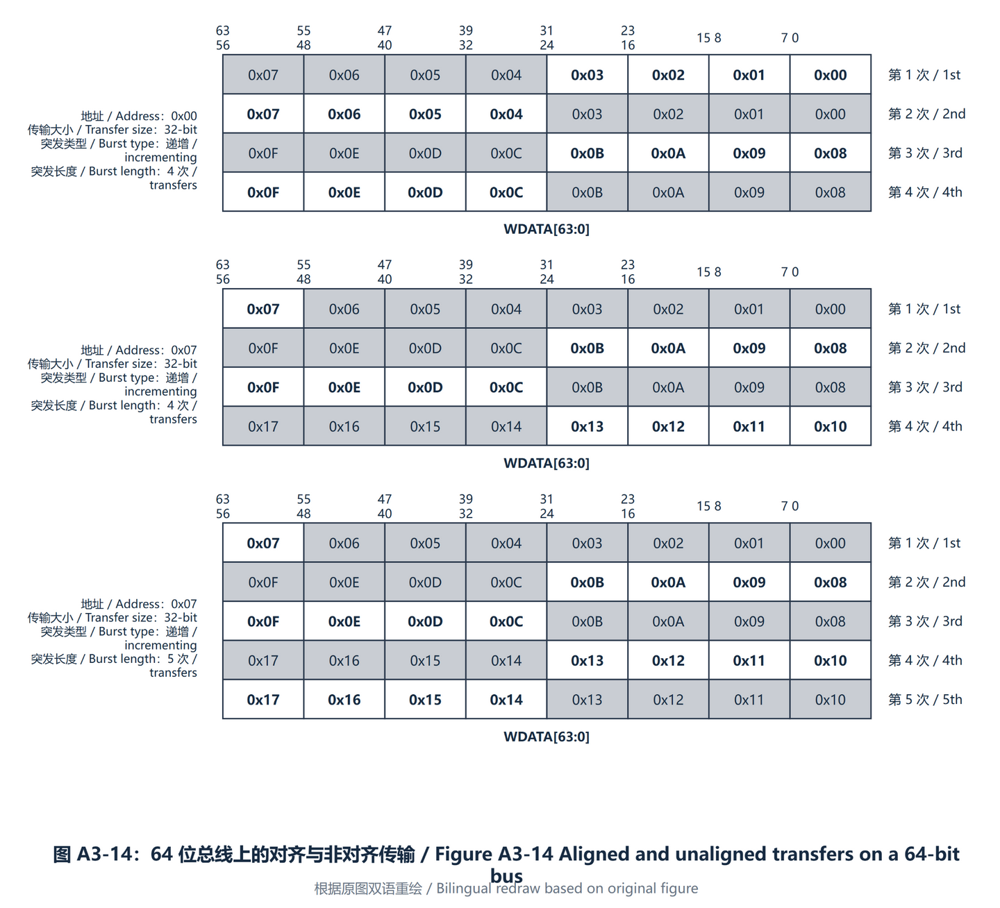

> **原文图题（English）**：Figure A3-14 Aligned and unaligned transfers on a 64-bit bus

图 A3-15 展示了在 64 位总线上进行对齐 32 位传输的回绕突发传输示例。图中的每一行表示一次传输，阴影单元格表示不传输的字节。

> **原文（English）**
>
> Figure A3-15 shows an example of a wrapping burst, with aligned 32-bit transfers, on a 64-bit bus. Each row in the figure represents a transfer and the shaded cells indicate bytes that are not transferred.

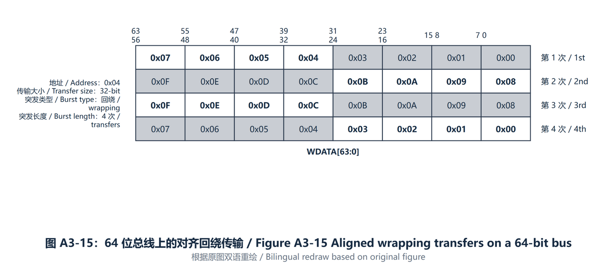

> **原文图题（English）**：Figure A3-15 Aligned wrapping transfers on a 64-bit bus

### A3.4.5 读写响应结构 / Read and write response structure

AXI 协议为读 transaction 和写 transaction 都提供响应信号：

- 对于读 transaction，Slave 的响应信息在读数据通道上发出。
- 对于写 transaction，响应信息在写响应通道上发出。

> **原文（English）**
>
> The AXI protocol provides response signaling for both read and write transactions:
>
> - For read transactions, the response information from the slave is signaled on the read data channel.
> - For write transactions the response information is signaled on the write response channel.

响应由以下信号给出：

- 对于读传输，为 `RRESP[1:0]`。
- 对于写传输，为 `BRESP[1:0]`。

> **原文（English）**
>
> The responses are signaled by:
>
> - RRESP[1:0], for read transfers.
> - BRESP[1:0], for write transfers.

响应为：

`OKAY`  普通访问成功。表示一次普通访问已成功。也可以表示一次独占访问失败。参见“OKAY，普通访问成功”。

`EXOKAY`  独占访问成功。表示独占访问的读部分或写部分已成功。参见第 A3-60 页“EXOKAY，独占访问成功”。

`SLVERR`  Slave 错误。当访问已成功到达 Slave，但 Slave 希望向发起访问的 Master 返回错误条件时使用。参见第 A3-60 页“SLVERR，Slave 错误”。

`DECERR`  解码错误。通常由互连组件生成，表示 transaction 地址上不存在 Slave。参见第 A3-60 页“DECERR，解码错误”。

> **原文（English）**
>
> The responses are:
>
> OKAY Normal access success. Indicates that a normal access has been successful. Can also indicate that an exclusive access has failed. See OKAY, normal access success.
>
> EXOKAY Exclusive access okay. Indicates that either the read or write portion of an exclusive access has been successful. See EXOKAY, exclusive access success on page A3-60.
>
> SLVERR Slave error. Used when the access has reached the slave successfully, but the slave wishes to return an error condition to the originating master. See SLVERR, slave error on page A3-60.
>
> DECERR Decode error. Generated, typically by an interconnect component, to indicate that there is no slave at the transaction address. See DECERR, decode error on page A3-60.

表 A3-5 给出了 `RRESP` 和 `BRESP` 信号的编码。

> **原文（English）**
>
> Table A3-5 shows the encoding of the RRESP and BRESP signals.

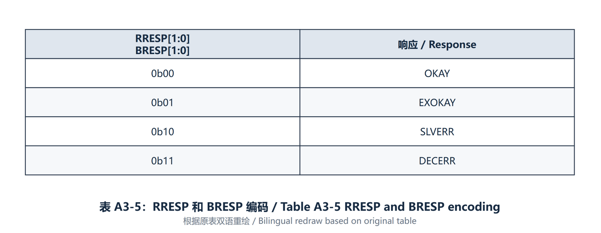

> **原文表题（English）**：Table A3-5 RRESP and BRESP encoding

对于写 transaction，整个突发传输只发出一个响应，而不是为突发传输中的每次数据传输分别发出响应。

> **原文（English）**
>
> For a write transaction, a single response is signaled for the entire burst, and not for each data transfer within the burst.


在读 transaction 中，Slave 可以为突发传输中的不同传输给出不同响应。例如，在包含 16 次读传输的突发传输中，Slave 可以为其中 15 次传输返回 `OKAY` 响应，并为其中一次传输返回 `SLVERR` 响应。

> **原文（English）**
>
> In a read transaction, the slave can signal different responses for different transfers in a burst. For example, in a burst of 16 read transfers the slave might return an OKAY response for 15 of the transfers and a SLVERR response for one of the transfers.

协议规定，即使报告错误，也必须执行所要求数量的数据传输。例如，如果请求从某个 Slave 读取八次传输的数据，而该 Slave 存在错误条件，则 Slave 必须执行八次数据传输，并且每次都给出错误响应。Slave 给出单个错误响应时，不会取消突发传输的剩余部分。

> **原文（English）**
>
> The protocol specifies that the required number of data transfers must be performed, even if an error is reported. For example, if a read of eight transfers is requested from a slave but the slave has an error condition, the slave must perform eight data transfers, each with an error response. The remainder of the burst is not canceled if the slave gives a single error response.


#### OKAY，普通访问成功 / OKAY, normal access success

`OKAY` 响应表示以下任一种情况：

- 普通访问成功。
- 独占访问失败。
- 对不支持独占访问的 Slave 进行独占访问。

> **原文（English）**
>
> An OKAY response indicates any one of the following:
>
> - The success of a normal access.
> - The failure of an exclusive access.
> - An exclusive access to a slave that does not support exclusive access.

`OKAY` 是大多数 transaction 的响应。

> **原文（English）**
>
> OKAY is the response for most transactions.

#### EXOKAY，独占访问成功 / EXOKAY, exclusive access success

`EXOKAY` 响应表示独占访问成功。只能将该响应作为独占读或独占写的响应。参见第 A7-96 页“独占访问”。

> **原文（English）**
>
> An EXOKAY response indicates the success of an exclusive access. This response can only be given as the response to an exclusive read or write. See Exclusive accesses on page A7-96.


#### SLVERR，Slave 错误 / SLVERR, slave error

`SLVERR` 响应表示一次不成功的 transaction。

> **原文（English）**
>
> The SLVERR response indicates an unsuccessful transaction.

为了简化系统监控和调试，本规范建议仅将错误响应用于错误条件，而不用于指示正常的预期事件。Slave 错误条件示例包括：

- FIFO 或缓冲区上溢或下溢条件。
- 尝试使用不受支持的传输大小。
- 尝试对只读位置进行写访问。
- Slave 中出现超时条件。
- 尝试访问已禁用或已断电的功能。

> **原文（English）**
>
> To simplify system monitoring and debugging, this specification recommends that error responses are used only for error conditions and not for signaling normal, expected events. Examples of slave error conditions are:
>
> - FIFO or buffer overrun or underrun condition
> - Unsupported transfer size attempted.
> - Write access attempted to read-only location
> - Timeout condition in the slave
> - Access attempted to a disabled or powered-down function

#### DECERR，解码错误 / DECERR, decode error

`DECERR` 响应表示互连无法成功解码一次 Slave 访问。

> **原文（English）**
>
> The DECERR response indicates that the interconnect cannot successfully decode a slave access.

如果互连无法成功解码一次 Slave 访问，则必须返回 `DECERR` 响应。本规范建议互连将该访问路由到默认 Slave，并由默认 Slave 返回 `DECERR` 响应。

> **原文（English）**
>
> If the interconnect cannot successfully decode a slave access, it must return the DECERR response. This specification recommends that the interconnect routes the access to a default slave, and the default slave returns the DECERR response.

AXI 协议要求，即使出现错误条件，也要完成一个 transaction 的所有数据传输。任何给出 `DECERR` 响应的组件都必须满足此要求。

> **原文（English）**
>
> The AXI protocol requires that all data transfers for a transaction are completed, even if an error condition occurs. Any component giving a DECERR response must meet this requirement.
