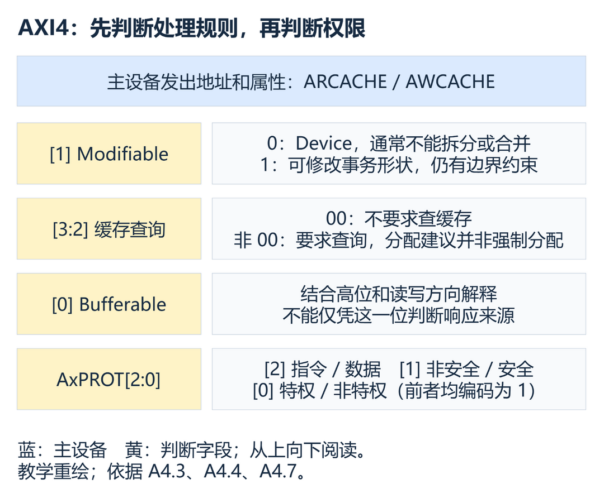
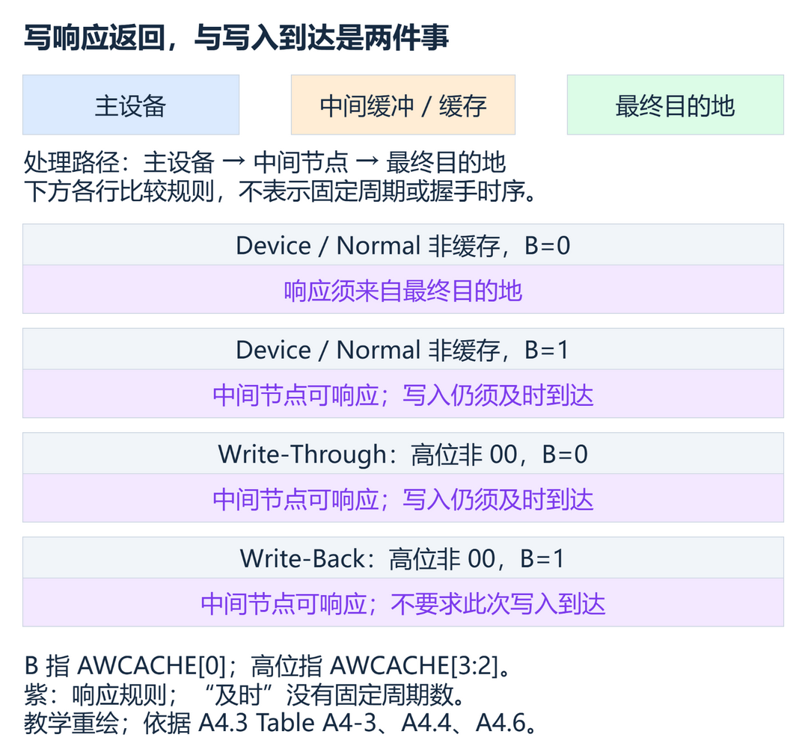
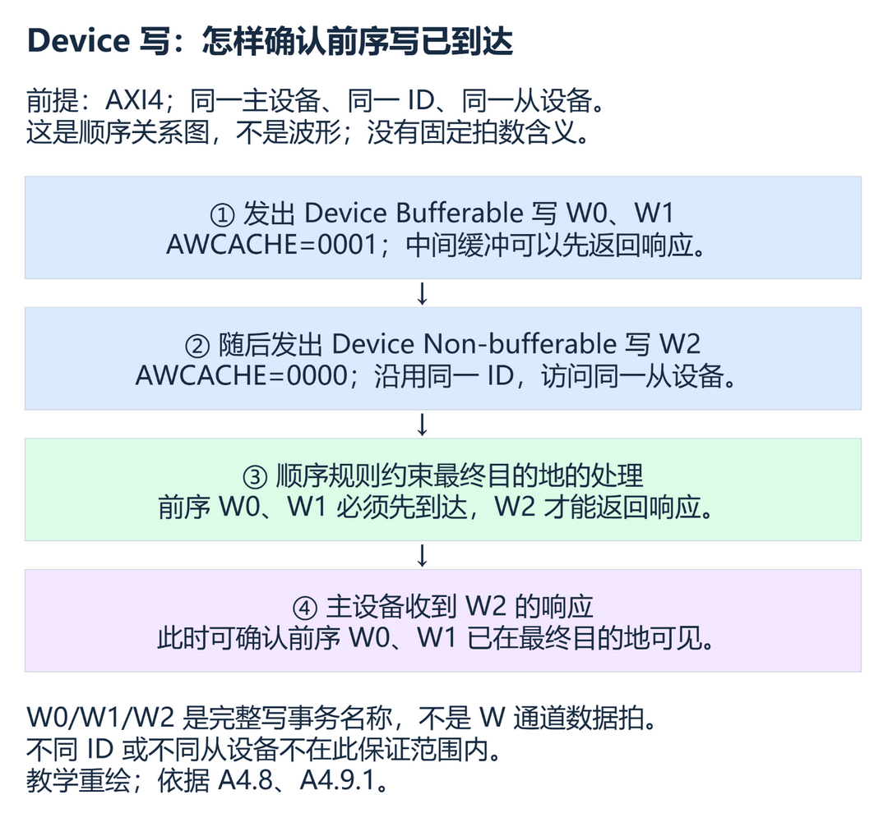

# A4：事务属性——看懂缓存、缓冲与访问权限

> 阅读对象：认识 AXI 五通道、希望理解系统如何处理一次访问的初学者。
> 依据：Arm IHI 0022H《AMBA AXI and ACE Protocol Specification》，Chapter A4 Transaction Attributes，A4-61～A4-78。A4-78 为章节末空白页。
> 范围：完整覆盖 A4.1～A4.9，以 AXI4 为主，单独说明 AXI3 的定义与兼容要求。
> 前置知识：地址通道携带控制信息；同一 ACLK 上升沿 VALID、READY 同为 1 才完成一次通道传输。

## 学习目标

1. 根据 `AxCACHE` 判断事务是否可修改、是否要求查缓存，以及响应允许来自哪里。
2. 区分 Device、Normal Non-cacheable、Write-Through、Write-Back 的处理规则。
3. 解释为什么 No-Allocate 不等于禁止缓存分配。
4. 判断多个主设备访问同一地址区域时，哪些属性可以不同。
5. 正确解码 `AxPROT`，说明同 ID、同从设备的 Device 写完成保证。

## 先建立认识：地址相同，处理方式可能不同

假设主设备连续写两次同一个地址。地址背后如果是普通内存，中间节点可能有机会合并写入；如果背后是一个“每写一次就触发一次动作”的外设寄存器，合并后就可能少执行一次动作。这个例子只帮助理解属性的用途，具体外设允许哪些访问仍由其说明书规定。

AXI（Advanced eXtensible Interface，高级可扩展接口）在地址之外携带事务属性，告诉沿途组件应当怎样处理这笔访问。Interconnect（互连）连接主设备与从设备；Buffer（缓冲）暂存正在传递的事务；Cache（缓存）保存可供后续访问使用的数据副本。缓存与缓冲的内部实现可能交织，本文按协议允许的行为区分它们。

`ARCACHE` 随读地址发送，`AWCACHE` 随写地址发送；`AxCACHE` 是两者的统称，不是额外一根信号。`ARPROT`、`AWPROT` 则描述读写访问的保护属性，合称 `AxPROT`。

图 1：事务处理属性与权限属性的分工（教学重绘）

读图时先把“可不可以改变事务形状”“需不需要查缓存”“响应可以来自哪里”分开，再看权限。它们相关，但不是同一个判断。

AxCACHE 描述事务经过系统时应遵守的处理规则，不能把它当成一个简单的“缓存开关”。

依据：A4.1、A4.3、A4.7。

## A4.1 从设备类型：协议完成与功能正确要分开

规范区分 Memory Slave（内存从设备）与 Peripheral Slave（外设从设备）。这里的从设备分类与某笔事务的 Device/Normal 属性不是同一个概念。

| 从设备分类 | 正确访问的要求 | 超出外设规定的访问方法时 |
| --- | --- | --- |
| Memory Slave | 正确处理所有事务类型 | 按规范处理事务 |
| Peripheral Slave | 按实现定义的访问方法工作，通常见组件说明书 | 仍须符合协议地完成事务，但功能继续正确不再有保证 |

例如，一个外设可能只支持某种访问宽度和访问顺序。它可以据此裁减接口信号，但不能把未支持的访问永久挂起。

1. 外设遇到超出规定方法的访问，仍须按协议完成这次及后续事务，避免系统死锁。
2. “按协议完成”不保证外设功能仍正确，也不等于一定返回 OKAY。

依据：A4.1，A4-62。

## A4.2 AXI3：先认识四个属性位

AXI3 用 `AxCACHE[3:0]` 表示以下属性。Allocate（分配）指把相关数据放入缓存中形成缓存条目；提示建议是否分配，和强制分配是两回事。

| 位 | AXI3 名称 | 含义 |
| --- | --- | --- |
| `[0]` | Bufferable，B，可缓冲 | 为 1 时，允许沿途组件延迟事务到达最终目的地；AXI3 此处允许任意周期延迟，通常与写有关 |
| `[1]` | Cacheable，C，可缓存 | 为 0 时禁止分配；为 1 时允许分配，也允许最终访问形态与原事务不同 |
| `[2]` | Read-Allocate，RA，读分配 | 为 1 时建议读分配，不强制 |
| `[3]` | Write-Allocate，WA，写分配 | 为 1 时建议写分配，不强制 |

C 为 1 时，写事务可能被合并；读事务可以预先取数，也可以用一次获取的数据服务多笔读事务。Prefetch（预取）就是在实际需要之前或超出当前所需范围提前获取数据。

AXI3 中 C=0 时，RA、WA 都必须为 0；C=1 允许缓存分配，但并不要求每笔访问都分配。

本节是 AXI3 的定义。后文 AXI4 对相关属性增加更明确的要求，不能直接用本节“任意周期延迟”解释 AXI4 的及时传播义务。

依据：A4.2、Table A4-1，A4-63。

## A4.3 AXI4：可修改、查询缓存和分配建议

### A4.3.1 Modifiable：允许改变哪些内容

AXI4 将 `AxCACHE[1]` 改名为 Modifiable（可修改）。规范说明，更名是为了准确描述原有功能；同时 AXI4 明确了相关行为和顺序要求。

#### 值为 0：Non-modifiable

Non-modifiable（不可修改）通常不允许拆成多笔事务，也不允许与其他事务合并。Burst（突发传输）是一笔事务中的一组数据传输；改变突发长度和每拍大小，就是改变事务的形状。

| 通常必须保持的参数 | 信号 |
| --- | --- |
| 传输地址与相应区域 | `AxADDR`，以及由此确定的 `AxREGION` |
| 每拍大小、突发长度、突发类型 | `AxSIZE`、`AxLEN`、`AxBURST` |
| 锁定类型与保护属性 | `AxLOCK`、`AxPROT` |

1. 不可修改事务的 AxCACHE 只允许从 Bufferable 改为 Non-bufferable，不允许其他属性改变。
2. 事务 ID（Identifier，标识符）及 QoS（Quality of Service，服务质量）值仍允许修改。
3. 长度超过 16 拍的不可修改突发允许拆分，只相应缩短长度、调整地址，其他要求仍须保持。
4. 不可修改的 Exclusive（独占）访问允许改变 AxSIZE、AxLEN，前提是访问总字节数保持不变。

超过 16 拍的合法 AXI4 突发是 INCR（Incrementing，地址递增）类型。拆分例外可用于衔接 AXI3 的突发长度能力，不表示普通短 Device 事务也能任意拆分。

规范还指出一种工程困难：下游总线比事务要求的每拍宽度更窄时，宽度转换可能无法维持不可修改属性。执行这种操作的组件可以提供实现定义的“发生过修改”提示，辅助软件调试。这是需要识别的系统集成限制，不能据此把不可修改规则忽略掉。

依据：A4.3.1、Table A4-2，A4-64～A4-65；长突发类型参见 A3.4.1。

#### 值为 1：Modifiable

允许修改后，互连可以拆分、合并事务，也可以调整 `AxADDR`、`AxSIZE`、`AxLEN`、`AxBURST`。读可以多取数据；写可以扩大访问地址范围，但要通过 `WSTRB`（Write Strobe，写字节选通）保证只更新应该写入的字节。

例如，在满足地址、权限、原子性及其他顺序要求时，中间节点可能把相邻小写事务整理为较大的写事务。这里说明的是允许的处理方式，不保证实现一定合并，也不承诺固定性能收益。

1. 可修改事务仍不能改变 AxLOCK 和 AxPROT。
2. 修改不能访问原事务所在 4KB 地址空间之外的地址。
3. 不能把对一个单副本原子性粒度区域的一次访问变成多次访问。
4. AxCACHE 可以调整，但不能降低其他组件对事务的可见性；同一地址范围的调整必须一致。
5. 事务 ID 与 QoS 值允许修改。

Single-copy atomicity（单副本原子性）要求其他观察者不能看到一次受保证访问被撕裂成多个部分的中间状态；粒度的完整定义见 A7.1.1。可见性约束包括：不能阻止事务传播到要求到达的位置，也不能不恰当地改变缓存查询需求。

依据：A4.3.1，A4-65；单副本原子性见 A7-94。

### A4.3.2 Allocate 与 Other Allocate：读写位置不同

AXI4 区分 Allocate（本类访问的分配提示）和 Other Allocate（可能因其他访问而已经分配）。其他访问既可能是另一读写方向的访问，也可能来自另一个主设备。

| 字段 | 读：ARCACHE | 写：AWCACHE |
| --- | --- | --- |
| Allocate | `[2]` | `[3]` |
| Other Allocate | `[3]` | `[2]` |
| Modifiable | `[1]` | `[1]` |
| Bufferable | `[0]` | `[0]` |

Allocate 为 1 时，规范建议出于性能原因分配本次事务，但并不强制分配。Other Allocate 提醒系统：不能因为本次访问自身不建议分配，就假定缓存中不可能已有该地址。

1. AxCACHE[3:2] 非 00 时，要求进行缓存查询；查询不等于命中，也不等于必须新建缓存条目。
2. AxCACHE[3:2]=00 时，不要求进行缓存查询；写事务必须传播到最终目的地。
3. 同一种内存类型，读写通道的合法编码可能不同。

这里的缓存查询要求用于系统中相关缓存的处理，不表示每个 AXI 接口都必须增加一个缓存。

依据：A4.3.2、Table A4-3、Table A4-4，A4-65～A4-68。

### Bufferable 为什么不能孤立解码

图 2：不同属性下的写响应来源与到达要求（教学重绘）

图中需要重点对比第二行与第三行：低位不同，写响应来源和及时到达义务却相同。因为高位表明它们属于不同内存类型。

1. AWCACHE[3:2]=00 且 [0]=0 时，写响应须来自最终目的地；[0]=1 时允许中间响应，但写入仍须及时在最终目的地可见。
2. AWCACHE[3:2] 非 00 时，[0]=0、[0]=1 都允许中间响应；前者仍要求及时到达，后者不要求此次写入在最终目的地可见。

对读而言，`ARCACHE[3:1]=000` 时低位不改变处理要求：两种 Device 读都要到最终目的地取数。`ARCACHE[3:2]=00`、`[1]=1` 时，低位决定能否从正在前进的写事务取数。高位非 00 时，低位区分 Write-Through 和 Write-Back。

依据：Table A4-3、Table A4-4，A4-67～A4-68。

## A4.4 内存类型：用完整编码理解行为

### 编码速查

以下以二进制 `[3:0]` 顺序列出 AXI4 优选编码。WT 是 Write-Through（写通），WB 是 Write-Back（写回）；RA 表示读分配建议，WA 表示写分配建议。这里的分配名称描述性能提示。

| 内存类型 | ARCACHE | AWCACHE |
| --- | --- | --- |
| Device Non-bufferable | `0000` | `0000` |
| Device Bufferable | `0001` | `0001` |
| Normal Non-cacheable Non-bufferable | `0010` | `0010` |
| Normal Non-cacheable Bufferable | `0011` | `0011` |
| WT No-Allocate | `1010` | `0110` |
| WT RA | `1110` | `0110` |
| WT WA | `1010` | `1110` |
| WT RA + WA | `1110` | `1110` |
| WB No-Allocate | `1011` | `0111` |
| WB RA | `1111` | `0111` |
| WB WA | `1011` | `1111` |
| WB RA + WA | `1111` | `1111` |

兼容 AXI3 的合法替代编码有四处：WT RA 的读编码可为 `0110`；WT WA 的写编码可为 `1010`；WB RA 的读编码可为 `0111`；WB WA 的写编码可为 `1011`。其他方向保持表中值。

表中优选编码及上述兼容编码之外的值是保留编码，不能随意拼接属性位。

比如 `0100` 的分配位非零而 Modifiable 为 0，并不是合法的新类型。表中也可看出，同一个通道编码不足以独自表达所有读写分配组合，不能把读方向的解码表原样套到写方向。

依据：A4.4、Table A4-5，A4-69。

### A4.4.1 各类型的要求

#### Device：保留访问本来的含义

两种 Device 都是不可修改事务。规范中 Device memory 与 Non-modifiable memory 可互换使用，但仍需保留 A4.3.1 的明确例外。

1. Device 读不能预取，写不能合并，读数据必须来自最终目的地。
2. Device Non-bufferable 的写响应必须来自最终目的地。
3. Device Bufferable 允许中间写响应，但仍须及时把写入传播到最终目的地。

对读访问，两种 Device 没有行为差异。因此，给外设读设置 Bufferable，并不能允许缓冲节点拿旧缓存副本代替实际读操作。

依据：A4.4.1，A4-69～A4-70。

#### Normal Non-cacheable：不缓存，也能修改事务

Normal（普通内存）允许受约束的事务修改。Non-cacheable（不可缓存）不意味着每个上游事务都必须原样传到下游。

| 类型 | 写处理 | 读数据来源 |
| --- | --- | --- |
| Non-bufferable | 可合并，响应来自最终目的地 | 最终目的地 |
| Bufferable | 可合并，可中间响应，仍须及时到达 | 最终目的地，或正在前进到该处的写事务 |

从写缓冲取数的做法称为 Forwarding（转发）：读请求恰好需要尚未送达目的地的写数据，就从这笔仍在前进的写事务中取数。

1. Normal Non-cacheable Bufferable 从写事务转发读数据时，必须取最新版本，不能把此次读到的数据缓存起来服务后续读。
2. 转发读成功，不代表那笔写已经在最终目的地可见。

例如主设备写入新值后立刻读取，中间缓冲可能返回新值，但不能由此断言其他主设备已经能在目的地看到它。后续读是否仍可从尚在前进的写事务取得数据，还必须满足 A4.6 的前进要求。

依据：A4.4.1，A4-70。

#### Write-Through：缓存可服务读取，写仍须及时到达

Write-Through 通常称为写通。它允许读从中间缓存副本返回，也允许写从中间节点得到响应。

1. Write-Through 的写必须及时在最终目的地可见，但收到中间写响应时无法据此确定已经到达。
2. Write-Through 读写都要求查缓存，事务可修改，读可预取，写可合并。

分配提示有四种：No-Allocate 不建议读写分配；Read-Allocate 建议读分配、不建议写分配；Write-Allocate 相反；Read and Write-Allocate 两者都建议。

Write-Through No-Allocate 仍要求查询缓存，也不禁止读写分配；No-Allocate 是性能建议。

依据：A4.4.1，A4-71。

#### Write-Back：此次写入可以停留在缓存层次

Write-Back 通常称为写回。同样允许中间写响应、从缓存读取、事务修改、读预取和写合并，也要求读写查缓存。

与 Write-Through 不同，Write-Back 不要求这次写事务在最终目的地可见。

它的 No-Allocate、Read-Allocate、Write-Allocate、Read and Write-Allocate 四种提示，与写通的建议组合相同；No-Allocate 同样不禁止分配。

“不要求此次写到达”不代表数据可以丢失。何时因缓存替换、维护等原因向更低层写回，要结合系统的缓存管理机制理解；本章没有规定统一的写回时刻。

依据：A4.4.1，A4-72。

## A4.5 多个主设备：哪些属性允许不一致

设两个主设备访问同一内存区域。一个把该区域看成可缓存，另一个直接绕过缓存，可能形成不一致的数据视图。A4.5 要求在每一层内存层次上保持一致的可缓存性认知。

1. 区域不可缓存时，所有主设备都应使用 AxCACHE[3:2]=00 的事务。
2. 区域可缓存时，所有主设备都应使用 AxCACHE[3:2] 非 00 的事务。
3. 不同主设备允许采用不同分配提示。
4. Normal Non-cacheable 区域允许使用 Device 事务访问。
5. 允许缓冲的区域可以用不允许缓冲行为的事务访问，例如要求从最终目的地返回响应。

这是一组有条件的兼容规则，不是允许任意修改内存类型。尤其不能从“允许用更严格的 Device 访问普通不可缓存区域”，反推出“外设也可用更宽松的 Normal 访问”。

依据：A4.5，A4-73。

### A4.5.1 改变区域属性需要协同过程

从 Write-Through Cacheable 改为 Normal Non-cacheable 等不兼容属性变化，需要合适的切换过程。规范给出的典型流程是：

1. 所有主设备停止访问该区域。
2. 一个主设备执行所需的缓存维护操作。
3. 所有主设备使用新属性恢复访问。

不能把不兼容的区域属性切换简化成“只改下一笔事务的 AxCACHE”。

具体缓存维护和同步指令取决于处理器与系统；上述是典型过程，不是一套适用于所有平台的寄存器操作步骤。

依据：A4.5.1，A4-73。

## A4.6 事务缓冲：及时前进，不能一直拖延

Device Bufferable、Normal Non-cacheable Bufferable、Write-Through 都允许中间写响应，也都要求写及时到达最终目的地。它们的读行为不同。

| 类型 | 允许的读数据来源 |
| --- | --- |
| Device Bufferable | 最终目的地 |
| Normal Non-cacheable Bufferable | 最终目的地，或正在前进的写事务 |
| Write-Through | 还可以来自中间缓存副本 |

“及时”并没有规定一个统一的周期上限。规范约束的是缓冲必须有持续前进的行为，不能因新请求到来而永远拖住旧请求。

1. Normal Non-cacheable Bufferable 的读转发尝试和供转发的数据不能无限维持；读取行为不能重置数据的超时期。
2. 写缓冲可以合并新写，但不能因此重置排出机制，导致旧写永远留在缓冲中。

第一个规则防止连续轮询同一位置，让缓冲中的值永不过期、读永远不朝目的地推进。第二个规则防止持续写同一位置，让合并后的写永远不向下游排出。具体采用什么超时或推进机制由实现决定，AXI 没有规定固定计数值。

依据：A4.6，A4-74。

## A4.7 AxPROT：三个独立维度

`AxPROT[2:0]` 随地址描述访问身份及类型，可供系统保护逻辑判定访问是否允许。

| 位 | 0 | 1 |
| --- | --- | --- |
| `[0]` | Unprivileged，非特权 | Privileged，特权 |
| `[1]` | Secure，安全 | Non-secure，非安全 |
| `[2]` | Data，数据访问 | Instruction，指令访问 |

例如 `AxPROT=3'b011` 按 `[2:0]` 解读是：数据访问、非安全访问、特权访问。三位不能当成一个“权限等级数值”比较大小。

1. AxPROT[1]=1 表示 Non-secure，不是 Secure。
2. AXI 的特权位只区分特权与非特权；处理器多个权限等级如何映射，要查处理器文档。
3. AxPROT[2] 是指令/数据提示，不能保证在混合访问等场景下完全准确；除非确定是指令访问，规范建议置 0。

安全位可以理解成区分安全与非安全两个地址空间的附加地址位。若两个空间之间存在地址别名，系统必须正确处理。Secure 是访问属性，不能理解成数据已经被加密；保护属性的携带也不等于系统中自动存在完整的访问控制逻辑。

依据：A4.7、Table A4-6，A4-75。

## A4.8 兼容旧组件：同 ID 的 Device 顺序不能漏查

AXI4 要求同 ID、同从设备的 Device 事务相互保序；不要据此把独立读写通道当成天然具有跨方向总顺序。

还应区分“最终目的地已收到”与“对后续事务可观察”。A6.5.2、A6.7 要求提前响应的中间节点仍承担相应顺序和可观察性责任，不能把“允许中间响应”理解成可以任意给后续请求返回旧值。本章的“到达”主要指写入已传播到最终目的地。

事务顺序的完整定义还需结合 A6。下面 A4.9 的例子专门使用写事务序列，因此可以直接讨论前序写的完成。

AXI3 没有明确提出相同的 Device 顺序要求。若 AXI4 组件依赖这一行为，就不能连接到不提供该行为的 AXI3 互连。规范认为多数已实现的 AXI3 互连支持这一行为，并强烈建议新的 AXI3 设计实现 AXI4 的该项要求；这仍需要针对实际组件核实。

命名方面，AXI4 要使用新的属性位名称和内存类型名称；AXI3 组件可以采用 AXI3 或 AXI4 名称。

依据：A4.8，A4-76；读写顺序边界参见 A6。

## A4.9 应用：用一笔不可缓冲 Device 写确认前序写已到达

### A4.9.1 Device 内存类型的组合使用

假设同一个主设备向同一个从设备发出 W0、W1 两笔 Device Bufferable 写，随后发出 W2，一笔 Device Non-bufferable 写。三笔写使用相同的事务 ID。

图 3：同 ID、同从设备的 Device 写完成关系（教学重绘）

按图中事件顺序看：

1. W0、W1 可以由中间缓冲先返回响应。这时主设备还不能确定它们何时到达最终目的地。
2. W2 使用相同 ID，且仍访问同一从设备，只是改为 Device Non-bufferable。
3. 顺序要求迫使前序 W0、W1 先到达最终目的地，W2 才能得到响应；W2 自己的响应也必须来自最终目的地。
4. 主设备收到 W2 的响应后，就能确认上述前序写已经在最终目的地可见。

1. 后续 Device Non-bufferable 写的响应，可以确认同 ID、同从设备的前序 Device Bufferable 写已经到达最终目的地。
2. 这一保证不覆盖不同 ID 或不同从设备的写，也不能把例子中的后续写随意换成读。

实际应用中，W2 必须是外设文档允许的有效写访问，不能为了“刷新缓冲”随便写一个有副作用的寄存器。这里讨论的是传播和可见性；返回错误响应时，不能把“得到响应”当作“成功更新了目标值”。同样，它不是对所有主设备私有缓存副本自动更新的承诺。

依据：A4.9.1，A4-77；Device 顺序要求见 A4.8。

## 易错点：把结论放回它的适用条件

| 常见误解 | 正确理解及误解原因 | 依据 |
| --- | --- | --- |
| AXI4 `[1]=1` 就必须缓存 | 名称来自 AXI3，AXI4 强调可修改；`0010`、`0011` 就是不可缓存类型 | A4.2～A4.4 |
| No-Allocate 禁止分配 | 把性能提示误当成硬限制；WT/WB No-Allocate 仍须查缓存且不禁止分配 | A4.4.1 |
| `[0]=0` 必须等最终目的地响应 | 忽略高位；WT 允许中间写响应 | Table A4-3 |
| 不可缓存就不可合并 | 混淆缓存性与可修改性；Normal Non-cacheable 可以合并写 | A4.4.1 |
| 有写响应就全系统可见 | 忽略响应来源与内存类型；中间响应未必说明写已到达 | A4.4、A4.9 |
| Bufferable 允许永远滞留 | 沿用 AXI3 简述而忽略 AXI4 及时传播要求 | A4.2、A4.6 |
| 特权访问一定是安全访问 | 把两个独立位当成同一维度；特权与非安全可以同时为 1 | A4.7 |
| 相同 ID 可以刷新所有从设备 | 漏掉同从设备条件，也忽略独立读写方向的顺序边界 | A4.9.1、A6 |

## 原文覆盖对照表

| PDF 章节或页码 | 原文知识点 | 本文位置 |
| --- | --- | --- |
| A4.1 / A4-62 | 两类从设备、越界访问方法的完成义务、AxCACHE 用途 | A4.1、开篇 |
| A4.2 / A4-63 | AXI3 B/C/RA/WA、分配限制、Table A4-1 | A4.2 |
| A4.3.1 / A4-64～65 | 更名、固定参数、属性调整、长突发与独占例外、窄化困难 | A4.3.1 不可修改部分 |
| A4.3.1 / A4-65 | 修改方式、WSTRB、可见性、4KB、原子性约束 | A4.3.1 可修改部分 |
| A4.3.2 / A4-65～68 | Allocate/Other Allocate、查询要求、读写不同定义，Tables A4-3/4 | A4.3.2、Bufferable 解码 |
| A4.4 / A4-69 | 十二种类型组合、优选与兼容编码、保留值，Table A4-5 | 编码速查 |
| A4.4.1 / A4-69～70 | Device 与两种 Normal Non-cacheable、转发最新值及限制 | A4.4.1 前两部分 |
| A4.4.1 / A4-71～72 | WT/WB 各四种分配提示及行为 | A4.4.1 后两部分 |
| A4.5、A4.5.1 / A4-73 | 属性兼容、层次一致性、切换流程 | A4.5 |
| A4.6 / A4-74 | 三类写前进要求、读来源区别、读转发与写合并不能无限延迟 | A4.6 |
| A4.7 / A4-75 | 保护编码、特权映射、安全地址空间、指令提示，Table A4-6 | A4.7 |
| A4.8 / A4-76 | AXI3/4 Device 顺序兼容与命名要求 | A4.8 |
| A4.9.1 / A4-77 | Device 写组合示例及同 ID、同从设备边界 | A4.9 |

A4 原章没有编号时序图；本文三幅图均为独立组织的教学说明，覆盖处理规则与原文示例，不是规范原图或仿真结果。

## 下一章衔接与参考来源

A5 将解释 Transaction ID（事务标识）如何关联请求和响应，以及多个事务同时未完成时怎样区分它们。进入下一章前，应能分清“事务允许怎样处理”和“它属于哪一笔请求”，并记住本章 Device 完成保证中的同 ID 条件。

参考来源：Arm IHI 0022H《AMBA AXI and ACE Protocol Specification》，Chapter A4，A4-61～A4-78。辅助边界参照 A3.4.1、A6、A7.1.1。

本文为个人学习导读，不是 Arm 官方文档。协议设计与实现应以适用版本的官方规范为准。

## 自测题

  
1. 外设遇到不支持的访问方法，可以一直不完成事务吗？

  不可以。它仍须按协议完成本次及后续事务，但功能继续正确不再有保证。依据：A4.1。

  
2. AXI4 的 AxCACHE=0010 表示必须使用缓存吗？

  不表示。它是 Normal Non-cacheable Non-bufferable；[1]=1 表示可修改。依据：A4.3、A4.4。

  
3. 一个 32 拍的不可修改 INCR 突发，是否绝对不允许拆分？

  不是。超过 16 拍的突发有明确拆分例外，须按规定缩短长度、调整地址并保留其他要求。依据：A4.3.1。

  
4. Write-Through No-Allocate 可以跳过缓存查询吗？

  不可以。读写都要求查询；No-Allocate 只是分配建议。依据：A4.4.1。

  
5. AWCACHE[0]=0 能独自证明写响应来自最终目的地吗？

  不能。还要看高位；Write-Through 的低位为 0，也允许中间响应。依据：Table A4-3。

  
6. Normal Non-cacheable Bufferable 读从在途写转发得到新值，能证明写已经到达目的地吗？

  不能。转发允许发生在写尚未到达时。依据：A4.4.1。

  
7. 两个主设备可以把同一区域分别当成可缓存和不可缓存区域访问吗？

  不可以。每一层的可缓存性认知必须一致；允许不同的是分配提示等符合 A4.5 的属性。依据：A4.5。

  
8. 连续合并新写，可以每次重置排出机制，让缓冲中的写一直不发送吗？

  不可以。合并不能使写事务无限滞留。依据：A4.6。

  
9. AxPROT=3'b011 中的安全属性是什么？

  Non-secure。安全属性看 [1]，其值为 1 表示非安全。依据：A4.7。

  
10. 写向从设备 B 的 Device Non-bufferable 响应，能确认先前写向从设备 A 的 Bufferable 写已经到达吗？

  不能。A4.9.1 的完成保证要求前后 Device 写同 ID、同从设备。依据：A4.9.1。

