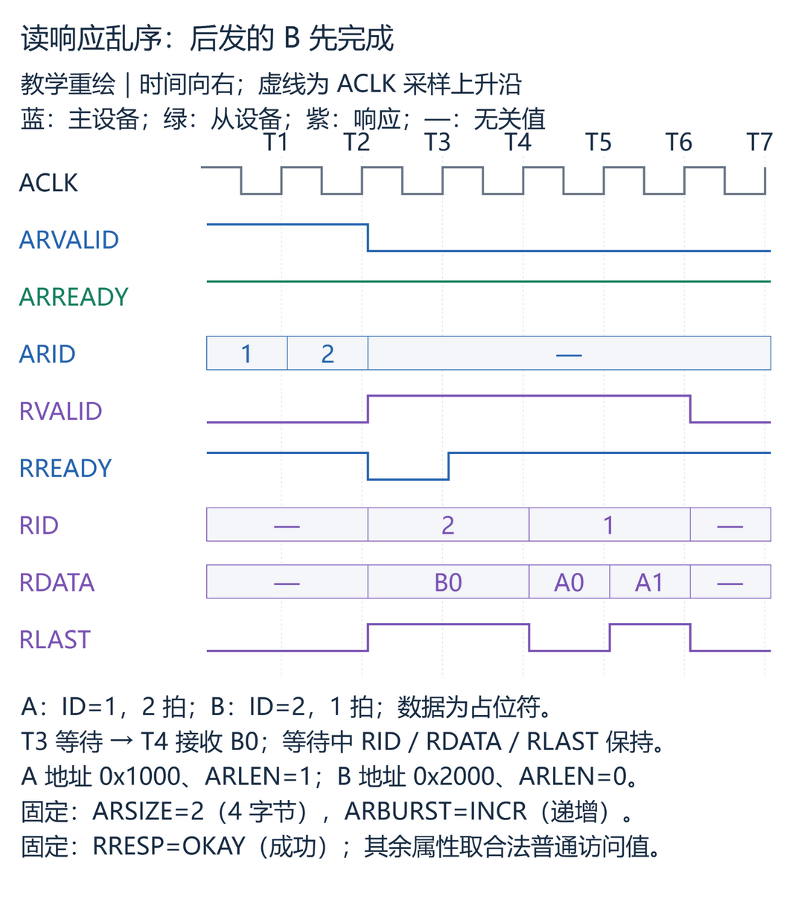
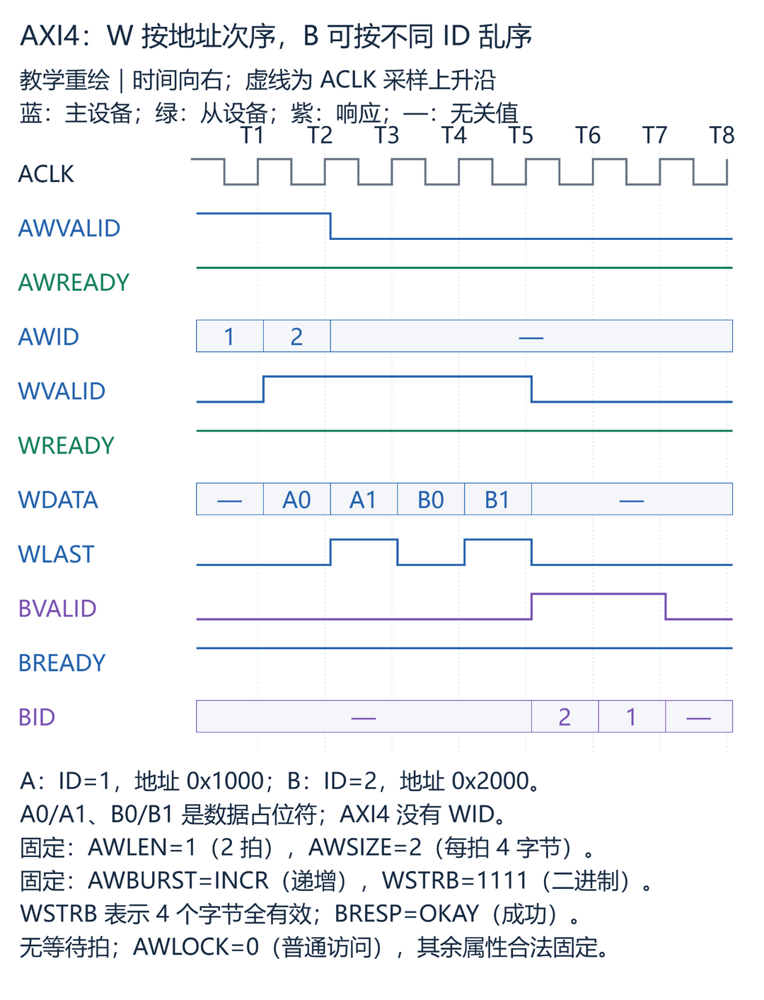
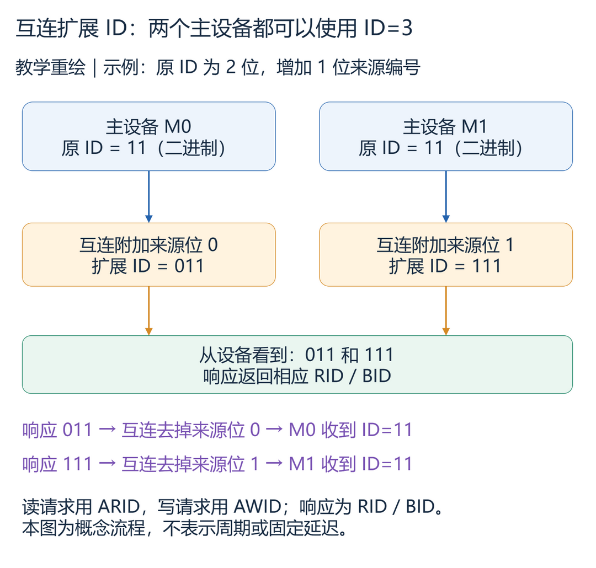

# A5：事务 ID——多笔请求同时在途，响应怎样找回原来的请求

> 阅读对象：已经认识 AXI 五通道和 VALID/READY 握手、准备学习多笔事务并行处理的读者。
>
> 依据：Arm IHI 0022H《AMBA AXI and ACE Protocol Specification》，Chapter A5 Transaction Identifiers，原文页码 A5-79～A5-82。
>
> 覆盖范围：A5.1、A5.2 及 A5.2.1～A5.2.3 的全部内容。以 AXI4 为主，单独说明 AXI3 的 WID 与写数据交织差异。
>
> 前置知识：AMBA（Advanced Microcontroller Bus Architecture，高级微控制器总线架构）中的 AXI（Advanced eXtensible Interface，高级可扩展接口）通过五个独立通道传递请求、数据和响应；只有在时钟上升沿同时满足 VALID=1、READY=1，才完成一次通道传输。握手细节见 A3.2，本篇不要求先读完 A4。

## 学习目标

1. 能根据 `ARID/RID`、`AWID/BID`，判断响应属于哪一组请求。
2. 能区分未完成事务数量、不同 ID 数量和读数据重排深度。
3. 能判断同 ID 与不同 ID 的读响应顺序是否合法。
4. 能解释 AXI4 为什么没有 `WID`，以及写数据与写响应各自的顺序要求。
5. 能说明互连怎样区分来自不同主设备、原 ID 数值相同的请求。

## 1. A5.1：为什么还没拿到结果，就继续发下一笔请求

假设一个主设备需要读取两个位置：先读 A，再读 B。A 所在的从设备正在等待内部存储器，B 所在的从设备却已经准备好数据。如果主设备必须等 A 完成以后才能发 B，B 也会被迫等待。

AXI 可以让主设备在 A 还没结束时继续发送 B。此时两笔请求都已经被接收，但结果还没有全部回来。Outstanding（未完成事务）描述的就是这种“已经发出、尚未完成”的状态。允许多笔事务同时在途，可以给系统留下并行处理的机会。

这样就出现一个新问题：如果 B 先返回，主设备怎么知道眼前的数据属于 B，而不是 A？仅看返回次序已经不够了，需要在请求中携带标识，并在响应中带回相应标识。ID（Identifier，标识符）在 AXI 中承担这项工作。

不过，不能把 ID 理解成每笔请求都必须领取的唯一流水号。主设备可以让多笔事务使用同一个 ID，表示这些事务的响应需要按请求次序返回；也可以给允许独立返回的事务分配不同 ID。于是，一个物理接口可以承载多个逻辑上的有序事务流。

### 1.1 ID 表达的是分组与顺序关系

1. 同一个 ID 可以对应多笔未完成事务，不要求每笔事务使用不同 ID。
2. 同 ID 的响应必须遵守对应请求的顺序；不同 ID 之间没有仅由 ID 建立的响应先后约束。
3. 不同 ID 允许乱序返回，不要求一定乱序返回，也不保证实现一定会并行处理。

依据：A5.1，A5-80。这里的响应顺序应分别放在读、写事务中理解，读写之间的边界见第 1.3 节。

可以把一个 ID 对应的事务流类比成一条排队队列：队列内部按次序返回，不同队列之间可以独立前进。这只是帮助理解的类比，不代表硬件内部一定采用队列结构，也不表示 ID 就是主设备编号。

### 1.2 Outstanding 应怎样计数

为了分析本篇波形，在观察接口上采用以下计数口径：读请求在 `ARVALID && ARREADY` 的采样沿进入未完成集合，在 `RVALID && RREADY && RLAST` 的采样沿退出；写请求在 AW 握手后计入，在 B 握手后退出。这是跟踪地址已接收事务的教学口径，实际硬件还可能单独跟踪提前到达的写数据。

1. 连续接收 4 笔 ID 都为 0 的读请求，在任何一笔完成前，仍然可以有 4 笔未完成读事务。
2. ID 宽度为 N 位，只说明最多有 2 的 N 次方种编码，不能直接推导接口最多允许多少笔未完成事务。

例如，是否有足够的请求缓冲、响应存储和跟踪表项，都会影响实现能够接收的请求数量。不同 ID 数量与未完成事务数量描述的是两件事。

依据：A5.1，A5-80；上述握手计数结合 A3.2、A3.3，属于教学推导，不是 A5 额外定义的容量参数。

### 1.3 “同 ID 保序”不能跨读写直接套用

假设一笔写请求使用 `AWID=3`，一笔读请求使用 `ARID=3`。两个字段的数值相同，并不自动要求读请求等写请求产生效果后才能执行。

读事务与写事务之间没有仅由相同 ID 数值提供的顺序保证。

这一区别很重要：本章主要解释请求与响应如何关联、响应按什么次序返回；内存位置何时更新、其他观察者何时看到结果，以及有副作用的外设访问顺序，需要结合事务属性和 A6 的顺序模型判断。

依据：A6.1，A6-84。A5.2 在表 A5-1 附近也明确提示继续阅读 A6。

### 1.4 简单设备可以一次只处理一笔

AXI 不强制主设备或从设备利用多个 ID 实现并发；一次只处理一笔事务也是允许的实现。

这里说的是“不必利用 ID 的并发能力”，并不是从设备可以忽略收到的 ID。即使内部串行执行，从设备仍要在响应中返回对应请求的 ID。

依据：A5.1 的正文及 Note，A5-80。

## 2. A5.2：哪些通道携带 ID

请求由 Master（主设备）发起，由 Slave（从设备）接收和处理。下表只说明 ID 的信息方向；相应通道的 `READY` 由接收方驱动。

| 通道 | ID 信号与方向 | 关联对象 |
| --- | --- | --- |
| 写地址 AW | `AWID`，主设备 → 从设备 | 给写请求指定事务 ID |
| 写数据 W | `WID`，主设备 → 从设备，仅 AXI3 | AXI3 写数据所属的事务 ID |
| 写响应 B | `BID`，从设备 → 主设备 | 对应写请求的 `AWID` |
| 读地址 AR | `ARID`，主设备 → 从设备 | 给读请求指定事务 ID |
| 读数据 R | `RID`，从设备 → 主设备 | 对应读请求的 `ARID` |

1. 每拍有效读数据的 RID 必须等于它所响应的读请求的 ARID。
2. 写响应的 BID 必须等于它所响应的写请求的 AWID。
3. AXI4 的 W 通道没有 WID，不能凭空添加 WID 来解释 AXI4 的数据归属。

依据：A5.1、A5.2、表 A5-1 及脚注，A5-80～A5-81。

例如两笔读请求都使用 `ARID=5`，返回数据中的 `RID=5` 只表示它们属于同一个有序事务流。主设备还需要结合这个流中请求的先后次序，以及 `RLAST` 指示的突发结束位置，区分第一笔与第二笔事务。

Burst（突发传输）是一笔请求包含的一组数据传输；Beat（数据拍）是其中的一次数据传输。`RID` 标识所属事务流，`RLAST` 标记当前读突发的最后一拍，两者作用不同。

## 3. A5.2.1：读响应可以怎样返回

### 3.1 不同 ID：后发的请求可以先完成

下面在同一个主设备接口上观察两笔读事务。A 有两拍数据，B 有一拍数据；互连与从设备假定支持这两笔请求同时在途，并允许不同 ID 的响应乱序。图中的等待是主设备对 R 通道施加的背压，即接收方暂时不接收。

图 1：A 先发出，B 先完成；B 的最后一拍等待一个采样沿（教学重绘，非仿真采集）。

1. T1：`ARVALID=1`、`ARREADY=1`，读请求 A 被接收，`ARID=1`。此时 `RVALID=0`，还没有读数据传输。
2. T2：AR 再次握手，读请求 B 被接收，`ARID=2`。A 尚未完成，地址已接收的未完成读事务数变为 2。
3. T3：`RVALID=1`、`RREADY=0`，B0 已经有效，但没有被接收。`RID=2`、`RLAST=1` 随 B0 一起保持，B 尚未完成。
4. T4：`RVALID=1`、`RREADY=1`、`RLAST=1`，B0 被接收，B 完成；未完成读事务数降为 1。
5. T5：R 握手，接收 `RID=1` 的 A0；`RLAST=0`，A 还没有结束。
6. T6：R 握手，接收 A1，且 `RLAST=1`，A 完成；未完成读事务数降为 0。
7. T7：`RVALID=0`，没有新的读数据传输，图中两笔事务均已结束。

由图得到的通用规则：

1. 不同 ARID 的读事务可以不按地址接收次序完成。
2. 等待接收时，发送方必须保持 RVALID 以及 RID、RDATA、RRESP、RLAST 等有效载荷稳定。
3. RLAST 保持两个周期不等于传了两拍；图中 B0 只在 T4 成功传输一次。

依据：乱序与 ID 关联见 A5.1、A5.2.1，A5-80～A5-81；握手、稳定性和事务结束条件见 A3.2、A3.3。

图中 B 的延迟只是示例。不能由这张图推导固定吞吐率、性能提升倍数或所有从设备都支持的并发数量。

### 3.2 同 ID：从设备不同，也不能把响应次序颠倒

现在把图 1 中 B 的 `ARID` 也改成 1，仍然先发 A，再发 B。B 即使在下游先准备好数据，也不能在主设备接口上先于 A 返回。

同 ARID 的读请求访问不同从设备时，互连必须保证主设备收到的数据遵守它发出地址的次序。

这里的责任不能只交给某一个从设备，因为单个从设备通常只看得到发给自己的请求。Interconnect（互连）连接多个主设备和从设备，负责转发请求与响应，也需要维护跨从设备的这项返回顺序。

实现可以限制请求发出，也可以暂存已经准备好的响应，具体方法由设计决定。规范约束的是主设备接口上可观察到的行为，并不要求某一种内部缓冲结构。

下面只列数据拍的逻辑返回次序，不表示连续时钟周期。A、B 各有两拍，A 的地址先发出。

| ID 条件 | 数据返回次序 | 判断 |
| --- | --- | --- |
| A、B 同 ID | A0、A1、B0、B1 | 满足本节同 ID 返回规则 |
| A、B 同 ID | B0、B1、A0、A1 | 不满足：后一笔越过前一笔 |
| A、B 同 ID | A0、B0、A1、B1 | 不满足：同 ID 两笔读突发交织 |
| A、B 不同 ID | B0、B1、A0、A1 | 本节 ID 规则允许 |

依据：A5.1、A5.2.1，A5-80～A5-81。本表只判断 ID 返回规则，不代替其他协议合法性检查。

### 3.3 乱序完成与读数据交织有什么区别

Out-of-order completion（乱序完成）关注哪笔事务先结束。图 1 中，后发的 B 先完成，就是乱序完成。

Read data interleaving（读数据交织）关注不同事务的数据拍是否穿插。例如 A 与 B 使用不同 ID，可以出现 A0、B0、A1、B1 的返回序列；该序列中 A 仍先完成，但两笔事务的数据已经交织。这是对 A5 不同 ID 独立返回规则的教学展开。

1. 不同 ID 的读数据可以交织；同一笔突发内部的数据拍仍按其原有次序返回。
2. 每次切换到另一笔读事务的数据，都必须携带那笔事务对应的 RID；最后一拍的 RLAST 也属于当前 RID 对应的事务。
3. 有乱序完成不一定有数据交织，有数据交织也不一定改变事务完成次序。

依据：A5.1、A5.2.1；突发内数据与 `RLAST` 的含义结合 A3.3、A3.4。是否实际交织取决于实现，本章没有要求每个从设备具备这种能力。

### 3.4 Read data reordering depth 到底是什么

Read data reordering depth（读数据重排深度）描述从设备中待处理地址能够参与重排的数量范围。它关注的是重排能力，不是 ID 编码空间，也不能直接当作全部请求缓冲区的大小。

1. 如果从设备对所有事务都按序处理，它的读数据重排深度为 1。
2. 读数据重排深度是静态值，需要由从设备设计者说明。
3. AXI 没有提供让主设备在协议运行时查询从设备读数据重排深度的机制。

一个从设备可以缓存多笔地址，却始终按序处理和返回；这样的实现不能仅因为“能接收多笔”就被认为重排深度大于 1。反过来，接口上存在很多种 ID，也不能证明从设备能任意重排同样多的请求。

依据：A5.2.1，A5-81。

## 4. A5.2.2：写数据必须按什么顺序发送

### 4.1 AXI4 没有 WID，数据依靠次序对应地址

读数据每拍都有 `RID`，但 AXI4 写数据没有 `WID`。如果先发写地址 A，再发写地址 B，W 通道必须先发送 A 的全部数据，再发送 B 的全部数据。`AWID` 不同也不能改变这项要求。

图 2 假设同一从设备能够接收两笔不同 ID 的写请求，并允许其 B 响应乱序。两笔突发都包含两拍数据。

图 2：W 按 A、B 次序传输，B 通道先响应 ID=2，再响应 ID=1（教学重绘，非仿真采集）。

1. T1：`AWVALID=1`、`AWREADY=1`，写地址 A 被接收，`AWID=1`；W 尚无有效传输。
2. T2：AW 握手接收写地址 B，`AWID=2`；同时 `WVALID=1`、`WREADY=1`，W 接收 A0。
3. T3：W 握手接收 A1，`WLAST=1`，A 的写数据传输结束。此时还没有 B 通道响应，A 的事务响应尚未完成。
4. T4：W 握手接收 B0，`WLAST=0`。
5. T5：W 握手接收 B1，`WLAST=1`，B 的写数据传输结束。
6. T6：`BVALID=1`、`BREADY=1`，接收 `BID=2` 的写响应，写事务 B 完成响应握手。
7. T7：B 握手接收 `BID=1` 的响应，写事务 A 完成响应握手。
8. T8：AW、W、B 均无有效传输，图中两笔事务均已结束。

由图得到的通用规则：

1. AXI4 的写数据次序必须对应写地址次序，不能用不同 AWID 作为写数据插队的理由。
2. W 通道不允许把两笔写突发的数据交织成 A0、B0、A1、B1。
3. 不同 ID 的写响应可以乱序；同 ID 的写响应必须按请求次序返回。
4. WLAST 握手完成的是该突发的写数据传输，不能替代 B 通道响应握手。

依据：写数据顺序见 A5.2.2，A5-81；ID 响应顺序见 A5.1 及 A6.1；写响应依赖条件见 A3.3。事务完成响应握手不等于对所有观察者都已经可见，后者需结合 A4、A6。

### 4.2 “按地址次序”不等于“地址必须先握手”

图 2 为了便于阅读，让 A 的地址先于其数据握手。这不是 AXI 强制的通道先后关系。

1. AW 与 W 是独立通道，写数据可以早于对应写地址到达，也可以同周期或更晚到达。
2. 不论通道延迟如何变化，AXI4 多笔写事务的 W 数据流都必须与 AW 请求流的事务次序一致。

这里比较的是两条通道各自的事务排列。例如 AW 请求流是 A、B，W 数据流就应是 A 的所有拍、B 的所有拍，而不是规定每笔数据的握手时刻必须晚于地址。

依据：A5.2.2；AW/W 独立性与依赖关系见 A3.3。

### 4.3 多个主设备的写请求合并后，互连也要守住次序

假设互连将 M0、M1 的请求合并到同一个下游接口，并选择先转发 M0 的写地址、再转发 M1 的写地址。对应的下游写数据也必须先是 M0 这笔事务的数据，再是 M1 这笔事务的数据。

合并多个主设备的写事务时，互连必须保证转发的写数据顺序与转发的写地址顺序一致。

不能因为 M1 的数据更早准备好，就把它放到 M0 数据前面。这会让没有 `WID` 的 AXI4 下游接口错误关联地址与数据。这里的顺序是在同一合并输出接口上判断，不是在所有独立接口之间建立全局排序。

依据：A5.2.2，A5-81。

### 4.4 AXI3 的 WID 为什么容易造成误解

| 对比项 | AXI3 | AXI4 |
| --- | --- | --- |
| W 通道是否有 `WID` | 有 | 没有 |
| 不同 ID 的写数据交织 | 协议曾允许，受能力和规则约束 | 不支持 |
| 本文的写数据示例 | 不能据此覆盖全部 AXI3 行为 | 按 AXI4 规则绘制 |

不要用 AXI3 的 WID 和写数据交织能力解释 AXI4 波形。

IHI 0022H 的 A5.2.2 指出 AXI3 曾允许不同 ID 的写数据交织，而 AXI4 及之后不再采用这项机制；详细的 AXI3 交织规则引导读者查阅 Issue F。本篇忠实保留这一版本边界，不把 Issue F 的扩展内容当作 H 版 A5 中已经展开的内容。

依据：表 A5-1 脚注、A5.2.2，A5-81。

## 5. A5.2.3：两个主设备都用 ID=3，会不会认错响应

### 5.1 互连为请求增加来源信息

主设备 M0 不需要提前知道 M1 使用了哪些 ID。A5 描述的互连方法是：给请求 ID 附加能够区分主设备端口的额外位，使这些请求在下游可以被区分。

图 3 采用原 ID 两位、主设备来源编号一位的教学示例。图中把来源位画在高位便于阅读，不表示规范要求所有互连都使用这个具体位宽或布局。

图 3：相同的本地 ID 经互连扩展后，在从设备侧成为不同标识（教学重绘）。

1. M0 发出原 ID 为二进制 `11` 的请求；互连加入来源编号 `0`，下游看到 `011`。
2. M1 也发出原 ID 为二进制 `11` 的请求；互连加入来源编号 `1`，下游看到 `111`。
3. 从设备在响应中带回收到的扩展 ID，互连根据来源位识别响应应返回哪个主设备端口。
4. 互连向主设备转发响应之前，去掉附加的来源位；两个主设备在各自接口上都看到原来的 ID `11`。

由图得到的通用规则：

1. 不同主设备可以使用相同的本地 ID，来源区分由互连维护。
2. 在 A5 描述的附加位方案中，从设备侧的 ID 比主设备侧更宽。
3. 响应回到原主设备时，互连要恢复该主设备接口上的原 ID。

依据：A5.2.3，A5-81～A5-82。

### 5.2 读、写分别经过哪些 ID 字段

| 路径 | 请求侧处理 | 响应侧处理 |
| --- | --- | --- |
| 读事务 | 对 `ARID` 附加来源位 | 由 `RID` 路由，去掉来源位后返回 |
| 写事务 | 对 `AWID` 附加来源位 | 由 `BID` 路由，去掉来源位后返回 |
| AXI3 写数据 | `WID` 也要处理相应来源位 | 写响应仍通过 `BID` 返回 |

A5.2.3 的请求字段列表包含 `WID`，阅读时必须结合表 A5-1 的脚注理解：`WID` 只存在于 AXI3。AXI4 的互连仍要跟踪写数据归属，但不能因此给 AXI4 接口增加一个标准中不存在的 `WID`。

依据：A5.2 表 A5-1、A5.2.3，A5-81～A5-82。

## 6. 易错点：看似记住了 ID，实际混淆了什么

| 常见错误理解 | 正确结论 | 容易误解的原因与复查位置 |
| --- | --- | --- |
| 每笔事务必须有独一无二的 ID | 同 ID 可以有多笔未完成事务，靠顺序区分。 | 把 ID 当成全局流水号；A5.1 |
| ID 不同，响应就一定乱序 | 不同 ID 允许乱序，也允许按序。 | 把协议许可当成性能承诺；A5.1 |
| 同 ID 跨从设备可以谁快谁先回 | 同 ARID 的读响应仍须按请求次序返回。 | 只看单个从设备，忽略互连责任；A5.2.1 |
| 重排深度 1 就只能缓存一笔 | 重排深度不能直接当作请求缓冲容量。 | 混淆接收能力与重排能力；A5.2.1 |
| AWID 不同，W 数据可以交织 | AXI4 写数据仍须按地址次序发送。 | 混用读通道或 AXI3 的规则；A5.2.2 |
| 不利用 ID 并发就能随便回 ID | 串行从设备也必须回显对应请求 ID。 | 把可选的并发能力当成可选的关联规则；A5.1 |
| ARID 与 AWID 相同就能保证先写后读 | 相同 ID 数值不能单独建立读写顺序。 | 将“同 ID 保序”跨方向套用；A6.1 |

## 7. 本章小结与原文覆盖对照

1. ID 把一个物理接口上的事务分成多个逻辑有序流，给不同流独立返回留下空间。
2. 读看 ARID/RID，写响应看 AWID/BID，AXI4 写数据归属看事务次序。
3. 并发数量、重排能力、缓冲容量需要分别确认，不能只凭 ID 位宽推断。

以上分别依据 A5.1、A5.2 和 A5.2.1；容量区分为根据这些规则得到的实现分析。

| 原文章节或页码 | 原文知识点 | 本文位置 |
| --- | --- | --- |
| A5 / A5-79 | 事务标识支持乱序完成与多个未完成地址 | 第 1 节 |
| A5.1 / A5-80 | 同 ID 保序、不同 ID 独立；物理端口与逻辑事务流 | 第 1.1、3 节 |
| A5.1 / A5-80 | 不等待先前事务完成即可继续发出请求，给并行处理提供机会 | 第 1、1.2 节 |
| A5.1 Note / A5-80 | 不强制利用 ID 并发，可一次处理一笔 | 第 1.4 节 |
| A5.1 / A5-80 | 从设备在 BID/RID 中回显请求 ID | 第 1.4、2 节 |
| A5.2 表 A5-1 / A5-81 | 五通道 ID 字段；WID 仅 AXI3 | 第 2、4.4、5.2 节 |
| A5.2 Note / A5-81 | AXI4 扩展顺序模型指向 A6 | 第 1.3、8 节 |
| A5.2.1 / A5-81 | RID 匹配 ARID；同 ARID 跨从设备读数据保序 | 第 2、3.1、3.2 节 |
| A5.2.1 / A5-81 | 重排深度定义、顺序实现深度 1、静态说明、不能协议查询 | 第 3.4 节 |
| A5.2.2 / A5-81 | 主设备按地址次序发写数据 | 第 4.1、4.2 节 |
| A5.2.2 / A5-81 | 互连合并多主设备写事务时维持地址/数据次序 | 第 4.3 节 |
| A5.2.2 / A5-81 | AXI3 写数据交织与 AXI4 差异，详情指向 Issue F | 第 4.4 节 |
| A5.2.3 / A5-81 | 附加主设备来源位、本地 ID 不必协调、下游 ID 变宽 | 第 5.1 节 |
| A5.2.3 / A5-81～A5-82 | RID/BID 按来源路由，返回前去掉附加位 | 第 5.1、5.2 节 |

说明：读数据交织的概念比较、未完成事务计数和两组时序均为教学扩展，已单独说明其依据。A5 没有原始时序图，本篇配图均为自行设计。

## 8. 下一章衔接：ID 之后，还要理解可观察的顺序

A6：AXI Ordering Model（AXI 顺序模型）继续讨论请求、响应和内存访问效果的顺序关系。进入 A6 前，应先能区分“请求被接收”“最后一拍数据被接收”“写响应被接收”，并记住相同 ID 不会自动建立读写之间的顺序保证。

参考来源：Arm IHI 0022H《AMBA AXI and ACE Protocol Specification》，Chapter A5，A5-79～A5-82；握手及突发规则补充参考 A3.2～A3.4；读写顺序边界参考 A6.1，A6-84。AXI3 写数据交织的详细规则按 A5.2.2 指引另见 Issue F，本篇未展开该版本内容。

本文为个人学习导读，不是 Arm 官方文档。协议设计与实现应以适用版本的官方规范为准。

## 9. 自测题

  
1. 三笔尚未完成的读请求都使用 ARID=0，这种情况是否一定违反协议？

  不一定。同 ID 可以有多笔未完成事务，但响应必须遵守该 ID 的请求次序。是否能够接收三笔还取决于实现容量。依据：A5.1。

  
2. 先接收 ARID=1 的 A，再接收 ARID=2 的 B，B 能先完成吗？

  可以。不同 ID 之间没有仅由 ID 建立的响应先后约束。允许不等于必须，具体返回方式取决于实现。依据：A5.1、A5.2.1。

  
3. 同 ARID 的 A、B 先后访问两个不同从设备，互连能先向主设备返回 B 吗？

  不能。互连必须维持同 ARID 的读数据返回次序，即使请求目标不同。依据：A5.2.1。

  
4. RVALID=1、RLAST=1，但本次上升沿 RREADY=0，读事务完成了吗？

  没有。最后一拍仍未握手，必须等 RVALID 与 RREADY 同时为 1 的采样沿才能完成接收。等待期间还要保持当前读响应载荷稳定。依据：A3.2、A3.3。

  
5. 一个从设备可缓存四笔读请求，但始终按序处理，它的读数据重排深度是多少？

  为 1。可缓存的请求数量不能直接当作读数据重排深度。依据：A5.2.1。

  
6. 主设备能否通过 AXI 协议查询从设备的读数据重排深度？

  不能。该深度是由从设备设计者说明的静态值，AXI 没有提供对应查询机制。依据：A5.2.1。

  
7. AXI4 中，先发两拍写请求 A，再发两拍写请求 B，能按 A0、B0、A1、B1 发 W 数据吗？

  不能。AXI4 不支持写数据交织，应先发送 A 的全部数据，再发送 B 的全部数据。即使 AWID 不同也不例外。依据：A5.2.2。

  
8. AXI4 写数据按 A、B 次序发送，且两笔 ID 不同，B 响应能否先于 A 响应？

  可以，只要分别满足各自的写响应条件。W 数据保序不要求不同 ID 的 B 响应也按相同次序返回。依据：A5.1、A5.2.2，结合 A3.3 的响应依赖条件。

  
9. 两个主设备都使用本地 ID=3，在附加来源位的方案中，互连凭什么区分返回目标？

  凭请求时附加、响应时带回的主设备来源位。互连根据来源位选择目标端口，去掉附加位后返回原 ID。依据：A5.2.3。

  
10. 一笔写使用 AWID=4，一笔读使用 ARID=4，仅凭这两个数值相同能保证先写后读吗？

  不能。相同 ID 数值不自动提供读事务与写事务之间的顺序保证。需要结合 A6 的顺序模型处理实际依赖。依据：A6.1。

