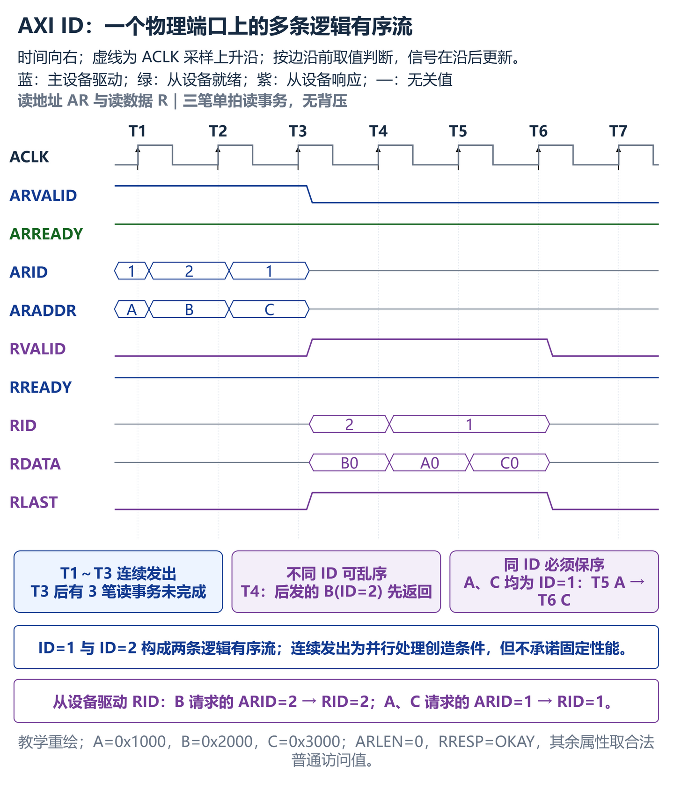
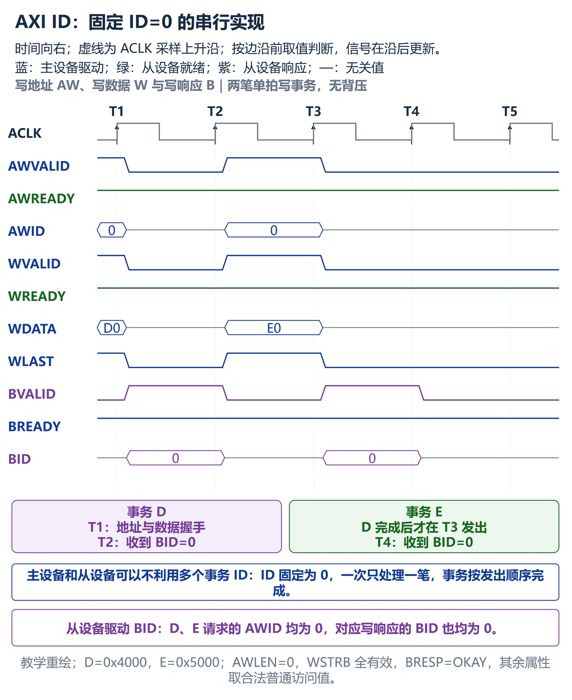
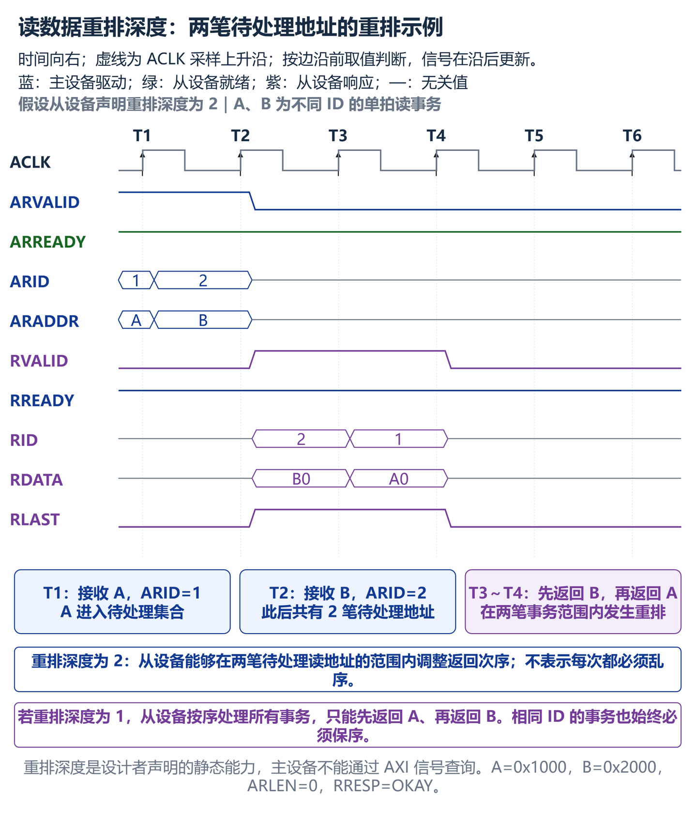
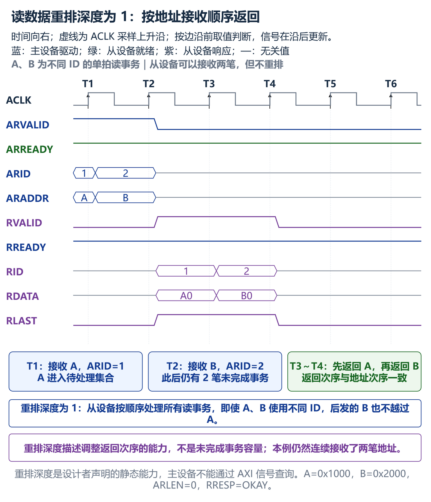
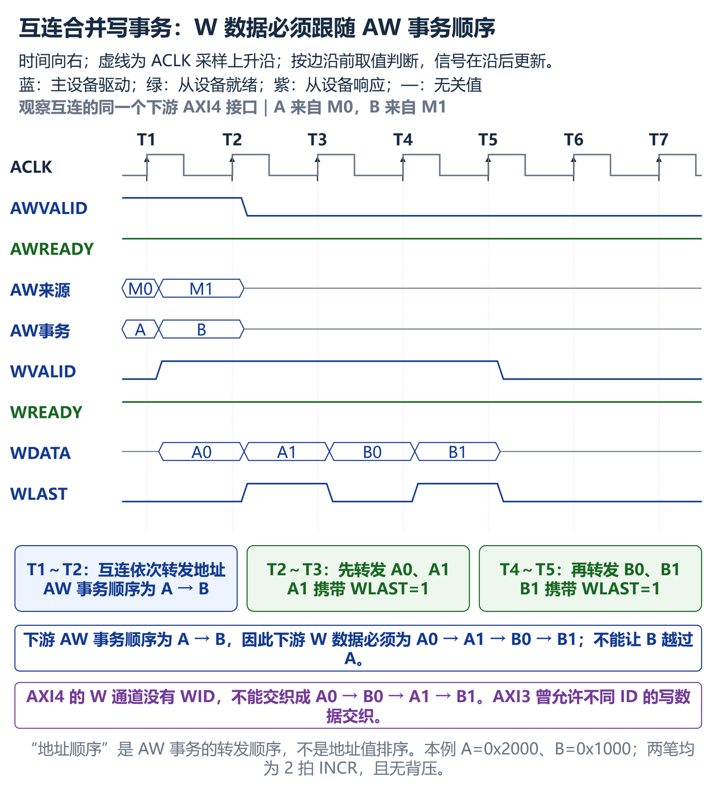
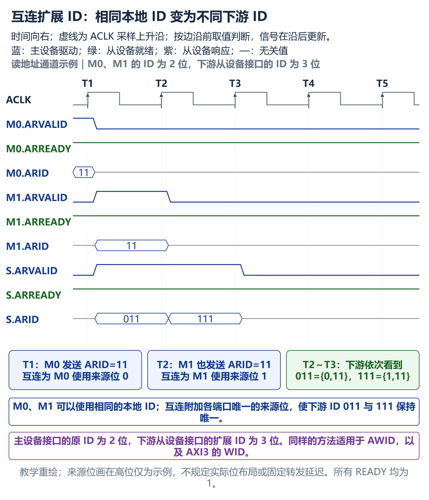
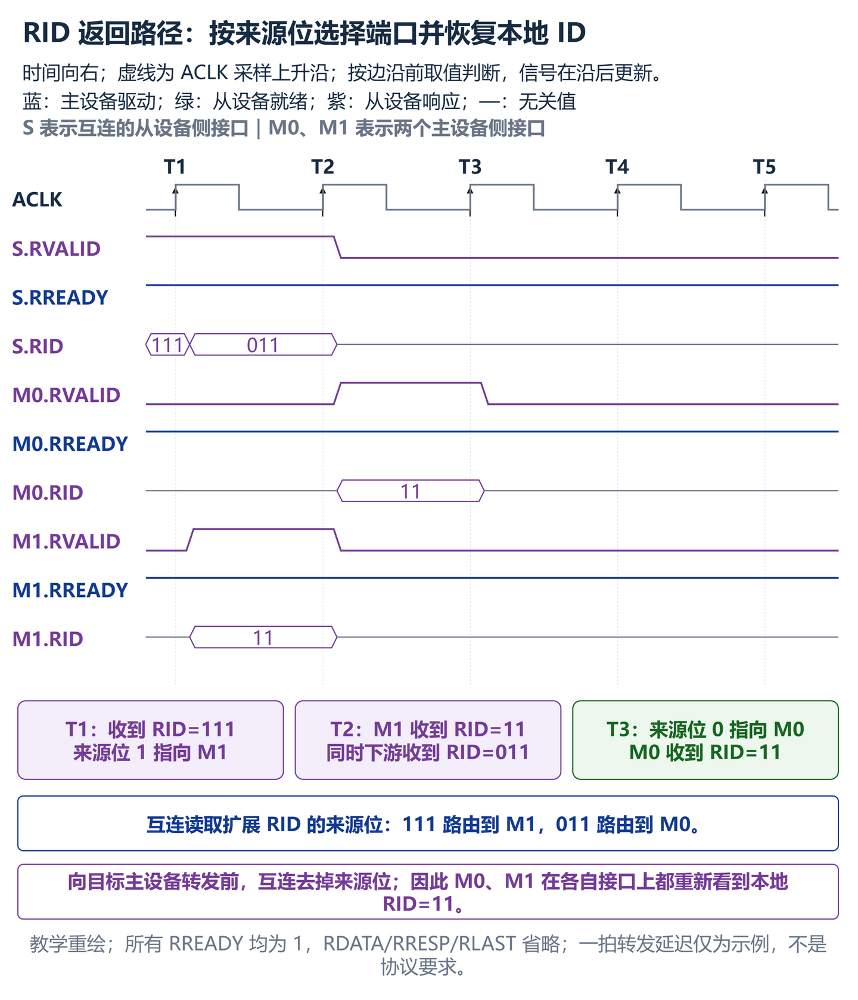

# A5：Transaction Identifiers

> 译文性质：Arm 规范的非官方中文翻译。
>
> 原始文档：Arm IHI 0022H《AMBA AXI and ACE Protocol Specification》。
>
> 版本：Issue H，ID040120。
>
> 范围：Chapter A5，原文章节页码 A5-79～A5-82。
>
> 说明：正文按原文顺序完整翻译；省略每页重复的页眉、页脚、版权行和物理页码。

本章介绍一种支持事务乱序完成以及发出多个未完成地址请求的机制。本章包含以下各节：

- AXI `Transaction Identifiers`，见第 A5-80 页。
- ID 信号，见第 A5-81 页。

## A5.1 AXI Transaction Identifiers

AXI 协议包含 AXI ID（`Transaction Identifier`）。主设备可以使用这些 ID 来标识必须按顺序返回的不同事务。

> 原文：A master can use these to identify separate transactions that must be returned in order.

具有给定 AXI ID 值的所有事务都必须保持有序，但对使用不同 ID 值的事务之间的顺序没有限制。一个物理端口可以通过表现为多个逻辑端口来支持乱序事务，其中每个逻辑端口都按顺序处理自己的事务。

> 原文：All transactions with a given AXI ID value must remain ordered, but there is no restriction on the ordering of transactions with different ID values.

通过使用 AXI ID，主设备可以在不等待先前事务完成的情况下发出事务。这可以提升系统性能，因为它支持事务的并行处理。

> **注（Note）**
>
> 不要求从设备或主设备使用 AXI 事务 ID。主设备和从设备可以一次处理一个事务。事务按照发出顺序处理。
>
> 原文：There is no requirement for slaves or masters to use AXI transaction IDs.

从设备必须在相应的 `BID` 或 `RID` 响应中回显从主设备接收到的 AXI ID。

> 原文：Slaves are required to reflect on the appropriate BID or RID response an AXI ID received from a master.

第一张图使用读通道展示一个物理端口上的多条逻辑有序流。

图中 A、C 使用相同 ID，因此必须依次返回；B 使用不同 ID，可以先于 A 返回。从设备在读响应中驱动 `RID`，其值与对应请求的 `ARID` 相同。

第二张图展示不利用多个事务 ID 的合法实现：接口固定使用 `ID=0`，一次只处理一笔事务。

事务 D 完成以后才发出事务 E。从设备在两个写响应中均驱动 `BID=0`，回显对应写请求的 `AWID=0`。

## A5.2 ID 信号

每个事务通道都有自己的事务 ID。表 A5-1 列出了这些指定信号。

> **注（Note）**
>
> AXI4 协议支持一种基于 AXI ID（`Transaction Identifier`）的扩展顺序模型。参见第 A6 章“AXI 顺序模型”。

### A5.2.1 读数据顺序

从设备必须确保，任何返回数据的 `RID` 值都与该数据所响应地址的 `ARID` 值相匹配。

> 原文：The slave must ensure that the RID value of any returned data matches the ARID value of the address that it is responding to.

互连必须确保：对于一系列使用相同 `ARID` 值、但目标为不同从设备的事务，主设备按照其发出地址的顺序接收到读数据。

> 原文：The interconnect must ensure that the read data from a sequence of transactions with the same ARID value targeting different slaves is received by the master in the order that it issued the addresses.

读数据重排深度是从设备中能够被重排的待处理地址数量。按顺序处理所有事务的从设备，其读数据重排深度为 1。读数据重排深度是一个静态值，必须由从设备的设计者指定。

> 原文：The read data reordering depth is a static value that must be specified by the designer of the slave.

主设备无法通过任何机制确定从设备的读数据重排深度。

> 原文：There is no mechanism that a master can use to determine the read data reordering depth of a slave.

下面假设从设备声明的读数据重排深度为 2。主设备连续发出两笔使用不同 ID 的单拍读事务，在任何读数据返回前，两笔地址都已进入待处理集合。

T3 返回后发的 B，T4 再返回 A，说明该从设备能够在两笔待处理地址的范围内进行重排。图中使用不同 ID 是为了允许乱序；相同 ID 的事务仍然必须保序。

作为对比，下面假设从设备的读数据重排深度为 1。它仍然可以连续接收 A、B 两笔读地址，但不会调整返回次序。

T2 握手后同时存在两笔未完成读事务，随后从设备在 T3 返回 A、T4 返回 B。这说明重排深度为 1 只表示从设备按序处理所有事务，不表示它最多只能接受一笔未完成事务。

### A5.2.2 写数据顺序

主设备必须按照发出事务地址的相同顺序发出写数据。

> 原文：A master must issue write data in the same order that it issues the transaction addresses.

对来自不同主设备的写事务进行合并的互连，必须确保按照地址顺序转发写数据。

> 原文：An interconnect that combines write transactions from different masters must ensure that it forwards the write data in address order.

下面从互连的同一个下游 AXI4 接口观察两笔写事务。互连选择先转发来自 M0 的事务 A，再转发来自 M1 的事务 B。

下游 AW 事务顺序为 A、B，因此 W 数据必须依次为 A0、A1、B0、B1，不能让 B 的数据越过或穿插到 A 的数据中。图中 A 的地址 `0x2000` 大于 B 的地址 `0x1000`，说明“地址顺序”指 AW 事务的转发顺序，不是按照地址数值从小到大排序。

AXI3 允许对具有不同 ID 的写数据进行交织，但该功能在 AXI4 及后续版本中已弃用。有关写数据交织的更多详细信息，请参见 Issue F 版本的《AMBA AXI and ACE Protocol Specification》。

> 原文：The interleaving of write data with different IDs was permitted in AXI3, but is deprecated in AXI4 and later.

### A5.2.3 互连对 Transaction Identifiers 的使用

当主设备连接到互连时，互连会向 `ARID`、`AWID` 和 `WID` 标识符附加额外位，这些额外位对于该主设备端口是唯一的。这会产生两个效果：

> 原文：When a master is connected to an interconnect, the interconnect appends additional bits to the ARID, AWID and WID identifiers that are unique to that master port.

- 主设备不必知道其他主设备使用了哪些 ID 值，因为互连通过向原始标识符附加主设备编号，使每个主设备使用的 ID 值具有唯一性。
- 从设备接口上的 ID 标识符比主设备接口上的 ID 标识符更宽。

下面以读地址通道为例。M0、M1 的本地 ID 都是 2 位，并且都使用 `ARID=11`；互连为两个主设备端口分别使用来源位 0 和 1。

互连在下游依次发送扩展 ID `011={0,11}` 和 `111={1,11}`。因此，两个主设备不需要协调各自使用的本地 ID，而从设备接口的 ID 位宽由 2 位增加到 3 位。同样的扩展方法适用于 `AWID`，以及仅 AXI3 使用的 `WID`。

对于读数据，互连使用 `RID` 标识符中的附加位来确定读数据的目标主设备端口。互连在将 `RID` 值传递到正确的主设备端口之前，会从 `RID` 标识符中移除这些位。

> 原文：For read data, the interconnect uses the additional bits of the RID identifier to determine which master port the read data is destined for. The interconnect removes these bits of the RID identifier before passing the RID value to the correct master port.

对于写响应，互连使用 `BID` 标识符中的附加位来确定写响应的目标主设备端口。互连在将 `BID` 值传递到正确的主设备端口之前，会从 `BID` 标识符中移除这些位。

> 原文：For write response, the interconnect uses the additional bits of the BID identifier to determine which master port the write response is destined for. The interconnect removes these bits of the BID identifier before passing the BID value to the correct master port.

下面延续前面的 2 位本地 ID 和 1 位来源编号示例。`S` 表示互连的从设备侧接口，`M0`、`M1` 表示两个主设备侧接口。

互连收到扩展 `RID=111` 时，根据来源位 1 将读数据发送到 M1，并在转发前去掉来源位，使 M1 看到本地 `RID=11`。扩展 `RID=011` 则被发送到 M0，并恢复为 `RID=11`。

写响应采用相同方法：扩展 `BID=011` 被发送到 M0，扩展 `BID=111` 被发送到 M1；去掉来源位以后，两个主设备在各自接口上都看到本地 `BID=11`。
