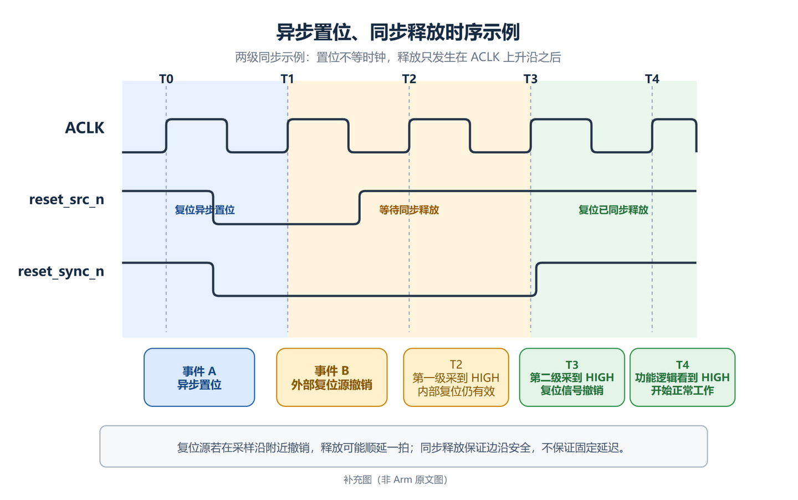
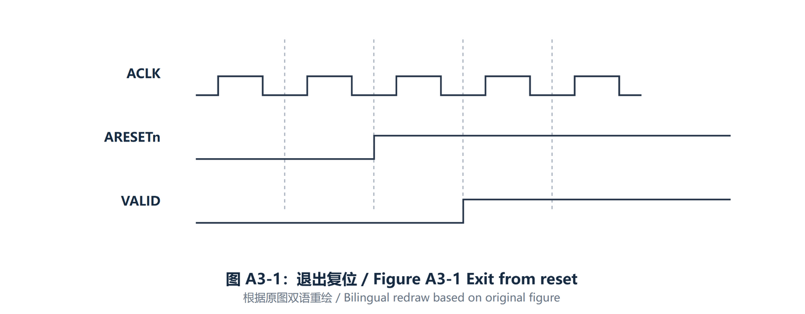

# 复位同步释放：从基本原理到 AXI `ARESETn`

“异步置位、同步释放”描述的是复位进入与退出的两种时序要求：复位可以不等待时钟立即生效，但退出复位必须由目标时钟域的有效边沿控制。

本文先解释通用原理，再说明它如何应用到 AXI 的 `ARESETn`。文中的两级同步只是一种常见示例，不代表同步释放固定需要两个周期。

## 1. 什么是同步释放

以低电平有效复位为例：

| 动作 | 含义 | 与时钟的关系 |
| --- | --- | --- |
| 异步置位 | 复位信号从 HIGH 变为 LOW，电路进入复位 | 不必等待时钟边沿 |
| 同步释放 | 送到目标逻辑的复位信号从 LOW 变为 HIGH，电路退出复位 | 只能在目标时钟的有效边沿之后发生 |

异步置位的价值是可以迅速把电路带回安全状态。同步释放的价值是让同一时钟域中的寄存器在可预测的时钟边沿退出复位，而不是在任意时刻恢复工作。

需要特别区分两个信号：

- `reset_src_n`：外部或上游产生的异步复位源。
- `reset_sync_n`：经过目标时钟域同步后，实际送给该时钟域逻辑的复位。

不能因为复位源已经变为 HIGH，就认为目标逻辑也已经安全地退出复位。

## 2. 为什么释放必须同步

异步复位端同样存在 recovery/removal 时序要求，可以把它们理解为“退出复位相对于时钟边沿需要留出的安全时间”。如果异步复位恰好在时钟边沿附近撤销，可能出现以下问题：

- 触发器进入亚稳态，输出不能在预期时间内稳定。
- 同一时钟域中的不同触发器可能在不同周期退出复位。
- 状态机、计数器或握手控制逻辑可能从不一致的初始状态开始运行。

常见做法是让复位的置位路径保持异步，并用目标时钟连续采样撤销状态。第一级负责承受潜在的亚稳态，后级再把稳定结果送给功能逻辑。这样不能保证第一级永不亚稳，但可以显著降低亚稳状态传播到功能逻辑的概率。

## 3. 通用时序图

图中采用常见的两级同步示例，按时间顺序阅读：

1. 开始时 `reset_src_n` 和 `reset_sync_n` 都为 HIGH，目标逻辑正常工作。
2. 事件 A 发生在两个 `ACLK` 上升沿之间。`reset_src_n` 被拉低后，`reset_sync_n` 不等待下一个时钟沿就进入 LOW，体现“异步置位”。
3. 事件 B 同样发生在两个上升沿之间。此时只有 `reset_src_n` 被撤销，`reset_sync_n` 仍保持 LOW，目标逻辑继续处于复位。
4. 在 `T2` 上升沿，第一级同步寄存器采到 HIGH；第二级看到的仍是第一级此前的 LOW，因此目标逻辑尚未退出复位。
5. 在 `T3` 上升沿，第二级采到已经稳定的 HIGH，`reset_sync_n` 在该沿之后变为 HIGH，完成同步释放。由于 `T3` 到来前 `reset_sync_n` 仍为 LOW，下游功能寄存器在这个沿仍保持复位状态。
6. 在 `T4` 上升沿，下游功能寄存器看到 `reset_sync_n` 已经为 HIGH，才第一次按正常工作逻辑更新状态。

图中的事件 B 与 `T2` 之间留有足够的采样时间。如果异步复位源在 `T2` 附近撤销，第一级可能到下一个周期才得到稳定的 HIGH，最终释放时刻也可能顺延一拍。同步释放保证的是输出只在安全的时钟边沿之后撤销，而不是保证从外部撤销到内部释放总有固定拍数。

## 4. AXI 中的 `ARESETn`

AXI 使用低电平有效复位 `ARESETn`。协议要求它可以异步置位，但只能与 `ACLK` 上升沿同步撤销。完整规范译文见 [A3.1.2 复位](ARM_IHI_0022H_AMBA_AXI_and_ACE_Protocol_Specification_A3.md#a312-复位)。

这张图中的虚线表示 `ACLK` 上升沿，可以分三段理解：

1. `ARESETn` 为 LOW 时接口处于复位。Master 必须令 `ARVALID`、`AWVALID`、`WVALID` 为 LOW；Slave 必须令 `RVALID`、`BVALID` 为 LOW。
2. `ARESETn` 在某个 `ACLK` 上升沿之后变为 HIGH，表示复位已经按该时钟域的要求同步撤销。
3. 到后续上升沿时，接口采样到 `ARESETn` 已为 HIGH。Master 最早可以在这个沿之后把 `ARVALID`、`AWVALID` 或 `WVALID` 驱动为 HIGH；图中用通用的 `VALID` 表示这三个请求侧信号中的任意一个。

协议没有要求复位期间把 `READY`、地址、数据以及其他所有信号统一清零。“没有规定复位值”只表示 AXI 不约束这些信号的复位电平，不代表实现可以违反自身的时序和安全要求。

外部异步复位源不能直接作为未经处理的 AXI 退出复位信号。工程上应先在 `ACLK` 时钟域中完成同步释放，再把同步后的信号作为该接口看到的 `ARESETn`。

## 5. 常见误解

- **同步释放不等于同步置位。** 置位仍然可以异步发生，只有撤销动作受时钟边沿控制。
- **同步释放不固定等于两拍。** 两级同步器很常见，但级数、实际延迟以及复位源靠近采样沿时产生的额外一拍，都取决于实现。
- **`reset_src_n=1` 不等于目标逻辑已经退出复位。** 应以同步后的复位信号为准。
- **退出复位不等于可以立刻发起 AXI 请求。** Master 必须遵守“在 `ARESETn` 已为 HIGH 之后的 `ACLK` 上升沿才允许拉高请求侧 `VALID`”这一要求。
- **复位期间并非所有 AXI 信号都必须为 LOW。** 协议明确要求的是五个 `VALID` 信号，其他信号没有统一复位值要求。

## 6. 记忆方式

可以把整个过程压缩成一句话：

> 拉低复位时立即停机；拉高复位源后继续等待；只有目标时钟确认复位已经稳定撤销，功能逻辑才重新工作。
