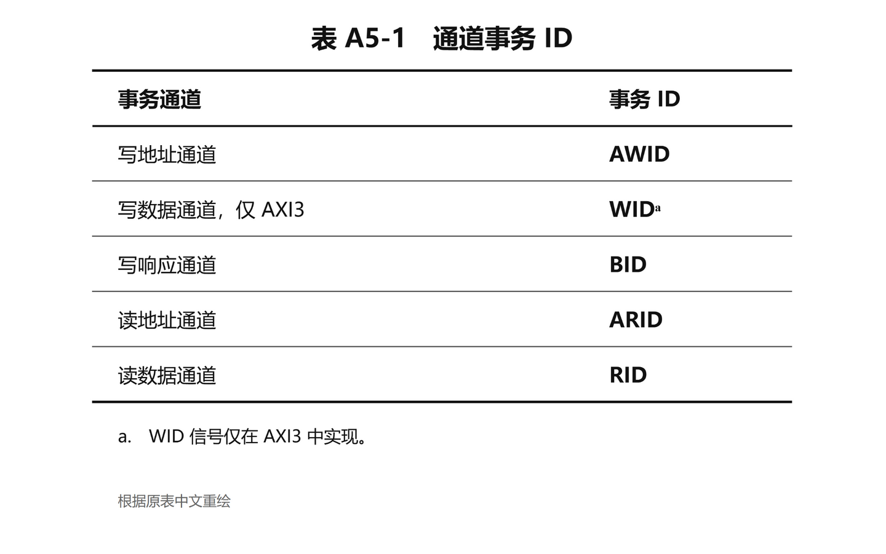

# AXI 协议翻译文档制作规范

## 1. 适用范围与规范基准

本规范用于将 Arm IHI 0022H《AMBA AXI and ACE Protocol Specification》制作成忠实的中文翻译文档。

新规范从 A5 及后续章节开始执行。A1 已按本规范重新制作，并按单章需求采用全文中英双语对照；A2 已按本规范重新制作，A3 保留为旧版学习导读。

除另有单章要求外，翻译文档采用“纯中文正文＋关键英文原句”的形式；A1 当前采用全文中英双语对照。正文以适用版本的 Arm 官方规范为唯一内容依据，完整保留原文信息和出现顺序，不增加原文没有的教学讲解、案例、自测题、总结或结论。

本地 PDF、规范版本号和文档发布日期必须在翻译前确认。旧学习稿、截图、搜索结果和既有配图只能用于定位或复核，不能替代 PDF 原文。

本文档是非官方中文翻译规范。协议设计和实现仍应以适用版本的 Arm 官方规范及勘误为准。

## 2. 文件与目录

每章译文在项目根目录保存为：

```text
ARM_IHI_0022H_AMBA_AXI_and_ACE_Protocol_Specification_章节编号.md
```

原文图表的中文重绘文件统一放在：

```text
image/axi-章节编号/
```

每个图或表必须同时保存：

1. 可编辑的 `.drawio` 源文件。
2. 从该源文件导出的高清 PNG。
3. Markdown 中位于原文对应位置的 PNG 引用。

生成和校验脚本放在 `tools/`。临时提取结果和核对清单放在 `tmp/`，不得作为正式译文提交。

原始 PDF、旧学习稿、旧图和风格参考图不得覆盖或删除。章节完成后更新根目录 `README.md`，写明覆盖章节、图表数量、翻译状态和仍待核对的问题。

## 3. “内容 1:1”的范围

### 3.1 必须保留的正文内容

译文必须按照原文出现顺序逐项保留：

1. Chapter、Section 和 Subsection 标题及编号。
2. 正文段落。
3. Note、Caution、Warning 等提示块。
4. 项目符号列表和编号列表。
5. 公式、伪代码、信号名、字段名、编码和数值。
6. 图、表、标题、编号、图例、标签和脚注。
7. 对其他章节、图、表和页码的交叉引用。
8. 原文中表示要求强度、许可范围、例外和版本差异的措辞。

不得遗漏、合并、拆散、提前或重新组织原文结论。中文语序需要调整时，只能在同一原文段落内部调整，不能把相邻段落合并为一个新的结论。

### 3.2 不纳入译文正文的重复页面信息

以下 PDF 页面元素不进入章节译文：

- 每页重复的运行页眉。
- 每页重复的版权行和保密级别。
- 每页重复的文档编号、发布日期和物理页码。
- 仅用于印刷排版的空白、分隔线和页面装饰。

章节号、原文章节页码范围和版本信息必须保留在译文开头的来源元数据中。正文中的实质性交叉页码不得删除。

### 3.3 禁止增加的内容

除关键英文原句，以及用户在明确位置明确要求的补充图外，不得增加原文不存在的：

- 学习目标和阅读路线。
- 整体认识、背景故事或机制类比。
- 教学案例、额外时序图和推导过程。
- 易错点、章节小结和下一章衔接。
- 自测题、答案和折叠块。
- 黄色高亮结论、译者观点或经验性建议。
- 从其他章节提前搬入的解释。

用户明确要求的补充图仅是针对该位置的例外，不代表可以增加其他教学内容。补充图必须遵守第 6.4 节，不得把相邻原文未提到的时序、行为、案例或结论扩展进图中。

发现原文可能存在歧义、勘误或版本差异时，不得擅自修正正文。保留准确译文和关键英文原句，并把待核对事项记录在章节状态或校验记录中。

## 4. 固定文档结构

每章译文只包含以下结构：

1. 中文章节标题，保留原章节编号。
2. 来源元数据。
3. 按原文顺序排列的完整中文译文；全文双语章节同时按第 5.5 节保留完整英文原文。
4. 位于原文对应位置的中文重绘图表。
5. 用户明确要求时，位于指定段落旁的补充图。

不得在结尾追加总结、覆盖对照表、自测题或参考讲解。

### 4.1 标题

标题直接翻译原文标题，不添加学习目标或读者收益。例如：

```text
# A5：Transaction Identifiers
```

### 4.2 来源元数据

标题后使用固定引用块：

```text
> <span style="color:#D9822B;">译文性质：Arm 规范的非官方中文翻译。</span>
>
> <span style="color:#D9822B;">原始文档：Arm IHI 0022H《AMBA AXI and ACE Protocol Specification》。</span>
>
> <span style="color:#D9822B;">版本：Issue H，ID040120。</span>
>
> <span style="color:#D9822B;">范围：Chapter A5，原文章节页码 A5-79～A5-82。</span>
>
> <span style="color:#D9822B;">说明：正文按原文顺序完整翻译；省略每页重复的页眉、页脚、版权行和物理页码。</span>
```

元数据不属于原文正文，按第 5.7 节使用淡橙色显示；不得在其中解释协议内容。

### 4.3 原文结构映射

- Chapter 标题使用一级标题 `#`。
- Section 标题使用二级标题 `##`。
- Subsection 标题依次使用三级及更低级标题。
- 每个原文段落对应一个中文段落。
- 每个原文列表项对应一个中文列表项，顺序和层级保持不变。
- 公式和伪代码保持原有顺序、变量和运算关系。
- Note 使用 `> **注（Note）**`；Caution 使用 `> **注意（Caution）**`；其他提示类型同样保留英文标签。
- 原文中的图表在相同内容位置插入，不前移或后置。

## 5. 翻译与术语规则

### 5.1 基本翻译要求

1. 译文准确、自然、简洁，但不得改写为教程或摘要。
2. 信号名、字段名、接口名、编码、寄存器名和协议名称保留英文，并使用行内代码。协议定义的专有名词可以直接保留英文；首次出现时应保证上下文能够明确其含义。
3. 数值、位宽、上下标、布尔值和公式不得因中文排版发生变化。
4. 同一术语在同章及跨章节必须使用统一译法；翻译前建立并复用术语表。
5. 代词或省略主语在中文中需要补全时，只能补出原文上下文能够唯一确定的对象。
6. 原文中的“要求”“允许”“建议”和“实现选择”必须保持原有强度。
7. 不得用既有工程经验补全原文没有明确给出的条件。

### 5.2 固定术语

以下术语默认采用统一译法：

- Master：保留英文 `Master`，不翻译为中文。
- Slave：保留英文 `Slave`，不翻译为中文。
- Manager：管理端。
- Subordinate：从属端。
- Interconnect：互连。
- Transaction：保留英文 `transaction`，不翻译为中文。
- Burst：突发传输。
- Beat：数据拍。
- Transfer：传输。
- Outstanding transaction：保留英文 `outstanding transaction`，不翻译为中文。
- Transaction Identifier：保留英文，可简称为 Transaction ID 或 AXI ID。
- Byte lane：字节通道。
- Register slice：寄存器切片。
- Implementation-defined：由实现定义。

如果适用版本原文使用 Master、Slave，则直接保留英文 `Master`、`Slave`，不翻译为“主设备”“从设备”，也不主动替换成后续版本的 Manager、Subordinate。

原文使用 transaction 时，在中文正文、标题和图表中直接保留英文 `transaction`；除引用旧稿或说明禁用译法外，不写成“事务”。

### 5.3 规范强度

下列关键词必须保持稳定译法：

- `must`、`must be`、`required`：必须。
- `must not`：不得。
- `can`、`may`：可以。
- `permitted`：允许。
- `no requirement`：不要求。
- `recommended`：建议。
- `deprecated`：已弃用。
- `IMPLEMENTATION DEFINED`：由实现定义。

不得把“可以”写成“必须”，不得把“已弃用”写成“禁止”或“不支持”，也不得把 Note 中的说明提升为强制规则。

### 5.4 关键英文原句

正文以中文为主。满足以下任一条件时，在对应中文段落后紧跟关键英文原句：

1. 包含 `must`、`must not`、`required`、`permitted`、`no requirement`、`deprecated` 或 `IMPLEMENTATION DEFINED`。
2. 该句定义协议行为、例外、边界或版本差异。
3. 中文译法可能改变规范强度或存在合理歧义。
4. 校验时需要保留英文作为逐句核对依据。

统一格式为：

```text
> 原文：The slave must ensure that ...
```

英文必须与 PDF 完全一致，不得节译、改写或拼接不同位置的句子。除非该章明确要求采用全文双语，普通叙述句不重复附英文。

### 5.5 全文双语章节

当某章明确要求采用全文中英双语对照时：

1. 章节和小节标题使用“中文 / English”形式。
2. 每个中文正文段落或列表后紧跟完整的英文原文块，不再只筛选关键规范句。
3. 英文原文块统一使用 `> **原文（English）**`，内容必须与 PDF 完全一致。
4. Note、Caution 等提示块同时保留中文和完整英文，且保持原有层级。
5. 原图图题在图片旁保留完整英文原图题。
6. 不得使用英文摘要、解释或改写来替代原文。

A1 当前采用全文中英双语对照。除非另有明确要求，其他章节（包括 A2）仍采用第 5.4 节的“中文正文＋关键英文原句”形式。

### 5.6 中文正文中的英文术语括注

中文正文中的重要协议名词可以在首次出现时补充英文，例如 `术语（terminology）`、`寄存器切片（register slice）`。`transaction` 和 `outstanding transaction` 按第 5.2 节直接保留英文。

1. 括注使用中文全角括号 `（ ）`。
2. 英文必须采用原文或已锁定术语表中的准确形式。
3. 普通名词在句中默认使用小写；专有名词、缩写和规范固定大小写保持原样。
4. 同一术语后续重复出现时通常不再反复括注，除非跨越较长章节后确有必要。
5. 信号名、字段名和编码仍使用行内代码，例如 `VALID`、`READY`，不改写成中文括注。

### 5.7 非原文补充文字的视觉区分

来源元数据以及用户明确要求添加并获准保留的补充说明不属于原文翻译，统一使用淡橙色 `#D9822B`，以便与规范原文译文区分。

1. 普通补充段落使用 `<span style="color:#D9822B;">补充文字</span>` 包裹整段文字。
2. 补充列表保留原有 Markdown 列表标记，并在每个列表项正文外单独包裹上述 `span`。
3. 补充文字中的信号名、字段名和编码仍使用代码样式，并写为 `<code style="color:#D9822B;">VALID</code>`，避免阅读器的代码配色覆盖橙色。
4. 原文中文译文、英文原文块、章节标题、“原文（English）”结构标签和原文图题不得应用该颜色。
5. 原文图表重绘和补充图内部继续按照第 6 节的视觉规则配色，不要求把图中文字统一改为橙色。
6. 同一项目不得为不同章节或不同补充段落自行选择其他橙色色值。

## 6. 图和表的 draw.io 重绘规范

### 6.1 重绘范围

原文中的每张图和每个表都必须在原出现位置使用 draw.io 重绘。普通中文译稿使用中文标签；全文双语章节的原图重绘可以使用“中文 / English”双语标签。原文没有图或表时，不主动额外制作教学图表；用户明确要求的补充图按第 6.4 节处理。

重绘必须完整保留：

- 图号或表号。
- 标题。
- 行列顺序。
- 节点、连线、箭头方向和层级关系。
- 图例、坐标、信号、标签、单位和全部数值。
- 表头、单元格、脚注标记和脚注正文。
- 原图中用于区分状态或类别的视觉编码。

不得添加教学结论框、额外示例、解释性箭头或原图没有的数据。

### 6.2 文件命名与引用

文件名使用原编号和简短英文主题，例如：

```text
table-a5-1-channel-transaction-id.drawio
table-a5-1-channel-transaction-id.png
figure-a3-5-read-transaction-dependencies.drawio
figure-a3-5-read-transaction-dependencies.png
```

Markdown 只引用 PNG：

```markdown

```

图表的编号、标题和脚注在 draw.io 图面中完整呈现；Markdown 不再使用可见的重复表格或重复图注。

### 6.3 视觉与导出

1. 画布使用白色背景，字体统一为 Microsoft YaHei。
2. 信号名、字段名、公式、位域和编码保持英文。
3. 中文标签准确对应原文，不增加解释；全文双语章节的原图重绘可以同时保留对应英文标签。
4. 默认导出宽度为 1440 像素，高度按内容自适应。
5. 线条、箭头、边框和表格网格在约 540 像素显示宽度下仍需清晰。
6. 表格不得裁切长文本；必要时增加行高，不缩小到不可读字号。
7. 原图使用颜色表达语义时保留该语义；原图没有颜色语义时采用克制的中性色。
8. 普通中文译稿标注“根据原图中文重绘”或“根据原表中文重绘”；全文双语章节可以相应标注“双语重绘”。不得把原图重绘标注为“教学重绘”。

每次修改 `.drawio` 后都必须重新导出 PNG，不能让源文件和图片内容不一致。

### 6.4 用户明确要求的补充图

只有用户明确要求在指定位置补图时，才可以添加原文不存在的补充图。补充图必须满足：

1. 只呈现相邻原文直接列出的对象和关系，不推导或扩展原文未提到的时序、行为、示例、状态或结论。
2. 使用中文标题和中文说明；信号名、字段名、编码等本来就应保留英文的内容除外。不做中英双语对照。
3. 图本身已经表达清楚时，Markdown 中只保留图片引用，不在图前或图后重复增加中文解释、英文翻译或图注说明。
4. 图面明确标注“补充图（非原文图）”，不得使用原规范的 Figure 或 Table 编号。
5. 文件名使用 `supplemental-` 前缀，并同时保存同名 `.drawio` 与 PNG。
6. 默认导出宽度仍为 1440 像素，并执行与原图相同的清晰度、裁切和可读性检查。
7. 补充图不计入原文图表数量；在源内容清单或 README 中单独注明。

## 7. 制作流程

1. 确认 PDF 文件、Issue、文档 ID 和目标章节页码。
2. 按页提取章节正文，并建立源内容清单。
3. 清单依次登记标题、段落、列表、Note、Caution、公式、图、表和脚注。
4. 建立或更新术语表，先锁定信号、字段、transaction 类型和规范强度译法。
5. 按清单和原文顺序逐段翻译，不跨段合并。
6. 对符合第 5.4 节条件的句子附上关键英文原句。
7. 使用 draw.io 重绘原文图表并导出 PNG。
8. 把图表引用插回原文对应位置。
9. 如果用户明确要求补充图，按第 6.4 节制作并插入指定位置。
10. 对照 PDF 和源内容清单逐项复核。
11. 完成结构、术语、图表和版本检查后更新 README 状态。

## 8. 验证清单

每章完成前必须检查：

1. 原文标题、段落、列表、Note、Caution、公式、图、表和脚注的数量及顺序与译文一致。
2. 没有遗漏、摘要、合并、重排或从其他章节提前引入内容。
3. 没有原文不存在且未经用户明确要求的学习目标、案例、总结、自测题或教学图。
4. 每个规范强度关键词的中文译法准确且一致。
5. 每条关键英文原句与 PDF 完全一致，并紧跟对应译文。
6. 所有信号名、字段名、编码、公式、数值和单位均未被误译。
7. 所有原图和原表均有同名 `.drawio` 与 PNG。
8. draw.io 源文件能够打开，PNG 来自最新源文件。
9. 图表编号、标题、内容、图例和脚注与原文一致。
10. 图片不存在裁切、重叠、乱码、黑块或不可读文字。
11. Markdown 只有一个一级标题，标题层级连续，图片路径存在。
12. 正文不存在 `<details>`、黄色结论高亮或外部教学链接。
13. 来源元数据中的文档版本、章节和页码正确。
14. 原始 PDF、旧学习稿和旧图未被修改。
15. `git diff --check` 无空白错误。
16. 补充图只包含相邻原文直接涉及的信息，没有自行扩展时序、行为、示例或结论。
17. 补充图未做中英双语对照；图已自解释时，正文没有重复说明。
18. 来源元数据及获准保留的非原文补充文字使用 `#D9822B`，原文译文和图内文字未被误着色。

## 9. 完成标准

一章只有同时满足以下条件才标记为“翻译完成”：

1. 源内容清单中的所有实质性项目均有对应译文或中文重绘图表。
2. 原文顺序、结构、编号和规范强度保持不变。
3. 关键英文原句完整、准确且数量适当。
4. 术语在本章及已完成译文章节中一致。
5. 所有图表完成 draw.io 重绘和视觉核验。
6. 未加入原文不存在且未经用户明确要求的教学内容；获准添加的补充图符合第 6.4 节。
7. README 已更新翻译范围、图表数量、状态和待核对事项。

A1 在 README 中标记为“全文双语稿”，A2 标记为“忠实翻译稿”，A3 标记为“旧版学习导读”。从 A5 开始的新文档必须遵守本规范。

本文规定翻译制作方法，不授予原规范的复制、发布或再许可权。使用和发布译文时应遵守 Arm 官方文档的许可条款。
